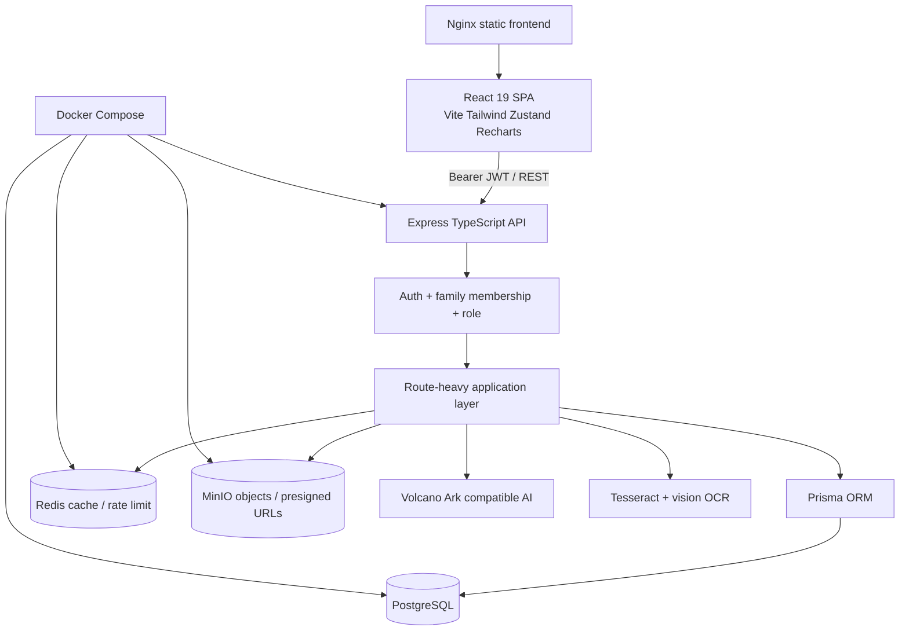
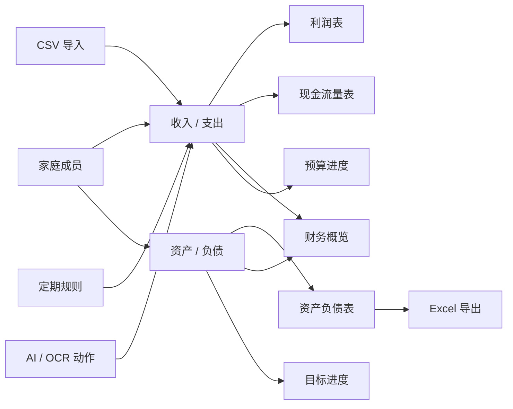
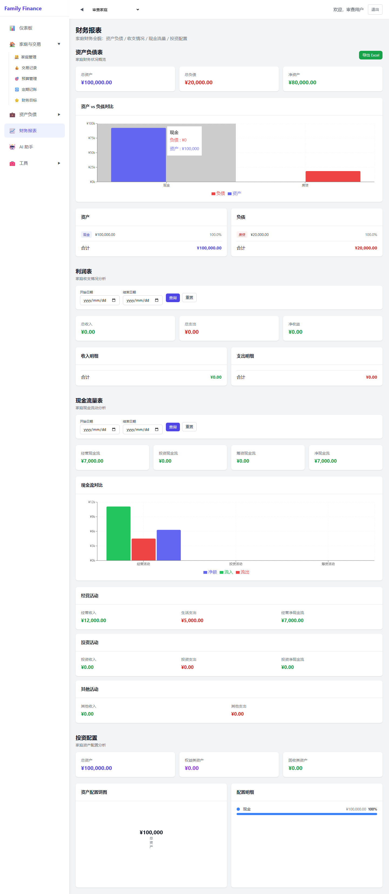
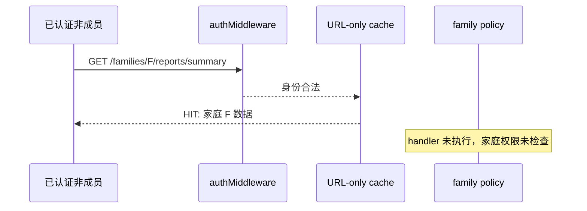

# HomeFinance 架构、功能与代码深度审查报告

## 摘要

本次审查基于 `main` 分支提交 `b103e4221ae58d2cd09ee586d69f3cf90c79c146`，覆盖源码静态分析、构建、测试与覆盖率、依赖审计、Prisma 校验、浏览器运行时冒烟、可访问性抽查和知识图谱分析。结论是：**HomeFinance 已形成可理解、可构建、具有较完整家庭财务功能面的模块化单体原型，但当前不宜按“生产可用家庭财务系统”发布。** 主要原因不是功能数量不足，而是两个发布阻断级访问控制缺口，以及报表正确性、缓存一致性、交易原子性和多币种语义尚未形成可信闭环。

| 维度 | 审查结果 | 判断 |
|---|---:|---|
| 构建 | 前后端均通过 | 基础工程可用 |
| 默认后端测试 | 21 suites / 215 tests 通过 | 有较好回归基础，但 README 统计已过期 |
| 覆盖率 | statements 53.78%、branches 39.72%、functions 55.21%、lines 54.07% | 低于配置的 60% 门槛 |
| 前端质量 | lint 0 error / 18 warnings；无前端自动化测试 | 变更风险偏高 |
| 主包体积 | 854.60 kB minified / 237.44 kB gzip | 路由未拆包，超过 Vite 500 kB 提示线 |
| 供应链 | 前后端各 6 个审计漏洞；前端 6 high，后端含 3 high | 发布前需处理 |
| 风险分布 | 2 个 P0、14 个 P1、6 个 P2 | 应先修正确性与权限，再扩功能 |
| 知识图谱 | 807 nodes / 896 edges / 133 communities | 可持续导航已建立，推断边需人工确认 |

最关键的判断是：**现有“家庭成员 + viewer”模型在设计上表达了只读角色，但多个 POST 写入口只验证成员身份，不验证角色；同时报表缓存会在家庭权限检查之前返回命中数据。** 这两个问题分别破坏了最小权限与租户隔离。财务层面，现金流净额遗漏“其他”现金流、预算周期没有真正生效、跨币种金额直接相加，使报表即使能够展示，也未必满足可依赖的财务正确性。

建议采用“先可信、再规模化、后智能化”的推进顺序：0–2 周完成权限与报表正确性的 Phase 0；3–6 周抽取统一授权/交易/缓存服务并补齐前端测试；7–12 周做数据库聚合、可观测性和部署加固；只有在这些门槛通过后，再启动汇率、审计账本、对账、自动调度和审批通知等新功能。详细计划见 `2026-08-27-homefinance-improvement-program.md`。

## 1. 审查范围与方法

### 1.1 范围

审查对象包含约 21,603 行、121 个相关文件，覆盖 68 个 Express endpoint、20 个前端页面、14 个前端 service、16 个后端 route 和 22 个 `*.test.ts` 文件。环境使用 Node `v25.8.2` 与 npm `11.11.1` 执行诊断；项目 CI 指定 Node 20，因此 Node 25 的本地通过不替代 Node 20 的发布验证。

本轮未修改生产业务代码，也未宣称完成任何整改。Docker CLI 不可用，Redis 6379 与 MinIO 9000 未监听；PostgreSQL 5432 可达但未在未知凭据下进行侵入式探测。因此 Compose 全栈、真实对象存储和本机真实数据库集成行为属于未验证项；CI 中存在独立 PostgreSQL 集成测试任务，是积极基础。

### 1.2 方法与证据等级

| 证据等级 | 方法 | 用途 |
|---|---|---|
| E1 | 源码与配置逐行检查 | 架构、授权顺序、计算公式、事务边界 |
| E2 | `npm ci`、build、lint、Jest、coverage、Prisma 命令 | 工程质量与可重复性 |
| E3 | Playwright + mocked API 浏览器冒烟 | 路由、请求头、页面降级、可访问性 |
| E4 | Graphify AST + 语义图 | 跨模块导航、God Nodes、薄弱社区与文档缺口 |

所有数字均来自本轮命令结果或仓库文件。缺少完整部署环境的数据明确标为“未验证”，没有以估算值替代。

## 2. 架构与内容分析

### 2.1 容器与依赖结构

顶层分层清楚：SPA、REST API、Prisma/PostgreSQL、Redis、MinIO 和外部 AI 的技术边界容易理解。问题集中在 API 内部：大量路由同时承担授权、输入转换、业务计算、事务编排和响应组装，形成“route-heavy modular monolith”。例如报表在 route 内拉取完整行集并 reduce，循环预算逐个查询支出，AI route 同时处理历史上下文、模型调用、动作执行与会话持久化。该结构在原型阶段开发快，但随着权限入口、写入入口和财务派生视图增多，策略很容易不一致。

Graphify 的 God Nodes 进一步印证这一点：`Family Membership Role-Based Access Control` 与 `Current Family Data Scope` 都有 17 条连接，是系统真正的跨模块核心；但各 route 又各自复制 `checkFamilyAccess`，使核心策略在图上高度中心化、在实现上却高度分散。下一阶段最有价值的架构工作不是拆微服务，而是在单体内建立统一 policy、ledger/application service 与 report query service。

### 2.2 核心数据与业务流

产品主线围绕“家庭即公司”的设计：流水与存量形成三张报表，预算、目标、AI、导入和定期记账作为数据入口或派生能力。数据模型使用 Prisma Decimal 保存金额并配置多个索引，家庭级级联删除有真实数据库集成测试；文件链路具有 10 MB 单文件限制、pHash 去重和 MinIO 持久化，OCR 存储失败不会阻断识别。这些是值得保留的设计资产。

然而多个入口直接写 `Income` / `Expense`，尚无统一账本服务或幂等键：普通 CRUD、CSV confirm、recurring execute、AI actions 分别实现自己的授权与持久化。由此产生三个系统性后果：viewer 限制难以一致执行；写后缓存无法统一失效；并发/重试下无法统一保证 exactly-once。改进应围绕“所有记账入口汇聚到一个受策略和事务保护的应用服务”展开。

### 2.3 模块职责与复杂度

| 领域 | 主要实现 | 当前特征 |
|---|---|---|
| 鉴权与家庭 | `auth.ts`、`families.ts`、`useAuthStore` | JWT + 家庭 RBAC；最后管理员不变量较好 |
| 账本 | incomes/expenses routes、`financeService.ts` | CRUD 与重复检测齐全；授权和缓存失效分散 |
| 报表 | `reports.ts`、`ReportsPage.tsx`、charts | 功能面完整；正确性、认证调用和聚合方式有缺陷 |
| AI/OCR | `ai.ts`、`aiService.ts`、`aiActions.ts`、`AIPage.tsx` | 降级与测试较丰富；文件大，文本动作缺确认 |
| 导入/定期 | `import.ts`、`recurring.ts` | 业务价值高；事务、幂等、边界限制不足 |
| 文件 | `files.ts`、MinIO、pHash | 去重和容错不错；viewer 写入与 URL fan-out 待处理 |
| 前端 shell | `App.tsx`、Layout、stores | 路由直观；页面全量 eager import，无统一错误边界 |

最大文件包括 `AIPage.tsx` 824 行、`ReportsPage.tsx` 669 行、`aiService.ts` 535 行、`ai.ts` 520 行和 `TransactionsPage.tsx` 518 行。行数本身不是缺陷，但这些文件同时承载多个可独立测试的职责，说明边界已经到达需要拆分的阶段。

## 3. 功能闭环审查

### 3.1 功能矩阵

| 用户任务 | UI | API | 数据/外部依赖 | 自动化证据 | 闭环判断 |
|---|---|---|---|---|---|
| 注册、登录、会话 | 有 | 有 | User + JWT | 后端测试 | 部分闭环；无登录限流，token 存 localStorage |
| 家庭创建与成员管理 | 有 | 有 | Family / FamilyMember | 单元 + DB 集成 | 基本闭环；最后管理员保护是亮点 |
| 收支记账与重复提示 | 有 | 有 | Income / Expense | 路由测试分布不均 | 功能可用；viewer 可创建 |
| 资产与负债 | 有 | 有 | Asset / Liability | 关键 route 覆盖为 0% | 功能可用；跨币种汇总错误 |
| 资产负债表 | 有 | 有 | 资产/负债派生 | 后端测试 | 部分闭环；缓存授权和币种问题 |
| 利润表 | 有 | 有 | 收入/支出派生 | 后端 + 浏览器复现 | **运行时断链**；前端请求无 token，静默显示 0 |
| 现金流量表 | 有 | 有 | 分类规则派生 | 后端测试未覆盖缺陷 | **数学不闭环**；净额遗漏 other |
| 财务概览/投资配置 | 有 | 有 | 多表派生 | 后端测试 | 部分闭环；近期记录未排序、币种混加 |
| 预算 | 有 | 有 | Budget + Expense | 后端测试 | **语义不闭环**；period 未参与计算 |
| 财务目标 | 有 | 有 | Goal + 全局净值 | 后端测试 | 形式闭环；目标进度缺独立基线/贡献 |
| 定期记账 | 有 | 有 | Recurring + Ledger | 后端测试 | 部分闭环；可重复执行且非原子 |
| 支付宝/微信导入 | 有 | 有 | CSV + Ledger | 后端测试 | 部分闭环；无上限、非原子、无幂等 |
| Excel 导出 | 有 | 有 | ExcelJS | 后端测试 | 基本闭环 |
| 家庭文件与去重 | 有 | 有 | DB + MinIO + pHash | 后端测试 | 基本闭环；viewer 可上传 |
| AI 对话与 OCR | 有 | 有 | AI/Tesseract/MinIO | 韧性测试较多 | 部分闭环；文本 AI 直接写账 |
| 多家庭对比 | 有 | 有 | 每家庭 4 查询 | 后端测试 | 功能可用；规模与币种问题 |
| PWA 离线 | 可安装 shell | 无离线数据层 | 静态预缓存 | build | 声明过度；仅静态 shell 预缓存 |

矩阵显示，项目的功能“广度”已经足够，核心短板是“完成定义”偏向有页面、有 endpoint，而没有把权限、会计一致性、失败恢复、并发和端到端请求作为同等必要条件。因此新增更多页面会扩大表面价值，却也扩大数据不可信的半径。后续项目治理应把每个 feature 的 Definition of Done 改为 UI、API、权限、数据语义、失败路径、自动化测试和运行时证据七项闭环。

### 3.2 浏览器运行时证据

Playwright 冒烟确认：未登录访问 `/` 会正确跳转 `/login`；登录控件有 label，但 email/password 缺少 `autocomplete`。在 mocked 已登录报表页，资产负债表和现金流 fixture 正常显示，而利润表发出两次无 `Authorization` 的请求，返回 401，浏览器控制台出现两条错误，页面最终把缺失数据表现为 0。证据记录位于 `evidence/ui-smoke-result.json`。

根因在 [`ReportsPage.tsx`](../../frontend/src/pages/ReportsPage.tsx#L240-L247)：该区块使用裸 `fetch`，绕过 [`api.ts`](../../frontend/src/services/api.ts) 的 Axios bearer interceptor，也绕过已经存在的 `reportService.getIncomeStatement()`。同时失败响应没有进入可见错误状态。这不是单纯 UI 显示瑕疵，而是会向用户呈现“利润为 0”的错误财务事实，故列为 P1。

## 4. 代码、安全与财务正确性审查

### 4.1 风险总表

| ID | 级别 | 发现 | 影响 | 核心证据 |
|---|---|---|---|---|
| HF-SEC-001 | P0 | viewer 可通过多个 POST 入口写数据 | 最小权限失效、账本被只读成员篡改 | `incomes.ts:101-121` 对比 `:139-141`；同型入口遍布 expenses/assets/budgets/goals/recurring/files/import/AI |
| HF-SEC-002 | P0 | 报表缓存先于家庭授权执行，key 只含 URL | 已认证非成员可能读取缓存中的家庭报表 | `reports.ts:21-26`；`cache.ts:10-16` |
| HF-CACHE-001 | P1 | 财务写入不失效 `cache:*` | 写后最多 300 秒显示旧报表 | `cache.ts:19-25`；生产代码仅见 `setEx`，无对应 invalidation |
| HF-FE-001 | P1 | 利润表绕过 API client | 401 后静默显示 0，误导用户 | `ReportsPage.tsx:240-247` + 浏览器证据 |
| HF-FIN-001 | P1 | 现金流净额遗漏 other income/expense | 报表分项与净额不相等 | `reports.ts:148-175` |
| HF-FIN-002 | P1 | MONTHLY/QUARTERLY/YEARLY 不参与预算窗口 | 月度预算从起始日无限累计，进度失真 | `budgets.ts:43-80` |
| HF-DATA-001 | P1 | 基线 recurring execute 无 due/active 防护、事务和幂等；当前 LOCALLY_REMEDIATED / PASS-REAL | 本地 PostgreSQL 已阻止重复/部分提交；仍待 E2E、populated restore 和 release observation | 基线 `recurring.ts:135-191`；当前 `370b2d9`、`recurring.phase1.integration.test.ts`、ADR-0006 |
| HF-DATA-002 | P1 | import 使用无大小限制 memoryStorage，逐行非事务写入 | 内存耗尽、部分成功、重试重复 | `import.ts:9,55-110` |
| HF-FIN-003 | P1 | 多币种字段存在，但汇总直接相加并按 CNY 展示 | 净值、对比、目标数学无效 | `schema.prisma:107,127`；`reports.ts:29-34`；多处 CNY formatter |
| HF-SEC-003 | P1 | Compose 暴露数据库/Redis/MinIO 默认端口与弱凭据 | 一键部署默认攻击面过大 | `docker-compose.yml:6-10,19-23,33-42,59-70` |
| HF-AUTH-001 | P1 | 登录/注册无限流、密码最短 6 位、7 天 JWT、无服务端撤销 | 暴力破解与 token 窃取影响扩大 | `auth.ts:10-21,46-49,62-100`；`useAuthStore.ts:16-33` |
| HF-AI-001 | P1 | 基线文本 AI 动作立即执行且 viewer 可触发；当前 PARTIALLY_REMEDIATED / PASS-MOCK + PASS-REAL schema | text chat 已停止自动执行，viewer 由统一 middleware 拒绝，server-owned proposal persistence 已建立；legacy raw-actions confirm 仍缺 route ownership、原子性和真实并发证据 | 基线 `ai.ts:132-175,457-468`；当前 `5a564c9`、`732eafd`、AI proposal tests、ADR-0004 |
| HF-QUAL-001 | P1 | CI 不执行 coverage，前端无自动化测试 | 已配置门槛实际不阻断回归 | `ci.yml:31-33` 对比 `jest.config.js:17-23` |
| HF-PERF-001 | P1 | 报表全表聚合、预算 N+1、compare 每家庭 4 查询 | 数据量与家庭数增长时延迟线性/乘法增长 | `reports.ts:29-44,220-267`；`budgets.ts:49-66`；`compare.ts:26-42` |
| HF-SUPPLY-001 | P1 | 前后端均有高危依赖链，Multer 1.x 已弃用 | DoS、host confusion、供应链暴露 | `npm audit` 基线；router 7.18.1、multer 1.4.5-lts.1 |
| HF-FE-002 | P1 | 所有页面 eager import，主包 854.60 kB；18 Hook warnings | 首屏成本高、闭包/刷新行为易出错 | `App.tsx:1-18`；build/lint 基线 |
| HF-PWA-001 | P2 | PWA 仅 precache 静态资源 | 无网络时动态财务数据不可依赖 | `vite.config.ts:9-15` |
| HF-A11Y-001 | P2 | 报表 5 个控件无可访问名称，无 skip link | 键盘/读屏体验不完整 | `ui-smoke-result.json` |
| HF-DATA-003 | P2 | “最近交易”对未排序查询直接 slice | 展示不一定真是最近记录 | `reports.ts:223-226,291-293` |
| HF-GOAL-001 | P2 | 目标进度使用全局净值/资产/负债 | 多目标互相污染，无法反映专项贡献 | `goals.ts:42-63` |
| HF-TIME-001 | P2 | `YYYY-MM-DD` UTC 解析与服务器本地月界混用 | 非 UTC 时区月末/日界可能偏移 | `reports.ts:69-75,215-218` 等 |
| HF-ARCH-001 | P2 | app 构建与 `listen` 同文件，route/page 大文件职责过多 | import 副作用、测试耦合、维护成本 | `app.ts:14-75` 与大文件统计 |

P0 定义为生产发布阻断：可导致跨租户数据暴露或绕过明确权限模型。P1 要求在公开生产运行或扩大用户前处理；P2 可在稳定化周期内排期。严重度未把“理论最佳实践”直接等同于漏洞，而是结合家庭财务数据的敏感性、可触发性和影响范围判断。

### 4.2 P0：viewer 写权限系统性失效

收入创建只判断 membership 是否存在，而同文件更新明确判断 `membership.role === 'viewer'` 并返回 403。这种前后对照证明 viewer 的产品语义确实是只读，并非审查者主观推断。相同缺口出现在支出、资产、负债、预算、目标、定期规则、定期执行、文件上传、导入确认、AI chat 自动动作和 `/execute-actions`。攻击者不需要越过身份验证，只需被邀请为 viewer 即可改变家庭财务数据。

根因是“成员身份”和“操作权限”没有形成统一 policy。修复不能只在一个 route 补 if；应定义 resource/action policy，并对所有 68 个 endpoint 建立角色矩阵测试。首个 RED 测试应参数化全部写入口：viewer 发送合法请求时必须得到 403，且 Prisma/MinIO/AI executor 零调用。GREEN 阶段先接入统一 `requireFamilyRole(['admin','member'])`，REFACTOR 再把重复 family lookup 合并为 request-scoped policy context。

### 4.3 P0：缓存命中绕过家庭授权

报表注册顺序为 `authMiddleware, cacheMiddleware(300), handler`，家庭 membership 检查位于 handler 内。缓存中间件用 `cache:${req.originalUrl}` 作为 key，命中后直接 `res.json` 返回。于是当某家庭报表已由合法成员预热，任意已认证非成员只要知道或猜到该 family URL，就可能在进入 `checkFamilyAccess` 前取得内容。

首个 RED 测试必须先由成员填充家庭 A 的缓存，再由非成员请求完全相同 URL，期望 403 而不是 200；现有 cache 单测只验证 hit/miss，不能证明 tenant isolation。最小修复是授权中间件前置于 cache；随后 cache key 至少包含 family、规范化 query 和数据版本。把 userId 放入 key 可阻止共享，但会牺牲家庭成员间复用；更优方案是先做 family policy，再使用 family-scoped key。

### 4.4 财务计算与语义

现金流 route 计算并返回 `totalOtherIncome` 和 `totalOtherExpense`，但 `netCashFlow` 只相加 operating、investing 和硬编码为 0 的 financing。只要分类未命中关键词，页面分项与总额就不守恒。首个 RED 测试应构造 100 元 other income 与 30 元 other expense，断言净现金流增加 70 元，并断言所有展示分区之和等于 total。

预算 route 读取 `period` 却从未用它确定当前月/季/年窗口；`effectiveStart = startDate > now ? startDate : startDate` 是恒等表达式，且每个预算单独执行一次 expense 查询。首个 RED 测试应冻结时间，创建跨两个月的 MONTHLY 预算和支出，断言只计当前周期；再补 QUARTERLY/YEARLY、未来起始日和结束日边界。实现时使用一个纯函数生成 period window，再做按 category 的 DB groupBy，避免 N+1。

多币种是“字段层支持、计算层不支持”：Asset/Liability 有 currency，但 report、compare、goal 只取 value/amount 相加，前端统一格式化为 CNY。短期应禁止非 base currency 或按币种分组返回，不能继续输出一个伪精确总额；长期需要 family baseCurrency、带日期的 FX rate、valuationDate 和可追溯换算明细。

### 4.5 原子性、幂等与失败恢复

定期执行先创建收入/支出，再单独更新规则；它不检查 `isActive`、`nextDate <= now` 或 endDate，且没有数据库事务、唯一执行键或乐观更新条件。并发两次请求可以都读到同一 nextDate 并各自创建记录；若创建成功后规则更新失败，下一次重试再次创建。首个 RED 测试应并发执行同一 due rule，断言只产生一条账目且 schedule 前进一次。

2026-09-01 remediation status：HF-DATA-001 已在 `codex/phase1-ledger-trust@370b2d9` 达到 LOCALLY_REMEDIATED / PASS-REAL。`RecurringExecution` 用 `(recurringTransactionId, scheduledFor)` 唯一约束仲裁业务发生项；执行、Ledger entry、规则条件推进、幂等结果和 `RecurringExecution` 审计在一个 PostgreSQL transaction 内提交。真实集成测试证明 20 个不同 key 对同一发生项只产生一条账目和一次规则推进，inactive/future/endDate 为零写入，规则推进失败回滚账目与 execution，墓碑删除保留执行历史。该风险尚未标记 DONE：浏览器 E2E、populated upgrade/restore、staging/release 与运行观察仍未完成，全球 branch coverage 门禁也仍为失败。

导入 confirm 接收任意长度 items，并在 for 循环逐行 await create。数据库错误会留下之前已写入的记录并返回通用 500，调用方难以判断安全重试；CSV upload 使用 `multer.memoryStorage()` 且没有 limit。需要先定义产品语义：推荐“整批原子 + 可预览行级校验”，所有行通过后单事务 createMany，并用 import batch id/行指纹防重。若业务坚持部分成功，也必须将 batch、row status 和可重放结果持久化，而不是用异常中断的不透明部分写入。

2026-09-01 remediation status：HF-AI-001 已部分修复。`5a564c9` 通过 failing-then-passing route contract 证明 text chat 返回 `proposedActions` 且确认前 `executeActions` 零调用；`732eafd` 进一步加入 server-owned AiProposal/AiProposalItem、原始/确认 payload/hash、version/status/expiry/source/result 和有序 action 合同，并通过 existing/fresh PostgreSQL migration、CHECK/unique/cascade 证据。该风险尚未关闭：chat/OCR 尚未持久化 proposal，`/execute-actions` 仍接受客户端 raw actions，尚无同-family 来源验证、单事务 Ledger/Balance、幂等并发或 E2E 证据。

## 5. 工程质量、测试与供应链

### 5.1 测试与覆盖率

21 个默认 suite、215 个 test 全部通过，AI/OCR 韧性、文件存储、缓存/限流、报表和多个业务 route 已有实质测试；CI 另设真实 PostgreSQL integration job，家庭级 cascade、Decimal 和约束得到覆盖。这些说明项目并非“无测试原型”。

但执行 coverage 后全局门槛失败：statements 53.78%、branches 39.72%、functions 55.21%、lines 54.07%。尤其 `assets.ts`、`incomes.ts`、`expenses.ts`、`liabilities.ts`、`aiActions.ts`、`importService.ts` 和 `phash.ts` 在该覆盖运行中为 0%；`app.ts` 也因 import/listen 耦合为 0%。CI 只运行 `npm test`，Jest 只有在 `--coverage` 时才应用 threshold，因此“配置了 60%”并未成为合并门槛。测试输出还有预期 console warning/error，未达到 TDD 规范要求的 pristine output。

前端没有 unit、component 或 e2e test 依赖/脚本。利润表缺 token 这种跨 service/page 集成问题因此只在本轮浏览器冒烟中暴露。建议先补 Vitest + React Testing Library 处理页面状态和请求契约，再保留 3–5 条 Playwright 关键旅程：登录、家庭切换、记账与报表联动、viewer 权限、AI/OCR 确认。

### 5.2 构建、静态质量与性能

前后端 clean install 和 production build 均通过。前端 Vite 产物主 JS 854.60 kB，PWA 预缓存 8 entries / 872.51 KiB；所有页面在 `App.tsx` 顶部静态 import，AI、Reports、Recharts 等非首屏模块进入主图。按路由 `React.lazy`/dynamic import 是直接收益最大的前端性能措施，随后再拆图表和 OCR 可选代码。

Oxlint 退出 0 但给出 18 个 Hook dependency warning，分布于 Dashboard、Reports、AI、Transactions、Assets、Liabilities、Budget、Recurring、Goals、Files、Families 和 FamilySelector。此类警告可能导致使用旧 familyId、旧过滤条件或重复请求，应逐条修复而不是关闭规则。对于依赖对象，应尽量缩小到 primitive dependency；对于交互动作，应移出 effect 或使用稳定 callback。

### 5.3 依赖与部署

后端 `npm audit` 发现 6 项（1 low、2 moderate、3 high），涉及 body-parser、brace-expansion、fast-xml-parser、js-yaml、uuid/exceljs；Multer 1.x 已弃用且应迁移 2.x。前端有 6 high，涉及 brace-expansion、fast-uri、nanoid、postcss、react-router/react-router-dom，其中当前 router 7.18.1 的修复版本为 7.18.2。依赖升级必须以 lockfile diff、构建、关键浏览器旅程和导入/export/OCR 回归测试为门槛，不能只运行 `npm audit fix --force`。

Compose 默认把 PostgreSQL 5432、Redis 6379、MinIO 9000/9001 都暴露到 host；PostgreSQL 使用 postgres/postgres，Redis 无认证，MinIO 可回退 minioadmin/minioadmin，镜像使用 `latest`。JWT 启动校验能够拒绝弱 secret，是积极控制，但不能抵消其他服务默认值。生产拓扑应只公开 80/443；数据服务置于 internal network，使用 secrets、Redis ACL/TLS、固定镜像 digest/tag、备份恢复演练和健康/容量监控。

## 6. UI、可访问性与产品体验

运行时抽查中，未登录保护和登录 label 正常，报表页未发现无名称 icon button；但家庭 select 与四个 date input 没有 label/aria-label，页面无 skip link，登录字段缺 autocomplete。报告失败没有可见错误，最终以 0 代替未知数据，违反财务产品“缺失不等于零”的核心原则。

优先级应是：先区分 loading/error/empty/zero 四态；给所有表单控件可访问名称、name 和正确 autocomplete；为 async 更新使用 aria-live；提供 skip-to-main；保证 focus-visible 与键盘路径。日期过滤、tab 和 pagination 应考虑同步 URL，以支持刷新与分享。可访问性不是独立美化项目，它也能迫使状态和控件契约更清晰，从而减少静默错误。

PWA manifest 与静态 precache 足以支持“可安装”，不足以支持“离线财务数据可用”。真正离线需要受保护的数据缓存、用户隔离、过期策略、离线写队列、冲突解决、退出清除和多设备一致性；在此之前应把 README 文案改为“可安装，静态 shell 可离线打开”。

## 7. SWOT 与战略判断

| Strengths | Weaknesses |
|---|---|
| 家庭财务功能面完整，三表主线清楚 | 权限策略散落，viewer 与缓存破坏租户边界 |
| 技术栈现代且前后端 build 通过 | 财务正确性、多币种和原子性未闭环 |
| Prisma Decimal、索引、Zod、真实 DB CI | 前端零自动化测试、覆盖率门槛未执行 |
| AI/OCR 降级、文件去重和管理员连续性较好 | route/page 大文件、全表聚合、路由未拆包 |

| Opportunities | Threats |
|---|---|
| 统一账本与授权服务可同时修复多类缺陷 | 家庭财务数据泄露或错误报表会迅速损害信任 |
| 以审计轨迹、对账和审批形成差异化 | AI 自动写入和重复执行可能造成隐蔽数据污染 |
| 基于现有三表扩展多币种、目标贡献、预测 | 默认部署凭据与高危依赖扩大攻击面 |
| Graphify + 项目记忆降低后续理解成本 | 文档宣称与真实闭环持续漂移会制造错误预期 |

战略上，HomeFinance 当前的优势不是“AI 功能很多”，而是已经具备统一家庭域、基础账本和派生报表的骨架。最具杠杆的投资是把这套骨架变成可信账本平台：一旦权限、原子性、对账和审计可依赖，AI、自动化、跨币种和家庭协作才会产生复利；反之，继续增加智能入口会放大现有写入风险。

## 8. 建议与推进优先级

| 阶段 | 时间 | 目标 | 退出标准 |
|---|---|---|---|
| Phase 0 | 0–2 周 | 阻断越权和错误报表 | 2 个 P0 与四个财务/前端 blocker 的 RED 测试转绿；依赖 high 有处置结论 |
| Phase 1 | 3–6 周 | 统一策略、账本事务和测试体系 | 所有写入口走 policy + ledger service；CI coverage 生效；前端关键旅程自动化 |
| Phase 2 | 7–12 周 | 性能、可观测性与生产部署 | DB aggregation、路由拆包、SLO/日志/指标、secrets/internal network 完成 |
| Phase 3 | 12 周后 | 可信新功能 | 多币种、不可变审计轨迹、目标贡献、自动调度、对账、通知/审批按独立项目立项 |

Phase 0 应保持范围克制：不先重写框架，不先拆微服务，不同时做大规模 UI 改版。每项整改从能够复现风险的失败测试开始，以最小变更关闭风险，随后才抽取公共 policy/service。详细 Epic、依赖、验收场景和项目治理见配套方案书。

## 9. 结论

HomeFinance 已经越过“概念 demo”阶段：它有真实数据模型、广泛 API、可构建 SPA、215 个通过的后端测试、数据库集成作业以及 AI/OCR 和文件处理的韧性设计。项目具备继续演进的价值，也不需要为了改善而立即转向微服务或完全重写。

但它尚未达到处理真实家庭财务数据所需的信任门槛。viewer 可写和缓存先于租户授权是发布阻断；现金流、预算、多币种、重复执行和导入原子性说明报表与账本还不能被视为稳定事实源；前端认证断链和静默零值进一步把后端问题转化为用户决策风险。

因此客观结论是：**当前版本适合受控开发与演示环境，不适合公开生产承载真实敏感财务数据。** 完成 Phase 0 与 Phase 1 后再重新进行权限矩阵、财务对账、并发、全栈部署和恢复演练审查，才应考虑进入生产候选。

## 10. 参考资料

### 审查后实施状态

本报告记录的是 `b103e422` 基线发现，不因后续代码修改而重写历史证据。`codex/phase0-remediation` 已为 HF-SEC-001、HF-SEC-002、HF-CACHE-001、HF-FE-001 和 HF-FIN-001 建立失败后通过的回归合同；其中缓存 revision 已升级为 PostgreSQL 事务内 trigger 驱动的持久 `Family.cacheVersion`，避免 Redis 故障后重启/跨实例丢失 dirty 状态。详情见 `2026-08-27-homefinance-phase0-implementation-report.md`。这些风险当前为代码级 `Regression verified`，尚未达到目标环境 `Released/Observed`。依赖 high advisory、真实 migration/基础设施、浏览器 E2E 和后续数据一致性风险仍保持开放。

[1] QZSAMA. HomeFinance source code[CP/OL]. `b103e4221ae58d2cd09ee586d69f3cf90c79c146`, 2026-08-27.

[2] HomeFinance. Family finance design specification[EB/OL]. `docs/superpowers/specs/2026-07-09-family-finance-design.md`, 2026-07-09.

[3] HomeFinance. CI workflow and Jest configuration[EB/OL]. `.github/workflows/ci.yml`; `backend/jest.config.js`, 2026-08-27.

[4] HomeFinance audit. UI smoke result and screenshots[DS/OL]. `docs/audit/evidence/`, 2026-08-27.

[5] HomeFinance audit. Graphify knowledge graph report[DS/OL]. `graphify-out/GRAPH_REPORT.md`; `graphify-out/graph.json`, 2026-08-27.

[6] Vercel Labs. Web Interface Guidelines[EB/OL]. https://github.com/vercel-labs/web-interface-guidelines, 2026-08-27.

[7] Redis. Redis security and cache key best practices[EB/OL]. https://redis.io/docs/latest/operate/oss_and_stack/management/security/, 2026-08-27.
