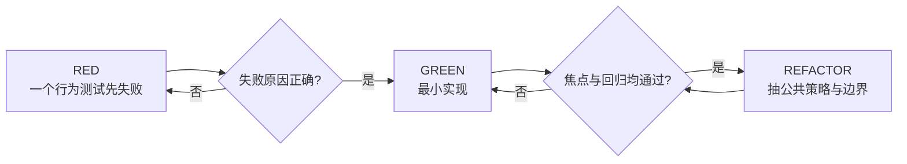
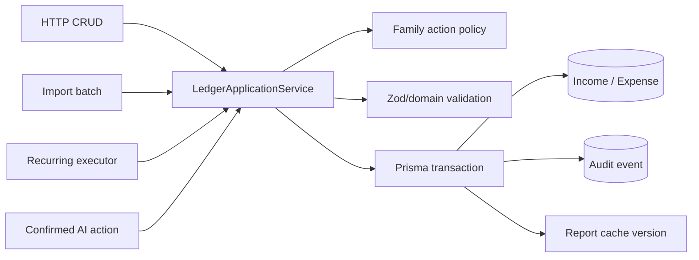

# HomeFinance 稳定化与新功能项目推进方案书

## 摘要

本方案以 2026-08-27 深度审查为基线，目标不是一次性重写，而是在保留现有功能资产的前提下，把 HomeFinance 从“功能较完整的原型”推进为“可验证、可运营、可扩展的家庭财务系统”。推荐路线是 **风险优先的模块化单体演进**：先用 TDD 固化越权、财务错误与重复写入的回归合同，再抽取统一授权、账本事务、报表查询和缓存版本服务；当安全与财务正确性门槛通过后，再启动多币种、审计轨迹、自动调度、对账和审批等新功能。

该方案给出 0–12 周稳定化计划及后续产品项目组合。时间为阶段窗口，不是承诺工期；实际人员、发布窗口和外部依赖未提供，因此不虚构人日和成本。每个阶段以可执行退出标准为准，而非以日历到期自动结束。

## 1. 项目目标与非目标

### 1.1 目标

1. 关闭所有 P0，并把 family tenant isolation 与 viewer read-only 变成统一、可参数化测试的系统合同。
2. 让三张财务报表、预算和目标使用明确的币种、期间和对账语义。
3. 让普通 CRUD、导入、定期执行和 AI 动作共享原子、幂等、可审计的记账入口。
4. 建立真正阻断回归的 CI：后端覆盖率、真实 DB、前端 component/e2e、lint/build 和安全依赖检查。
5. 降低 route/page 巨型文件、全表聚合、N+1 和主包 eager loading 带来的演进成本。
6. 形成可持续项目记忆：规则、Graphify、ADR、风险状态和测试证据随变更更新。

### 1.2 非目标

- Phase 0 不拆微服务、不更换 React/Express/Prisma、不重做全部 UI。
- 在账本与报表可信之前，不扩展更多 AI 自动写入能力。
- 不以提升覆盖率数字为目的编写无行为价值的测试。
- 不在没有汇率来源、估值日和追溯模型时“假装支持”多币种汇总。
- 不把 PWA 静态 shell 等同于离线财务数据能力。

## 2. 路线选择

| 方案 | 做法 | 优点 | 风险 | 结论 |
|---|---|---|---|---|
| A. 风险优先渐进演进 | 先测试复现 P0/P1，最小修复，再抽服务 | 反馈快、回归可控、保留现有资产 | 需要严格限制顺手重构 | **推荐** |
| B. 先做大规模架构重构 | 先重写 service/repository，再修功能 | 最终结构可能更整齐 | 风险无法被既有合同约束，周期长 | 不推荐 |
| C. 功能优先并行推进 | 一边修缺陷一边做新功能 | 表面路线快 | 扩大不可信数据入口和回归面 | 禁止用于 Phase 0/1 |

推荐 A 的原因是当前主要风险可以用具体行为测试复现，且系统仍是单体、模块边界可演进。先把正确行为写成失败测试，既能验证审查判断，也为后续抽取 policy/ledger/report service 提供安全网。

## 3. 项目工作流与治理

### 3.1 TDD 强制循环

每个缺陷一个最小行为测试；必须实际观察 RED，且失败因为缺陷存在而不是测试配置错误。GREEN 只实现该行为，REFACTOR 后重新运行完整相关套件。测试输出中的非预期 warning/error 视为失败。配置类变更若难以直接单测，应以容器配置检查、启动失败测试或安全 smoke 作为可执行合同。

### 3.2 Definition of Ready

- 有唯一问题 ID、用户影响、证据位置和严重度。
- 明确受影响角色、family boundary、数据表和失败/重试行为。
- 写出首个失败测试名称、fixture 和预期状态/数据副作用。
- 依赖项与回滚路径已确认；财务语义由产品/财务责任人确认。
- 若改变 API 或 schema，先确定兼容和迁移策略。

### 3.3 Definition of Done

- RED 与 GREEN 证据可在 PR/任务中复现。
- 相关 unit、integration、component/e2e、build、lint 均通过且输出干净。
- 权限变更覆盖 unauthenticated、non-member、viewer、member、admin。
- 写入变更覆盖校验失败、DB 失败、重试和并发；没有部分写入或重复写入。
- 财务变更覆盖边界日期、0 值、负值规则、币种和对账恒等式。
- 文档、项目记忆、ADR/风险状态和 Graphify 已更新。
- 生产可观测指标、告警和回滚步骤明确。

## 4. Phase 0：发布阻断与财务纠错（0–2 周）

### 4.1 Epic P0-A：统一写权限

**目标**：viewer 无法通过任何 HTTP、AI、导入、文件或定期入口产生状态变化。

| TDD 步骤 | 内容 |
|---|---|
| RED | 新增参数化 `viewer write matrix`：对 incomes、expenses、assets、liabilities、budgets、goals、recurring create/execute、files upload、import confirm、AI chat/execute-actions 发合法写请求，全部期望 403 |
| RED 副作用断言 | Prisma create/update/delete、MinIO upload、AI action executor 均未调用 |
| GREEN | 引入最小 `requireFamilyRole(['admin','member'])` 并接入所有写入口 |
| REFACTOR | 合并 route-local `checkFamilyAccess`，形成 request-scoped `FamilyAccessContext` 和声明式 action policy |
| 回归 | admin/member 保持可写，viewer 的 GET 保持可读，最后管理员不变量保持 |

建议测试文件：`backend/src/tests/family-permissions.test.ts`。不要复制十几份相似 case；使用 endpoint matrix 生成独立命名测试，并保留少量 route-specific payload fixture。

### 4.2 Epic P0-B：授权前置与租户安全缓存

**目标**：任何缓存命中都不能跳过 tenant policy，财务写入后读到新版本。

| TDD 步骤 | 内容 |
|---|---|
| RED-1 | 合法成员先预热 family A 报表；family A 非成员请求同 URL，必须 403，即使 Redis 中已有值 |
| RED-2 | family A 成员和 family B 成员请求相似 query，不得共享数据 |
| RED-3 | 创建一笔 expense 后立即请求 summary，必须看到新值，不等待 300 秒 TTL |
| GREEN | 把 family authorization middleware 放在 cache 前；key 使用规范化 family/query/version |
| REFACTOR | 建立 `ReportCache`，mutation commit 后递增 family finance version 或精准 invalidation |

建议测试文件：`backend/src/middleware/cache.authorization.test.ts` 和各账本 mutation 的 integration case。避免生产使用 `KEYS cache:*`；采用版本 key 可在 O(1) 写入成本下让旧 cache 自然过期。

### 4.3 Epic P0-C：报表运行时与数学一致性

**目标**：利润表请求携带 bearer token；三表不把错误当零值；现金流分项与总额守恒。

| TDD 步骤 | 内容 |
|---|---|
| RED-1 frontend | render `IncomeStatementSection` 后断言调用 `reportService.getIncomeStatement` 或请求含 `Authorization: Bearer ...`；401 时显示错误而不是 0 |
| GREEN-1 | 删除裸 fetch，统一使用 API service；引入 loading/error/empty/data 四态 |
| RED-2 backend | other income 100、other expense 30 时，`netCashFlow` 包含净 70；所有显示分区净额之和等于 total |
| GREEN-2 | 明确 other net 并计入 total；financing 未实现时标记 unavailable 或实现真实分类 |
| REFACTOR | 把 report formula 抽成纯函数，route 只做授权、query 与 response |

建议前端测试栈为 Vitest + React Testing Library + MSW，浏览器保留 Playwright 旅程作为集成证据。

### 4.4 Epic P0-D：依赖与部署止血

**目标**：处理当前高危 advisory，禁止默认弱生产拓扑。

- 先升级 react-router 7.18.2、Multer 2.x 及可直接修复的 postcss/nanoid 链；每组升级单独 lockfile diff 和回归。
- 为 auth register/login 增加 Redis-backed rate limit，并在 Redis 降级时选择保守的进程内限制或明确告警策略。
- Compose 使用 required env/secrets，不允许 production profile 回退默认密码；数据服务只挂 internal network，不发布 host ports。
- 固定 MinIO 与其他镜像 tag/digest，加入配置校验和安全 smoke。
- 加 Helmet/CSP/HSTS 等响应头；若短期保留 localStorage token，CSP 为 P0-D 的必要缓解，后续评估 httpOnly cookie + CSRF 方案。

**Phase 0 退出门槛**：2 个 P0 关闭；viewer endpoint matrix 全绿；cache non-member 测试全绿；利润表 bearer 与错误态 e2e 全绿；cash-flow reconciliation 全绿；当前 high advisory 已修复、隔离或有书面接受；前后端 build/test/lint 通过。

## 5. Phase 1：可信账本与质量体系（3–6 周）

### 5.1 Epic P1-A：Ledger Application Service

建立单一记账应用服务，供普通 CRUD、import、recurring、AI 调用：

服务输入应包含 actor、family、source、idempotencyKey、effectiveDate 和 action payload；输出包含 entry id、audit id 和是否 deduplicated。先对每个现有入口写 characterization/desired behavior test，再逐个迁移，避免一次性替换全部 route。

### 5.2 Epic P1-B：Recurring exactly-once

首个 RED：冻结时间并并发执行同一 due rule 两次，只产生一条 ledger entry。补充 inactive、future nextDate、past endDate 都拒绝执行。实现可采用事务内条件更新/唯一 `(recurringId, scheduledFor)` execution 记录；成功创建 entry 与推进 schedule 必须同事务。自动调度器在这一 Epic 完成前不立项，否则会自动放大重复风险。

### 5.3 Epic P1-C：Import batch

定义 `ImportBatch` 与 row fingerprint/idempotency。上传设置文件字节、行数和字段长度上限；preview 完成全部 validation，confirm 只接受服务端 batch token，防止客户端篡改预览结果。推荐整批原子提交；若产品要求部分成功，则每行状态必须持久化并可安全重放。首个 RED：第 N 行 DB 失败时，整批 0 条写入；相同 batch 重试仍只有一份结果。

### 5.4 Epic P1-D：预算、目标与时间语义

- 用纯函数实现 monthly/quarterly/yearly current window，先覆盖月初、月末、闰年、时区和显式 endDate。
- 选择统一业务时区或存储 family timezone；API 日期区间使用显式 inclusive/exclusive 规则。
- 目标增加 baseline/current contribution 或 goal-account allocation，不再让所有目标共享全局净值。
- 财务 query 使用 DB `aggregate/groupBy`，预算一次查询返回 category totals。

2026-09-03 进度记录：P1-F-01/02 的决策已由 ADR-0005 Accepted；`1d2872b` 已将 Family 时区以 additive migration、IANA 校验和创建后不可变触发器落地，`3d5db10` 已提供 family-local half-open PeriodWindow 纯服务并通过上海、闰年和 DST 测试。预算/报表/目标/币种/对账接入仍是后续门禁，不能据此宣称财务语义整体闭环。

### 5.5 Epic P1-E：测试与 CI

| 门禁 | Phase 1 目标 |
|---|---|
| 后端 coverage | CI 显式 `--coverage`；全局先恢复并维持 ≥60%，改动行更高；不得通过排除业务文件达标 |
| 权限 | endpoint role matrix 100% 覆盖 |
| DB | ledger/recurring/import/cache version 使用真实 PostgreSQL integration |
| 前端 | 新增 component/service test；关键 5 条 Playwright 旅程 |
| 静态质量 | 18 个 Hook warning 清零；新 warning 视为失败 |
| 输出卫生 | 测试无非预期 console warning/error |

**Phase 1 退出门槛**：所有交易入口统一走 Ledger service；recurring/import 并发与重试合同全绿；预算 period 生效；CI 真实执行 coverage；前端关键旅程可重复；项目记忆与 ADR 更新。

## 6. Phase 2：性能、可观测性与生产化（7–12 周）

### 6.1 查询与前端性能

- 报表 totals/category totals 下推 PostgreSQL aggregate/groupBy；返回图表所需字段，不回传完整行集。
- 所有列表默认 bounded pagination，兼容旧调用的无分页模式设废弃期。
- compare 用批量 group by 代替每家庭 4 查询；file presigned URL 按需/分页生成。
- `App.tsx` 使用 route-level lazy loading；AI、Reports/Recharts、import/export 按功能拆包。
- 为性能建立真实数据规模 fixture。当前没有生产数据，故不写虚假的 p95 基线；在 staging 测量后再设 SLO。

### 6.2 可观测性与运营

- 结构化日志携带 requestId、userId（脱敏）、familyId、route、status、duration、cache result、idempotency key。
- 指标至少包括 4xx/5xx、auth deny、cache hit/miss、stale-version miss、DB query latency、AI latency/cost/error、OCR path、import rows、recurring duplicate prevented。
- 对权限异常峰值、重复写入冲突、report reconciliation failure、Redis/MinIO outage 建告警。
- 健康检查拆 liveness/readiness；readiness 体现 DB 和关键依赖状态，降级服务在 UI/API 明示。

### 6.3 生产部署与恢复

- internal network、secrets、固定镜像、非 root 容器、只读文件系统（可行处）、资源 limits。
- PostgreSQL/MinIO 备份与恢复演练；Redis 明确作为可丢缓存，不承载唯一事实。
- 数据迁移采用 expand/migrate/contract，先兼容读写再回填；每次 migration 有回滚或 forward-fix 方案。
- 建立 staging 全栈 Compose/部署 smoke，覆盖重启、Redis/MinIO 失效、AI 超时和数据库迁移。

**Phase 2 退出门槛**：查询和 bundle 有测量前后对比；SLO/告警上线；生产 profile 无默认凭据与公开数据端口；恢复演练有记录；故障降级用户可见且不产生错误财务事实。

## 7. Phase 3：新功能项目组合（12 周后）

| 优先序 | 项目 | 用户价值 | 前置依赖 | 首个验证问题 |
|---:|---|---|---|---|
| 1 | 不可变审计轨迹与对账 | 知道谁在何时为何改变账目，可发现漏账/重复 | Ledger service、actor/action audit | 任意报表数值能否追溯到 entry 与变更事件？ |
| 2 | 自动定期调度 | 无需手工点击执行固定收支 | exactly-once recurring、job observability | worker 重启/并发时仍只执行一次吗？ |
| 3 | 多币种与历史汇率 | 正确管理外币资产负债与净值 | base currency、valuation date、FX source | 同一 as-of date 是否可重放相同估值？ |
| 4 | 目标专项贡献 | 目标进度反映真实储蓄/投资贡献 | goal baseline/allocation model | 多目标是否互不污染且可审计？ |
| 5 | 家庭审批与通知 | 大额支出/AI 动作多人确认 | audit、role policy、notification infra | viewer/member/admin 的审批权是否明确？ |
| 6 | 离线记账与同步 | 弱网环境可安全录入 | idempotency、conflict model、安全本地存储 | 多设备冲突是否可解释、可恢复？ |

“不可变审计轨迹与对账”优先于更多预测/生成式 AI，因为它既提升用户信任，也为调试 AI 自动动作、导入和定期任务提供基础。多币种不应只加汇率 API；它是估值模型项目，需要定义 base currency、rate source、rate timestamp、rounding、历史重算和缺失汇率行为。

每个新功能必须独立经过需求探索、设计审批、书面 spec、实施计划和 TDD，不把上表直接视为已批准的详细设计。

## 8. 交付组织与依赖

建议按四条工作流组织，但在小团队中可以由同一人兼任：

| 工作流 | 主要责任 | 不能独立决定的事项 |
|---|---|---|
| Security & Platform | policy、auth、cache、Compose、依赖 | viewer 产品语义、token 策略重大改变 |
| Finance Domain | report formula、period、currency、ledger | 会计分类、base currency、历史重算规则 |
| Client Experience | API client、状态、a11y、tests、bundle | 财务缺失值和错误态文案 |
| Quality & Operations | CI、integration、observability、release | 风险接受、SLO 与发布门槛 |

依赖顺序：Policy 先于所有写入口迁移；Ledger service 先于 recurring/import/AI 重构；exactly-once 先于自动调度；base currency 模型先于多币种 UI；错误状态模型先于离线缓存。

## 9. 风险与应对

| 项目风险 | 早期信号 | 应对 |
|---|---|---|
| “修权限”只补个别 route | endpoint matrix 仍有漏项 | 以 action/role matrix 作为唯一退出标准 |
| 大重构导致行为漂移 | RED 测试不明确或一批测试同时改 | 每个行为独立 TDD，按入口逐个迁移 |
| 追求覆盖率产生低价值测试 | mock 调用断言多、真实行为少 | 优先 integration 与状态/副作用断言 |
| 财务语义由工程猜测 | 分类/期间讨论反复 | 指定财务产品 owner，形成 ADR 和例子表 |
| 依赖升级引入破坏变更 | lockfile 大范围变化、e2e 缺失 | 分组升级、固定版本、关键旅程回归 |
| Redis/MinIO 降级掩盖错误 | 只有 console error，无用户状态 | readiness、指标、UI degraded state |
| 新功能挤占稳定化 | Phase 0 未退出就开启 Phase 3 | 发布治理明确 blocker，不并行扩大写入口 |

## 10. 里程碑评审材料

每个阶段评审只接受可复现证据：测试名称与 RED/GREEN 输出、覆盖率摘要、权限矩阵、财务 reconciliation fixture、浏览器旅程截图/trace、依赖审计、性能基线对比、部署配置扫描和恢复演练记录。报告中的“已修复”必须链接到这些证据及对应 commit。

项目看板建议使用以下状态：`Evidence confirmed` → `RED reproduced` → `GREEN minimal fix` → `Refactored` → `Regression verified` → `Released/Observed`。风险只有在生产/目标环境验证后才关闭；代码合并不等于风险关闭。

## 11. 首批可直接创建的任务

1. `SEC-001 viewer write endpoint matrix`：参数化全部 family mutation。
2. `SEC-002 cached report authorization regression`：成员预热、非成员命中仍 403。
3. `FE-001 income statement authenticated request`：service client + 可见错误态。
4. `FIN-001 cash-flow reconciliation`：other flows 进入 net total。
5. `CACHE-001 write-through version invalidation`：写后立即读新报表。
6. `FIN-002 budget period windows`：monthly/quarterly/yearly 边界纯函数。
7. `DATA-001 recurring exactly-once`：并发执行仅一条账目。
8. `DATA-002 atomic import batch`：中途失败零部分写入、重试不重复。
9. `QUAL-001 coverage in CI`：显式 coverage 命令并恢复 ≥60%。
10. `FE-002 frontend test harness`：Vitest/RTL/MSW + 关键 Playwright 旅程。

建议前四项构成第一个发布阻断修复批次；第五至第八项在其测试合同稳定后进入同一稳定化版本；第九和第十项不能推迟到功能开发结束，因为它们是后续安全重构的基础设施。

## 12. 结论

该推进方案的中心不是增加流程，而是把每个高风险判断转化为可执行合同。HomeFinance 现有架构足以渐进改善；真正需要改变的是权限和账本策略的分散、测试门禁的非强制，以及以页面/endpoint 存在代替功能闭环的完成定义。

在 0–6 周范围内关闭 P0、统一 Ledger 与 Policy、落实 coverage 和前端旅程，项目即可从“功能原型”进入“生产候选工程”。7–12 周的性能、观测和部署工作完成后，才具备安全承接自动调度、多币种、审计对账和审批协作的基础。
