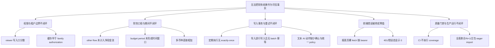
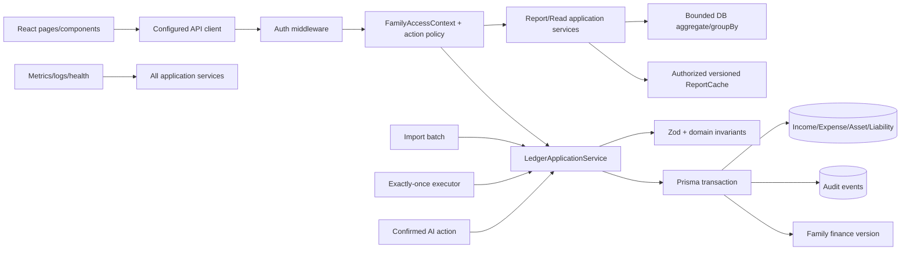

# HomeFinance 综合整改与后续项目推进方案

## 执行摘要

本方案以 `main` 分支提交 `b103e4221ae58d2cd09ee586d69f3cf90c79c146` 的深度审查为基线，并吸收 6 个领域分析流的证据。结论是：HomeFinance 已具备家庭财务产品的主要功能骨架，但当前仍是“功能较完整的模块化单体原型”，不应按可承载真实家庭财务数据的生产系统发布。发布阻断来自两类不同性质的失效：viewer 可通过多个写入入口改变状态；报表缓存可在家庭授权之前返回命中数据。与此同时，现金流、预算、币种、重复写入、导入原子性以及前端认证错误态等问题，会让“显示成功”不等于“财务事实可信”。

推荐采用风险优先的模块化单体演进路线：先用 TDD 把越权、跨家庭缓存、财务对账和错误态固化为失败测试，再以最小 GREEN 修复；随后抽取统一 Family Policy、Ledger Application Service、Report Query/Formula Service 和版本化缓存；最后再进入性能、部署、审计、多币种、自动调度和审批等新项目。当前不建议拆微服务、重写前端或扩展更多 AI 自动写入能力。

本方案中的阶段窗口是治理窗口而非工期承诺。人员数量、生产负载、财务口径负责人、目标部署拓扑和外部依赖尚未提供，故不虚构人日、成本、生产 p95 或发布日期。任何风险只有在目标环境中由可复现证据关闭，不能因代码合并或文档更新自动标记为已解决。

## 1. 范围、证据与事实边界

### 1.1 审查基线

- 仓库：`D:\Repo\Qz_Private\HomeFinance`
- 基线：`main` / `b103e4221ae58d2cd09ee586d69f3cf90c79c146`
- 功能范围：认证、家庭协作、收入/支出、资产/负债、三表、预算、目标、定期记账、导入/导出、文件、AI/OCR、比较。
- 架构范围：React 19 + Vite SPA、Express + TypeScript API、Prisma/PostgreSQL、Redis、MinIO、外部 AI/OCR、Docker Compose、GitHub Actions。

### 1.2 已验证、推断和未验证

| 类型 | 结论 |
|---|---|
| 已验证事实 | 前后端 build 通过；默认 Jest 21 suites/215 tests 通过；coverage 为 statements 53.78%、branches 39.72%、functions 55.21%、lines 54.07%，低于配置的 60% 门槛；前端 lint 0 error/18 warnings；主 JS 854.60 kB minified/237.44 kB gzip。 |
| 已验证事实 | `reports.ts` 的路由顺序为认证、中间件缓存、handler；缓存 key 来自 URL，family membership 检查在 handler 内。 |
| 已验证事实 | 多个写入口只检查成员存在，不统一拒绝 viewer；`Income`/`Expense` 等金额存储为 Decimal，但资产/负债存在 currency 字段。 |
| 合理推断 | 若合法成员先预热某 family 的报表，已认证非成员可以利用相同 URL 命中缓存；需要回归测试在目标 app/Redis 拓扑中最终确认。 |
| 未验证 | Docker、Redis、MinIO 本机未运行；完整 Compose、真实对象存储、生产数据规模、真实 p95、备份恢复和依赖升级后的兼容性均未在本地确认。 |

完整证据和原始风险说明见 [`2026-08-27-homefinance-deep-audit-report.md`](./2026-08-27-homefinance-deep-audit-report.md)；既有阶段路线见 [`2026-08-27-homefinance-improvement-program.md`](./2026-08-27-homefinance-improvement-program.md)。

## 2. 六个领域并行分析索引

| 流程 | 输出文件 | 核心问题 | 集成方式 |
|---|---|---|---|
| 安全与权限 | `parallel-analysis/01-security-authorization.md` | viewer、租户隔离、缓存授权、认证、Compose、供应链 | 决定 Phase 0 发布阻断与 policy 设计 |
| 财务正确性 | `parallel-analysis/02-financial-correctness.md` | 三表、预算、币种、目标、日期和对账恒等式 | 决定财务语义 ADR、公式服务和数据迁移 |
| 数据一致性 | `parallel-analysis/03-data-integrity.md` | Ledger、recurring、import、AI、幂等、事务和缓存失效 | 决定 Phase 1 写入服务与 schema 扩展 |
| 前端体验 | `parallel-analysis/04-frontend-quality.md` | API client、错误态、a11y、PWA、bundle、Hook、测试 | 决定客户端契约和关键旅程门禁 |
| 架构运维 | `parallel-analysis/05-architecture-operations.md` | 单体边界、查询、CI、可观测、部署、恢复 | 决定 Phase 2 生产化与容量验证 |
| 知识治理 | `parallel-analysis/06-knowledge-governance.md` | Graphify、记忆、ADR、风险生命周期与路线依赖 | 决定持续查看和变更治理机制 |

并行执行记录：本轮已为六个领域分别建立独立 Agent 分工并发起执行；安全与权限、数据一致性两个 Agent 最终成功完成并返回报告，其余四个任务因平台并发上限或连接中断未稳定返回。为避免把失败任务包装成已完成的 Agent 结论，财务正确性、前端体验、架构运维和知识治理四份分域文档由主线程按相同范围、证据等级和 TDD 模板完成，并在综合前重新核对源码。各文件的价值取决于可复现证据，不取决于作者是 Agent 还是主线程。

## 3. 问题树与目标架构

### 3.1 问题树

### 3.2 目标架构

目标不是微服务化，而是在现有模块化单体内部明确四个不可绕过的边界：所有 family 资源先通过 policy；所有派生报表先通过明确公式和 query service；所有产生账目的入口通过 Ledger service；所有缓存只是授权后的优化且与 family 数据版本绑定。

## 4. 方案比较与推荐

| 方案 | 做法 | 优点 | 主要风险 | 决策 |
|---|---|---|---|---|
| A 风险优先渐进演进 | 先为 P0/P1 写 RED，最小修复，再抽 Policy/Ledger/Report service | 保留现有资产，行为可回归，适合当前单体 | 需要严格控制顺手重构 | **推荐** |
| B 先大重构 | 先重写 route/service/repository，再补功能 | 目标结构一次成型 | 既有缺陷未被合同锁定，行为漂移和迁移风险高 | 不推荐 |
| C 功能优先并行 | 修缺陷同时继续扩 AI、离线、自动调度 | 表面交付速度快 | 放大不可信写入和回归面 | Phase 0/1 禁止 |

选择 A 的判断依据是：已发现风险都可以被 endpoint、财务 fixture、并发和前端状态测试复现；现有 Prisma、服务和 CI 基础足以承载渐进演进；真正的瓶颈是策略分散和门禁失效，而不是服务数量不足。

## 5. 统一风险处置矩阵

严重度仅表示风险处置优先级；“退出”必须由测试、运行时或部署证据确认。

| ID | 级别 | 领域 | 处置动作 | 首个 RED 合同 | 依赖 | 退出门禁 |
|---|---|---|---|---|---|---|
| HF-SEC-001 | P0 | 安全 | 所有 mutation 接入统一 action policy，viewer 403 且零副作用 | 参数化 incomes/expenses/assets/liabilities/budgets/goals/recurring/files/import/AI 写入口 | 无 | viewer matrix 全绿；admin/member 可写、viewer GET 可读 |
| HF-SEC-002 | P0 | 安全/缓存 | family authorization 早于 cache；key 含 family/query/version | A 预热后，A 非成员同 URL 必须 403；A/B 不共享 | Policy 先 | Redis 命中也不能绕过 policy；跨 family 负向测试全绿 |
| HF-CACHE-001 | P1 | 一致性 | commit 后递增 family finance version 或精确失效 | 写 expense 后立即读 summary 得到新值 | SEC-002 | 无等待 TTL 的写后读测试全绿 |
| HF-FE-001 | P1 | 前端 | 所有报表调用配置 API client；401 显示错误而非 0 | Income statement 请求含 bearer，401 渲染 error state | API contract | component + Playwright 旅程全绿 |
| HF-FIN-001 | P1 | 财务 | 抽现金流纯函数并计入全部显示分类 | other income 100、other expense 30，net 增加 70 | 财务口径确认 | 分项净额守恒 |
| HF-FIN-002 | P1 | 财务 | period 纯函数生成月/季/年窗口；DB 按窗口聚合 | 冻结时间，跨周期支出不能进入当前预算 | 日期语义 ADR | 边界日期和三种 period 全绿 |
| HF-DATA-001 | P1 | 一致性 | execution key/唯一约束 + 条件推进 + 单事务 | 同一 due rule 并发两次只生成一条 | Policy/Ledger | 并发、inactive、future、endDate 全绿 |
| HF-DATA-002 | P1 | 一致性 | upload 限制 + server batch + 整批事务/row fingerprint | 第 N 行失败整批 0 条；重试不重复 | Ledger/schema migration | size/row/field limit、失败回滚、重试全绿 |
| HF-FIN-003 | P1 | 财务 | 短期拒绝伪汇总或按币种分组；长期引入 base/FX/as-of | CNY+USD 汇总不得输出无换算总额 | 财务语义 ADR | 无不可解释的跨币种 total |
| HF-SEC-003 | P1 | 平台安全 | production profile required secrets、internal data network、固定镜像 | 缺 secret 或公开数据端口的配置检查必须失败 | 部署环境确认 | Compose security smoke 全绿 |
| HF-AUTH-001 | P1 | 认证 | login/register rate limit、密码策略、短 token/撤销策略 | 连续失败请求触发 429；弱密码拒绝；logout 后 token 行为明确 | Redis/产品决策 | auth negative tests 和会话策略全绿 |
| HF-AI-001 | P1 | AI/安全 | viewer 禁止 mutation；文本输出仅 proposal，显式确认后走 Ledger | 未确认 action 不落库；viewer executor 403 | Policy/Ledger | malformed/replay/concurrency/confirmation 全绿 |
| HF-QUAL-001 | P1 | 质量 | CI 显式 coverage、前端 component/e2e、警告治理 | CI 命令真实执行 coverage，前端首个失败组件测试 | 测试栈决策 | build/test/lint/coverage/e2e 门禁全绿 |
| HF-PERF-001 | P1 | 性能 | DB aggregate/groupBy、bounded pagination、批量 compare | fixture 规模下 query count 不随类别/家庭乘法增长 | 公式/服务边界 | 测量报告和 query budget 有证据 |
| HF-SUPPLY-001 | P1 | 供应链 | 分组升级 router/Multer/postcss/nanoid 等并逐组回归 | 依赖审计结果被测试/配置门禁捕获 | 兼容矩阵 | high advisory 已修复、隔离或书面接受 |
| HF-FE-002 | P1 | 前端性能 | route lazy loading、Hook warning 清零 | 路由切换不加载无关页面；warning 数量不增加 | 前端测试 harness | lint clean、bundle 对比有真实数据 |
| HF-PWA-001 | P2 | 产品 | 先准确改文案；离线写入另立项目 | 无网络时动态财务数据不被伪装为可用 | 同步/冲突模型 | 仅在安全缓存和冲突测试后宣称离线 |
| HF-A11Y-001 | P2 | UX | label/aria、skip link、focus、aria-live | 每个报表控件有 accessible name | 前端组件测试 | 自动化 a11y + 键盘旅程全绿 |
| HF-DATA-003 | P2 | 数据展示 | orderBy date/createdAt 后再取 recent | 输入乱序时返回真正最近 N 条 | Report query service | service test + API test 全绿 |
| HF-GOAL-001 | P2 | 财务产品 | 明确 goal contribution/allocation，不再共享全局净值 | 两个目标的贡献互不污染 | 财务语义 ADR | 多目标 fixture 可解释可追溯 |
| HF-TIME-001 | P2 | 财务平台 | family timezone/UTC contract，统一 inclusive/exclusive | 非 UTC 月末 fixture 窗口稳定 | 日期语义 ADR | server/client/timezone matrix 全绿 |
| HF-ARCH-001 | P2 | 架构 | app/server 分离，逐步拆大 route/page | import app 不监听端口 | 无行为变化 | route tests 无副作用；拆分后回归全绿 |

## 6. 分阶段执行计划

### 6.1 Phase 0：发布阻断与财务纠错

目标是让系统“不越权、不泄露、不把明显错误当事实”。范围严格限制在 policy/cache/report formula/frontend auth/deployment stopgap，不拆微服务、不重写全部 UI。

#### Epic P0-A：统一写权限

**文件范围：** 新增 `backend/src/middleware/authorization.ts`、`backend/src/policies/familyPolicy.ts`、`backend/src/tests/family-permissions.test.ts`；修改 `backend/src/routes/incomes.ts`、`expenses.ts`、`assets.ts`、`liabilities.ts`、`budgets.ts`、`goals.ts`、`recurring.ts`、`files.ts`、`import.ts`、`ai.ts`，后续把 route-local `checkFamilyAccess` 收敛到 policy。

**TDD：**

1. RED：参数化合法 payload，使用 viewer token 调用每个写入口；断言 HTTP 403，且 Prisma mutation、MinIO upload、AI action executor 均未调用。运行 `cd backend; npm test -- src/tests/family-permissions.test.ts --runInBand`，预期当前至少一个入口返回 2xx 或触发副作用。
2. GREEN：先引入 `requireFamilyRole(['admin', 'member'])`，接入全部 mutation，保留现有 GET 行为。
3. REFACTOR：将成员查询结果包装为 request-scoped `FamilyAccessContext`，声明 resource/action/allowedRoles，不再复制 route-local role 判断。
4. 退出：unauthenticated/non-member/viewer/member/admin 五类矩阵覆盖；viewer 的所有 HTTP、上传、导入、recurring、AI mutation 403；admin continuity 测试继续通过。

#### Epic P0-B：授权前置与版本化缓存

**文件范围：** 修改 `backend/src/routes/reports.ts`、`backend/src/middleware/cache.ts`；新增 `backend/src/services/reportCache.ts`、`backend/src/middleware/cache.authorization.test.ts`，并在 mutation 服务/路由加入 version bump。

**TDD：**

1. RED：成员预热 family A summary；非成员请求同 URL，断言 403；A/B 成员使用规范化相似 query，断言响应不交叉；expense commit 后立即读 summary，断言新值。运行 `cd backend; npm test -- src/middleware/cache.authorization.test.ts --runInBand`，预期当前 cache middleware 可能直接 200。
2. GREEN：把 family authorization 放到 cache 前；key 使用 `familyId + canonicalQuery + familyFinanceVersion`，不以 cache 作为授权来源。
3. REFACTOR：建立 `ReportCache` 接口，commit 后 O(1) 递增版本，让旧 key 自然失效；禁止生产使用 `KEYS cache:*` 扫描。
4. 退出：Redis 命中/未命中、Redis 不可用、跨 family、写后读均有测试；cache 读之前有 policy 证据。

#### Epic P0-C：报表运行时和现金流守恒

**文件范围：** 修改 `frontend/src/pages/ReportsPage.tsx`、`frontend/src/pages/IncomeStatementPage.tsx`、`frontend/src/services/reportService.ts`；新增前端测试 harness 和 `frontend/src/pages/*.test.tsx`；修改 `backend/src/routes/reports.ts`、新增 `backend/src/services/reportFormulas.ts` 与其测试。

**TDD：**

1. RED：render income statement，断言调用 configured report service/带 Authorization；mock 401，断言出现错误状态且不显示 0。后端构造 other income=100、other expense=30，断言 `netCashFlow` 计入 70 且分项净额守恒。
2. GREEN：删除裸 `fetch`；统一 loading/error/empty/zero/data 四态；现金流公式补齐 other 分类。
3. REFACTOR：route 只负责 auth/query/response，公式为纯函数，明确 financing 未实现时返回 unavailable 而不是 0。
4. 退出：浏览器冒烟从 mocked API 升级为可重复 component/Playwright；所有报表数值可区分未知、空集合和真实零。

#### Epic P0-D：依赖与部署止血

**文件范围：** `backend/package.json`、`backend/package-lock.json`、`frontend/package.json`、`frontend/package-lock.json`、`docker-compose.yml`、`.env.example`、`backend/src/routes/auth.ts`、`backend/src/config/security.ts`、CI workflow。

**TDD/配置合同：** 分组升级依赖，每组先记录当前 advisory，再运行 build、相关测试、import/export/OCR 旅程；配置检查断言 production profile 在缺少 required secrets、使用默认密码或暴露 PostgreSQL/Redis/MinIO host ports 时失败。认证负向测试覆盖登录限流、弱密码和 token 生命周期。不得用 `npm audit fix --force` 作为唯一方案。

**Phase 0 退出：** 两个 P0 关闭；viewer matrix、cache non-member、bearer/error state、cash-flow reconciliation 全绿；high advisory 已修复、隔离或书面接受；前后端 build/test/lint 通过。

### 6.2 Phase 1：可信账本与质量体系

#### Epic P1-A：Ledger Application Service

**文件范围：** 新增 `backend/src/services/ledgerApplicationService.ts`、`backend/src/services/ledgerTypes.ts`、`backend/src/services/ledgerApplicationService.test.ts`；逐步修改 income/expense CRUD、`import.ts`、`recurring.ts`、`aiActions.ts`。输入至少包含 `actorId`、`familyId`、`source`、`idempotencyKey`、`effectiveDate` 和 domain payload；输出包含 entry id、audit id 和 deduplicated 状态。

**TDD 顺序：** 先为普通收入/支出 characterization；再写同一 idempotency key 只产生一条记录；再写 family mismatch、viewer actor、校验失败和 DB 失败零部分写入。GREEN 只包住一个现有入口，逐入口迁移；REFACTOR 再合并 audit/version/invalidation。

#### Epic P1-B：Recurring exactly-once

**文件范围：** `backend/src/routes/recurring.ts`、`backend/src/services/recurringService.ts`、`backend/prisma/schema.prisma` 和新 migration、真实 DB integration tests。

**TDD：** 冻结时间并发执行同一 rule 两次，断言仅一条 ledger entry、schedule 只推进一次；补 inactive、future nextDate、past endDate。推荐新增 execution record，唯一键为 `(recurringId, scheduledFor)`，创建 entry、execution record、推进 schedule 同一 Prisma transaction；若唯一冲突，返回 deduplicated 而不是 500。

#### Epic P1-C：Import batch

**文件范围：** `backend/src/routes/import.ts`、`backend/src/services/importService.ts`、schema/migration、`backend/src/routes/import.test.ts` 与真实 DB 测试。

**TDD：** 先验证字节、行数、字段长度上限；预览完成服务端 validation；第 N 行写入失败断言整批 0 条；同一 batch confirm 重试只保留一份。推荐 `ImportBatch`/row fingerprint + 服务端 batch token + `createMany`/transaction；如产品坚持部分成功，必须持久化每行状态并允许安全重放，不能保留当前隐式部分成功。

#### Epic P1-D：预算、目标、币种和时间语义

**文件范围：** `backend/src/routes/budgets.ts`、`goals.ts`、`reports.ts`、`compare.ts`、`backend/prisma/schema.prisma`、对应 frontend services/pages；新增 `backend/src/services/periodWindow.ts`、`reportFormulas.ts` 测试和 ADR。

**TDD：** 冻结时钟覆盖月初/月末/闰年/时区；MONTHLY/QUARTERLY/YEARLY 只读取当前窗口；目标 fixture 中两项目标互不污染；混合币种不得生成无换算 total。短期可选择禁止非 base currency 或按 currency 分组；长期再加入 `Family.baseCurrency`、历史汇率、rate timestamp、rounding、valuationDate 和缺失汇率策略。财务 owner 必须在 ADR 中确认会计分类和历史重算。

#### Epic P1-E：测试与 CI

**文件范围：** `.github/workflows/ci.yml`、`backend/jest.config.js`、backend tests、`frontend/package.json`、frontend test config、component/e2e tests。

**TDD/门禁：** CI 的 backend 命令改为 `npm test -- --runInBand --coverage` 并实际失败于当前 coverage；补集成 DB job、权限 matrix、真实事务测试；前端引入 Vitest/React Testing Library/MSW（或团队批准的等价栈），Playwright 覆盖登录、家庭切换、记账后报表、viewer、AI/OCR 确认；逐条清零 18 个 Hook warnings。禁止用排除业务文件提高数字。

**Phase 1 退出：** 所有交易入口统一走 Ledger；recurring/import 并发重试合同全绿；budget period 生效；CI 真正执行 coverage；前端关键旅程可重复；project memory、ADR、风险台账和 Graphify 已更新。

### 6.3 Phase 2：性能、可观测与生产化

#### Epic P2-A：查询与前端性能

修改 `reports.ts`、`budgets.ts`、`compare.ts`、列表 route 和 `frontend/src/App.tsx`。将全表 `findMany + reduce` 改为可解释的 `aggregate/groupBy`；列表默认 bounded pagination；compare 采用批量查询；路由使用 lazy import，Reports/Recharts、AI、导入导出按需拆包。先建立可重复数据规模 fixture、query count/响应大小测量和 bundle report，再设目标，不写未测量的 p95。

#### Epic P2-B：可观测性

新增 request id、结构化日志和 metrics adapter，记录脱敏 user/family、route/status/duration、cache hit/miss、DB latency、AI/OCR latency/error、import rows、recurring duplicate prevented、reconciliation failure。区分 liveness/readiness；Redis/MinIO 降级必须在 API/UI 可见，不能只写 console error。

#### Epic P2-C：部署、备份与恢复

修改 Compose、部署 workflow 和运维文档：internal network、secrets、固定镜像 tag/digest、非 root、资源限制、仅公开 80/443；PostgreSQL/MinIO 备份恢复演练；Redis 只承载可丢缓存；staging smoke 覆盖重启、DB migration、Redis/MinIO 故障、AI timeout。Phase 2 退出要求有性能对比、SLO/告警、生产 profile 配置扫描和恢复演练记录。

## 7. Phase 3：新功能立项组合

只有 Phase 0/1 退出且 Phase 2 的基础生产门禁具备后，才允许扩大写入口。

| 顺序 | 项目 | 用户价值 | 前置条件 | 首个验收问题 |
|---:|---|---|---|---|
| 1 | 不可变审计轨迹与对账 | 追溯谁在何时为何改变账目，发现漏账/重复 | Ledger、actor/action audit、report reconciliation | 任意报表数值能否追到 entry 和变更事件？ |
| 2 | 自动定期调度 | 无需手工点击固定收支 | recurring exactly-once、job observability | worker 重启/并发是否仍只执行一次？ |
| 3 | 多币种与历史汇率 | 正确处理外币资产负债和净值 | base currency、FX source、valuation date、rounding | 同一 as-of date 是否可重放相同估值？ |
| 4 | 目标专项贡献 | 目标进度反映真实储蓄/投资贡献 | goal allocation/baseline | 多目标是否互不污染、可解释、可审计？ |
| 5 | 家庭审批与通知 | 大额支出/AI 动作多人确认 | policy、audit、通知基础设施 | 各角色审批权是否明确且不可绕过？ |
| 6 | 离线记账与同步 | 弱网下安全录入 | idempotency、conflict model、安全本地存储 | 冲突是否可解释、可恢复、可清除？ |

每个项目必须另行通过需求探索、财务/安全 ADR、书面 spec、TDD 计划和独立风险评审；表格不是自动批准的详细设计。

## 8. Schema/API 迁移与兼容策略

采用 expand → migrate → contract：

1. **Expand：** 新增可空字段/表（如 family finance version、import batch、recurring execution、audit event），先部署兼容读写代码，不删除旧字段。
2. **Backfill：** 在 staging 和备份副本上验证 row count、唯一性、金额/日期转换和报表 reconciliation；大表按批处理并可暂停。
3. **Dual read/write：** 在可观测期间同时写旧/新路径，读新路径失败时只允许明确的兼容 fallback，不得默默改变财务结果。
4. **Contract：** 所有客户端迁移后再删除旧 API/字段；先返回 deprecation header 和文档，保留可回滚窗口。

所有 migration 必须有向前修复方案和备份恢复方案。财务历史数据不允许通过不可追踪的批量覆盖修改；任何重算须保存版本、口径、汇率来源和执行时间。

## 9. 回滚与故障策略

| 变更 | 回滚方法 | 不允许的做法 |
|---|---|---|
| Policy/缓存 | feature flag 关闭新 cache read path，但保留授权；旧缓存不可作为授权来源 | 回滚到绕过授权的缓存顺序 |
| Ledger 迁移 | 入口级 flag 回到旧 handler；新写入带 source/version 可审计 | 同一请求同时落两份账目 |
| Schema | expand 结构保留；contract 延后；恢复前先停止写入或只读 | 直接删除新列/新表造成不可逆丢失 |
| 依赖升级 | 以 lockfile 分组回退并运行对应回归 | `npm audit fix --force` 后无兼容证据 |
| 前端 API/状态 | 保留旧 service adapter 一段兼容期；401/error 状态优先于零值 | 将请求失败 fallback 成财务 0 |
| 部署依赖故障 | Redis/MinIO 按明确降级策略运行，readiness/UI 报告状态 | 把 Redis 当唯一事实源或隐藏降级 |

发现跨租户数据暴露、重复写入或报表对账失败时，发布动作是暂停相关 mutation/报表发布、保留审计和快照、修复后从可验证版本恢复；不得用删除数据或改测试断言“消除”证据。

## 10. 持续查看、记忆和治理机制

### 10.1 Source of truth

优先级固定为：Prisma schema/migrations/可执行测试 → backend route/middleware/service/config → frontend service/store/page → 设计文档/wiki/README → Graphify 生成图。Graphify 的 `INFERRED` edge 只是待确认假设，不能直接变成架构事实。

### 10.2 变更触发器

以下变化必须更新 `docs/project-memory.md`、受影响 ADR、风险状态和 Graphify：family/role 规则；金额/币种/期间/估值；任何写入口或 route；schema/index/cascade/transaction；cache key/invalidation；MinIO/AI/Compose/CI；P0/P1 关闭或风险接受。

### 10.3 每次变更的证据卡

每个任务必须记录：唯一风险/需求 ID、源码证据、受影响角色和 family、首个 RED 命令及真实失败、GREEN 变更、REFACTOR 变更、回归结果、迁移和回滚、Graphify 更新结果、目标环境观察结果。状态流转为：`Evidence confirmed` → `RED reproduced` → `GREEN minimal fix` → `Refactored` → `Regression verified` → `Released/Observed`。

### 10.4 Graphify 使用规则

保持 `graphify-out/graph.json` 作为机器查询入口、`graph.html` 作为可视导航、`GRAPH_REPORT.md` 作为社区和知识缺口摘要。每次代码或文档变化后执行对应增量 semantic update，检查 `detect_incremental == 0`；对 God Nodes、薄社区、suggested questions 进行人工确认，并把已确认关系落入源文档/ADR，而不是手改生成图。

## 11. Definition of Ready / Done 与评审材料

### Definition of Ready

- 有唯一 ID、严重度、用户影响、源码行号和证据等级。
- 明确角色、family boundary、表、期间、币种、错误/重试/并发语义。
- 已写出首个 RED 的文件、测试名、fixture、断言、命令和预期失败。
- schema/API 变更有兼容迁移和回滚路径；财务语义有责任人确认。

### Definition of Done

- RED 真实失败且失败原因是目标缺陷；GREEN 只做最小实现；REFACTOR 后相关套件仍全绿。
- security 变更覆盖 unauthenticated、non-member、viewer、member、admin、malformed、replay、concurrency（适用时）。
- financial 变更覆盖边界日期、0/负值规则、币种和 reconciliation 恒等式。
- 写入覆盖 DB failure、retry、concurrency；无部分写入和重复事实。
- build/test/lint/coverage/component/e2e/真实 DB（适用时）均有可复现输出且无非预期 warning/error。
- project memory、ADR、风险状态、Graphify 和部署/回滚文档同步。

### 里程碑评审材料

只接受：权限矩阵、RED/GREEN 输出、财务 reconciliation fixture、浏览器 trace/screenshot、coverage、依赖审计、bundle/query 对比、配置扫描、健康指标和恢复演练记录。代码合并不是风险关闭证明。

## 12. 关键决策与待确认事项

工程上可以立即推进 policy、cache authorization、API client、cash-flow formula、coverage CI 和 ledger characterization；以下事项需要产品/财务/运维责任人书面确认后才进入对应 GREEN：

- 预算 period 的自然月/季度/年定义、起始日和边界包含规则。
- 收入/支出分类到 operating/investing/financing/other 的会计口径。
- family base currency、历史汇率来源、估值日、缺失汇率和舍入规则。
- 目标是全局净值指标还是需要账户/交易专项分配。
- token 使用 httpOnly cookie + CSRF，还是短期 access token + refresh/revocation。
- import 采用整批原子还是持久化部分成功；两者不能同时以隐式行为存在。
- Redis、MinIO、PostgreSQL 的目标部署环境、secret 管理和恢复 RPO/RTO；当前均无实测数据。

在这些决定没有记录前，系统必须选择保守行为：拒绝不可解释的跨币种汇总、拒绝未确认 AI mutation、拒绝 viewer mutation、错误不可视为零、缓存不可视为授权。

## 13. 结论

HomeFinance 不需要通过一次性重写来获得可信度；它需要把现有功能骨架置于可验证的 policy、账本、报表和运行门禁之下。最短关键路径是：统一写权限与缓存授权 → 固化前端认证和财务对账 → 统一 Ledger 与幂等事务 → 让 coverage/前端旅程/真实 DB 成为 CI 门禁 → 再做性能和生产恢复 → 最后启动审计、多币种、调度、审批和离线等项目。

如果 Phase 0 和 Phase 1 的退出证据完整，项目可从“功能原型”进入“生产候选工程”；在此之前，继续增加 AI 自动写入、离线同步或自动定期调度，只会扩大现有不可信入口。方案的成功标准不是功能数量，而是任何家庭成员看到的财务结果都能回答三个问题：谁有权读取或改变它、它按什么财务口径计算、失败或重试时为什么不会泄露或重复。

## 14. 参考资料

1. HomeFinance. `2026-08-27-homefinance-deep-audit-report.md`[EB/OL]. 本仓库 `docs/audit/`，2026-08-27。
2. HomeFinance. `2026-08-27-homefinance-improvement-program.md`[EB/OL]. 本仓库 `docs/audit/`，2026-08-27。
3. HomeFinance. `project-memory.md`[EB/OL]. 本仓库 `docs/`，2026-08-27。
4. HomeFinance. `GRAPH_REPORT.md`[EB/OL]. 本仓库 `graphify-out/`，2026-08-27。
