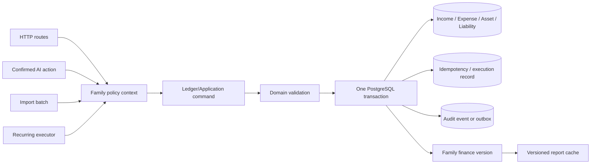
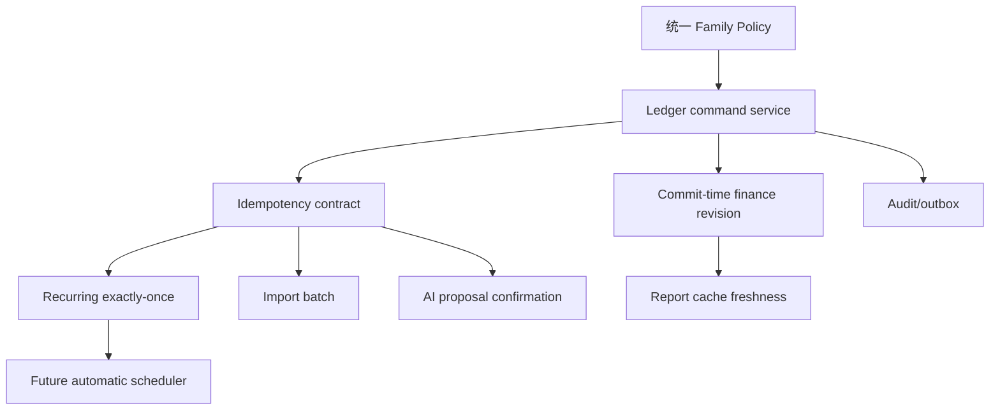

# 数据一致性与写入入口专项分析

## 1. 范围、结论与证据纪律

本专项只分析 HomeFinance 的写入入口、账本服务边界、原子性、幂等、并发、重试与写后派生数据一致性。基线为 `main` 分支提交 `b103e4221ae58d2cd09ee586d69f3cf90c79c146`。本文件仅产出分析和实施合同，不修改生产代码，不宣称任何整改已经完成。

结论先行：当前系统的核心问题不是缺少一个事务调用，而是同一类“产生财务事实”的动作由多个入口分别直接操作 Prisma。普通收入/支出 CRUD、导入确认、定期执行、文本 AI 动作和 OCR 确认没有共享一个 application service、统一幂等键、统一审计事件或统一 cache version。结果是：

- 失败可留下部分成功；
- 网络重试和并发请求可产生重复记录；
- viewer、AI 确认、后台任务等权限语义容易在入口间漂移；
- 报表缓存无法在每一种写入后可靠失效；
- AI 批量动作可以逐条吞错，客户端难以判定是否安全重试。

本报告区分三种证据：

- **已验证事实**：由当前源码、当前测试、schema 或基线命令直接支持，并给出精确路径与行号。
- **合理推断**：由已验证的控制流和数据结构推导出的风险或架构后果；需要补充行为/集成测试确认运行时结果。
- **尚未验证**：当前环境没有真实 PostgreSQL/Redis/MinIO 或并发生产拓扑证据，不能把预期行为写成已发生事实。

遵循仓库的 TDD 约束：每个整改项都先定义一个可复现的 RED 测试，确认失败原因是目标缺陷，再做最小 GREEN，最后才抽取公共边界。依据 `C:\Users\kotei\.codex\skills\test-driven-development\SKILL.md`，不能用“测试以后补”替代 RED 证据。

## 2. 当前写入拓扑与边界判断

### 2.1 实际入口清单

| 写入入口 | 当前直接副作用 | 关键证据 | 一致性判断 |
|---|---|---|---|
| 收入创建/更新/删除 | route 直接调用 `prisma.income.create/update/delete` | `backend/src/routes/incomes.ts:101-129,133-170,173-197` | 没有统一 ledger command、幂等键或写后版本 |
| 支出创建/更新/删除 | route 直接调用 `prisma.expense.create/update/delete` | `backend/src/routes/expenses.ts:101-130,133-171,173-198` | 与收入路径重复实现 |
| 资产/负债/预算/目标 | 各 route 直接 create/update/delete | `backend/src/routes/assets.ts:125-220`；`backend/src/routes/liabilities.ts:66-161`；`backend/src/routes/budgets.ts:123-207`；`backend/src/routes/goals.ts:106-185` | 不是同一个 ledger entry，但同样绕过统一 mutation policy/cache invalidation |
| 定期执行 | 先写 Income/Expense，再更新 RecurringTransaction | `backend/src/routes/recurring.ts:135-191` | 跨表非原子，重复执行无唯一执行记录 |
| 导入确认 | 客户端传 `items`，逐行 create | `backend/src/routes/import.ts:54-110` | 可部分成功，重试会再写；无 batch 持久化 |
| 文本 AI chat | 解析模型动作后直接 `executeActions` | `backend/src/routes/ai.ts:132-191`，尤其 `:165-175` | 没有显式确认；模型输出可成为直接写入命令 |
| OCR execute-actions | 客户端确认后调用 `executeActions` | `backend/src/routes/ai.ts:450-485` | 有入口层确认语义，但服务端没有 confirmation token/幂等命令 |
| AI action executor | 逐条执行 create/delete，逐条捕获错误 | `backend/src/services/aiActions.ts:34-55,57-207` | 批量动作可部分成功，且直接写 Prisma |
| OCR 图片存储 | 先 MinIO upload，再 File create | `backend/src/services/fileStorageService.ts:13-58` | DB 失败可能留下孤立对象；当前“失败不阻塞 OCR”是产品取舍，不等于可追踪补偿 |
| 普通文件上传 | 每个文件先 MinIO upload，再 File create | `backend/src/routes/files.ts:101-155` | 单批非事务；DB 失败/请求中断的对象清理未形成一致协议 |

### 2.2 目标边界

建议把“所有会改变家庭财务事实或影响报表版本的命令”收敛到模块化单体内的 application service，而不是马上拆微服务：

目标服务的最小输入应包含 `actorId`、`familyId`、`role/policy context`、`source`、规范化 payload、业务有效日期和 `idempotencyKey`。输出应至少区分 `created`、`deduplicated/replayed`、`rejected`，并返回可追踪的 entry/batch/execution 标识。Route 只负责协议适配、HTTP 状态映射和调用服务；服务负责授权上下文复核、校验、事务和派生版本。

### 2.3 Schema 对一致性的支持与缺口

**已验证事实**：`Income`、`Expense`、`Asset`、`Liability` 使用 Decimal 金额字段，且均通过 `familyId` 关联 `Family`；`RecurringTransaction` 具有 `nextDate`、`endDate`、`isActive`、`lastExecutedAt`，但只有 family/nextDate 普通索引；`AiConversation` 仅保存 family/user/content/response/type/fileId；schema 中没有 `ImportBatch`、`IdempotencyKey`、Recurring execution ledger、outbox 或 audit event 模型。证据见 `backend/prisma/schema.prisma:59-97,99-135,156-171,191-212`。

**合理推断**：数据库目前没有能够把“同一个外部请求/同一个预定执行日已经成功”的事实作为唯一约束保存下来。因此单靠应用层的“先查有没有”不能抵抗并发竞态；需要新增持久化唯一键，或在事务内使用带条件的行锁/条件更新加可证明的执行记录。

**尚未验证**：未在真实 PostgreSQL 上运行新增索引、隔离级别、锁等待、死锁和重试行为；现有 integration suite 仅证明基础模型、级联和显式事务回滚能力，不能证明当前业务入口 exactly-once。

## 3. 问题 DATA-001：缺少统一 Ledger/Application Service

### 3.1 证据与问题定义

**已验证事实**：收入与支出 route 各自实现 schema、family lookup 和 Prisma create/update/delete；收入创建在 `backend/src/routes/incomes.ts:101-123`，支出创建在 `backend/src/routes/expenses.ts:101-123`。导入在 `backend/src/routes/import.ts:81-103` 直接选择 `prisma.income.create` 或 `prisma.expense.create`。定期在 `backend/src/routes/recurring.ts:153-178` 直接写两类账；AI executor 在 `backend/src/services/aiActions.ts:66-112` 直接写两类账。

**合理推断**：同一财务事实有至少五个写入实现，任何一个新规则（幂等、币种、审计、版本失效、权限、来源标记）都可能只接入部分入口。Graphify 将 `Transaction Creation Ingress Paths` 标为 **INFERRED** 超边，列出 incomes、expenses、import、recurring、aiActions；这是有价值的导航线索，但不是运行时证明。见 `graphify-out/GRAPH_REPORT.md:171-177`。

**根因**：写入策略以 route/service 局部代码为中心，缺少一个同时承载 family policy、领域校验、事务、幂等、审计和 finance revision 的 application boundary。

### 3.2 影响与可复现场景

场景 A：用户网络超时后重发同一笔手工收入。第一次 DB create 已成功但响应丢失，第二次请求没有 idempotency key，两个请求都会进入 `prisma.income.create`。当前 schema 也没有外部请求唯一约束。

场景 B：以后只给 import 接入 cache invalidation，而普通 income route 未接入；同一家庭的 summary 可能在不同写入后表现不同。该场景是基于当前入口分散和 cache 仅提供通用 middleware 的合理推断，需集成测试确认。

**风险**：相同业务动作在不同入口产生不同授权、失败、重试和缓存语义，最终可能形成重复财务事实、部分提交或报表派生数据不一致。

### 3.3 方案比较

| 方案 | 做法 | 优点 | 主要代价/风险 | 适用性 |
|---|---|---|---|---|
| A. 统一 Ledger Application Service（推荐） | Route/Import/Recurring/AI 均调用同一 command service；service 负责 policy、校验、事务、幂等、版本 | 迁移可渐进；行为合同集中；保留模块化单体 | 需要设计 command contract 和逐入口迁移 | 最符合当前规模和风险 |
| B. 仅建 repository/helper | 把 Prisma create 封装成 `createIncome/createExpense`，route 仍决定事务和 policy | 改动较小 | 无法统一跨表事务、幂等、source/actor/audit；入口继续分叉 | 只能作为过渡层 |
| C. 直接拆 Ledger 微服务 | 单独服务拥有账本和事件 | 物理隔离清晰，未来可扩展 | 分布式事务、回滚、网络重试和迁移复杂度显著上升 | 当前不推荐 |

### 3.4 推荐实施、兼容迁移与回滚

推荐 A，采用“外观先行、入口逐一迁移”的顺序：

1. 先建立不改变 API 响应形状的 `LedgerApplicationService` interface；将 actor/source/idempotency 设为内部 command 字段，旧 route 在过渡期生成明确 source（`manual`、`import`、`recurring`、`ai_confirmed`）。
2. 先迁普通收入/支出 create，再迁 recurring；导入和 AI 先保留现有响应字段，由 adapter 转换 service result。
3. 将资产/负债视为 `BalanceMutationService` 或同一 application layer 的另一个 command family，避免强行把存量资产冒充收入/支出 ledger entry；但共享 policy、transaction、audit/version 基础设施。
4. 旧客户端未提供幂等键时，短期允许 `idempotencyKey` 缺省但只对新入口强制；发布文档声明旧行为不享有 exactly-once。迁移完成后对所有 mutation 要求 key，或使用服务端生成的 request identity 并明确只保证单次请求生命周期内去重。
5. 若迁移期间出现行为差异，按入口 feature flag 回退到旧 adapter；不得同时让新旧实现对同一请求写两次。回滚只回退路由委托，不回滚已经提交的财务事实；被错误提交的记录需通过受审计的反向更正流程处理。

### 3.5 TDD 合同：DATA-001

**第一个 RED**

- 测试文件：`backend/src/services/ledgerApplicationService.test.ts`（新建）或迁移期采用 `backend/src/routes/incomes.test.ts` 的真实 app service 集成夹具。
- 测试名：`replaying the same family-scoped command with the same idempotency key returns one income and one created result`。
- 核心断言：同一 `familyId`、`actorId`、payload 和 `idempotencyKey` 执行两次；底层持久化只有一条 `Income`，第二次结果为 `deduplicated/replayed`，两次不能生成两个 report version increments。
- 精确命令：`npm test -- --runInBand src/services/ledgerApplicationService.test.ts`（工作目录 `backend`）。
- 预期失败：当前目标测试文件/服务不存在，或若先以 route 作为 characterization 测试，则第二次调用会产生两条 `prisma.income.create`，断言 `count === 1` 失败。RED 必须确认是缺少幂等实现，而不是 import/config 错误。

**最小 GREEN**：新增一个只处理 `create_income/create_expense` 的 application service；在事务内以 `(familyId, idempotencyKey)` 读取/插入幂等记录，再创建 entry，并返回 replay 结果。第一阶段只支持已明确的命令 payload，不同时重写全部路由。

**REFACTOR 目标**：用类型化 command union、统一 `ActorContext`、domain validation、repository port 和 mutation hooks 取代 route 内直接 Prisma；将版本递增和 audit/outbox 写入纳入同一事务。

**退出门禁**：普通收入/支出 create 的 admin/member、viewer、non-member、unauthenticated、invalid payload、相同 key replay、不同 key 并行请求均有测试；真实 PostgreSQL integration 证明唯一约束和事务回滚；`npm run build` 与全量 `npm test -- --runInBand --coverage` 通过。

## 4. 问题 DATA-002：Recurring 执行缺少事务、幂等与 due/active 复核

### 4.1 已验证事实与根因

`POST /:id/execute` 在 `backend/src/routes/recurring.ts:135-148` 只验证成员和规则所属 family；没有在执行前检查 `rule.isActive` 或 `rule.nextDate <= now`。它在 `:150-178` 创建收入/支出，再在 `:180-191` 更新规则。中间任何失败都会跳到 `:199-202` 返回 500，但已成功的前一步不会由该 route 的数据库事务自动撤销。`due` 查询本身正确带有 `isActive: true` 和 `nextDate: { lte: new Date() }`，见 `:40-56`；这不能替代 execute endpoint 的再次检查，因为 execute 可直接被调用。

现有测试 `backend/src/routes/recurring.test.ts:195-287` 只验证成功路径、收入/支出类型和 404；viewer 负面测试覆盖 delete 而非 execute，见 `:329-357`。没有 inactive、future、endDate-before-now、DB failure rollback 或 concurrent execute 合同。

**根因**：due 查询和 execute 命令是两条独立控制流；execute 没有把状态复核、账本创建和规则推进放入同一个由数据库裁决的执行协议，也没有以 `scheduledFor` 唯一标识一次执行。

### 4.2 影响与可复现场景

场景 A：规则已经 `isActive=false`，仍直接 POST execute；当前控制流没有拒绝分支，若 `findUnique` 返回该规则，会继续创建账目并推进规则。

场景 B：规则 `nextDate` 在未来，仍直接 POST execute；同样没有 due guard，会生成一笔未来计划外账。

场景 C：两个 worker/浏览器同时读取同一个 due rule。两者都可在各自的 `findUnique` 获得相同 `nextDate`，随后各自 create，再各自 update。当前 schema 没有 execution unique record；重复是合理推断，需真实并发测试验证。

场景 D：Income create 成功、Recurring update 失败；响应 500，但 Income 已存在。客户端重试无法从响应判断是否已产生账目，下一次可能再写一笔。

**风险**：非 due/inactive 规则可能被错误执行，并发或重试可能产生重复记录，跨表失败会留下不可解释的中间状态。

### 4.3 方案比较

| 方案 | 做法 | 优点 | 主要代价/风险 | 结论 |
|---|---|---|---|---|
| A. 事务 + execution ledger 唯一键（推荐） | 新增执行记录，唯一 `(recurringId, scheduledFor)`；同一事务内 due 条件、创建 entry、推进规则 | 数据库最终裁决并发；可审计、可重放 | schema migration；需要定义补偿/历史规则 | 推荐 |
| B. 仅行锁/条件 update | `SELECT FOR UPDATE` 或 `updateMany where id,nextDate,isActive,due` 成功者执行 | schema 变化较少 | 执行事实不独立持久化；跨重试恢复/审计弱；Prisma 事务和数据库能力要仔细验证 | 可作为短期止血 |
| C. 分布式 Redis lock | SET NX 锁住 recurring id | 上手快 | 锁过期、进程崩溃、数据库提交顺序和锁丢失会造成复杂边界；Redis 非事实源 | 不作为唯一保证 |

### 4.4 推荐实施、兼容迁移与回滚

推荐 A。新增 `RecurringExecution`（字段至少为 recurringId、familyId、scheduledFor、status、entryId/entryType、attempt metadata、createdAt/updatedAt），在数据库建立 `UNIQUE(recurringId, scheduledFor)`。执行事务内：

1. 用 family + id 查询规则，并验证 `isActive=true`、`nextDate <= now`，且 `endDate` 未越界；将 `scheduledFor = rule.nextDate` 固定为本次业务日期。
2. 创建 execution intent 或以唯一键抢占执行权；冲突时读取已完成结果并返回 replay/deduplicated，不再创建账目。
3. 通过 Ledger service 创建 entry，写入 execution 的 entry 关联。
4. 计算下次日期；若下一日期超过 `endDate`，本次账目仍只按 `scheduledFor` 生成，再将规则置 inactive；所有动作在同一 PostgreSQL transaction。

迁移策略：历史规则没有执行记录时不回填不确定的历史执行事实；从上线时刻开始为新执行写 execution。若必须兼容已有客户端，保留原 endpoint 和成功响应字段，增加 `executionId`、`deduplicated` 为可选字段。回滚时停止新执行入口或切回只读，而不是删除 execution 表；已执行的账目通过审计更正，避免 destructive rollback。

### 4.5 TDD 合同：DATA-002

**第一个 RED**

- 测试文件：首选 `backend/src/services/recurringExecutionService.integration.test.ts`；路由契约保留在 `backend/src/routes/recurring.test.ts`。
- 测试名：`concurrent execution of one due rule creates one entry and advances the schedule once`。
- 核心断言：冻结或注入 `now`；同一 due、active rule 并发调用两次；数据库最终只有一条对应收入/支出，一条 execution，`nextDate` 只推进一次；一个结果为 created，另一个为 replay/deduplicated 或明确 conflict，不是第二个成功账目。
- 精确命令：`npm run test:integration -- --runInBand`（工作目录 `backend`；并发由测试内部 Promise.all 产生）。
- 预期失败：当前 schema 没有 execution model，route 两次均可进入 `income.create/expense.create`；测试会看到 entry 数量为 2，或目标 execution 查询不存在。若环境无 PostgreSQL，应标记为未运行，不得把环境错误写成 RED。

**最小 GREEN**：先在真实 PostgreSQL transaction 中加入 due/active/endDate 检查和一个条件更新/唯一 execution 记录，使同一 `scheduledFor` 只有一个获胜者；获胜者写 entry 并推进规则，冲突者读取既有结果。

**REFACTOR 目标**：抽出注入 clock、`RecurringExecutionPolicy`、schedule calculator（处理月末/时区）、Ledger command 和统一 error/result mapping；后台调度器只能调用该服务，不复制执行逻辑。

**退出门禁**：active/due/endDate 边界、viewer/non-member、重复 HTTP retry、双 worker 并发、create 失败、schedule update 失败、Redis 不可用均有测试；真实 PostgreSQL 在唯一约束和 rollback 下通过；没有自动调度器绕过服务的代码路径。

## 5. 问题 DATA-003：Import 无边界、无批次事实、逐行非事务

### 5.1 已验证事实与根因

上传使用 `multer.memoryStorage()` 且未配置 limits：`backend/src/routes/import.ts:8-10`。全局 JSON/urlencoded 解析上限是 10 MB，见 `backend/src/app.ts:25-27`，但这不是 CSV 文件的明确文件/行/字段预算，也会让 multipart 行为依赖 Multer 默认设置。`/csv` 先解析整个 buffer，见 `import.ts:41-47`；`parseRows` 也把整个 buffer 转成 UTF-8 字符串并一次性返回 records，见 `backend/src/services/importService.ts:29-35`。

确认端点从客户端接收任意 `items` 数组：`backend/src/routes/import.ts:64-67` 只检查是非空数组。之后逐行 `safeParse`，合法行立即执行 `income.create/expense.create`，见 `:69-105`。校验失败的行跳过并继续，返回 `successCount/failedRows`；DB 失败则在 `:108-110` 返回 500，但之前的合法行不会被本 route 回滚。

**已验证事实**：当前导入测试把“合法行 + 非法行部分成功”定义为 200 与 `successCount=1`，见 `backend/src/routes/import.test.ts:151-172`；这体现了现有 API 行为，但不是推荐的财务一致性目标。

**根因**：上传解析、客户端 preview 和财务确认没有服务端持久化批次/版本边界；confirm 直接信任客户端数组，并在循环内逐行提交。

### 5.2 影响与可复现场景

场景 A：提交超大 CSV 或超多行 JSON，内存中同时存在 multipart buffer、UTF-8 string、records 和 response items；内存压力随文件/行数增长。具体可承受上限尚未在目标部署上测量，因此只报告风险方向，不虚构阈值或吞吐。

场景 B：第 N 行合法写入后，第 N+1 行遇到 DB error；响应 500，但前 N-1 行已提交。客户端按通常语义重试整个批次，前面行再次写入。

场景 C：客户端篡改 preview 后直接向 confirm 提交不同 items；当前服务端没有 batch token、预览快照或行指纹来证明确认的是服务器解析结果。

场景 D：同一文件重复确认没有 batch identity。基于当前 schema 无 ImportBatch/row fingerprint 的已验证事实，可合理推断重试会重复记账。

**风险**：资源耗尽、部分提交、preview 篡改和重试重复同时存在，客户端无法可靠判断批次最终状态。

### 5.3 方案比较

| 方案 | 做法 | 优点 | 代价/风险 | 结论 |
|---|---|---|---|---|
| A. 预览批次 + 全批原子确认（推荐） | upload/preview 持久化 batch、规范化行和 fingerprint；confirm 校验 token，单事务写入 | 最容易解释；失败无部分账；重试可返回原结果 | 需要 schema 和存储/清理策略；大批次需规划 transaction size | 推荐默认 |
| B. 持久化行状态的部分成功 | batch/row 状态逐行持久化，明确 succeeded/failed/retryable | 适合超大批次和逐行修复 | 产品复杂；必须保证每行幂等，不是当前裸循环的“半成功” | 仅在明确产品需求时采用 |
| C. 仅把 for loop 换成 `$transaction` | 所有 create 放进一个 transaction | 能防 DB 失败的部分提交 | 没有 batch identity/preview integrity；巨大 transaction、重试重复仍在 | 只能作为过渡止血 |

### 5.4 推荐实施、兼容迁移与回滚

推荐 A，并把“文件解析”和“财务提交”分成两个明确状态：`PREVIEWED` → `CONFIRMING` → `COMMITTED`/`FAILED`/`EXPIRED`。建议 `ImportBatch` 保存 familyId、actorId、source format、原始文件摘要、schema/version、状态、createdAt/expiry；`ImportRow` 保存规范化 payload、行号、fingerprint、validation status 和最终 entry id。确认请求只传 batchId、批次版本和用户修正项，不能把整个客户端数组当成事实源。

短期兼容可保留现有 `/csv` 返回数组，同时服务端创建 preview batch 并在响应增加 `batchId`；旧客户端仍可发送 `items`，服务端仅在无法识别 batchId 时进入临时兼容路径，并记录风险/限制，逐版本废弃。推荐整批原子；如果产品必须保留“非法行跳过、合法行提交”，也应改变为持久化每行状态的可重放模型，并让响应明确 `committedRows` 和 `notCommittedRows`，不把 DB 异常伪装为普通 failedRows。

回滚：expand/migrate/contract。先加 nullable batch 表和兼容字段，再双写新 batch metadata；确认读取新 batch，观察稳定后收紧；回退代码时保留已提交批次和唯一指纹表，不能直接删表或重复导入历史文件。孤立 preview 按 TTL 清理，已提交 entry 不做物理删除。

### 5.5 TDD 合同：DATA-003

**第一个 RED**

- 测试文件：首选 `backend/src/services/importBatchService.integration.test.ts`；现有协议回归保留在 `backend/src/routes/import.test.ts`。
- 测试名：`a database failure in row N rolls back the complete import batch and retrying the same batch does not duplicate rows`。
- 核心断言：构造至少两条合法规范化行，在第二条 create 失败时，事务后 batch 对应 Income/Expense 数均为 0；再次以同一 batchId confirm 返回同一失败状态或安全重试结果，不能出现第一行重复/孤儿；确认过程不能接受被篡改的 preview version。
- 精确命令：`npm run test:integration -- --runInBand`（工作目录 `backend`）。
- 预期失败：当前 route 在 `backend/src/routes/import.ts:71-105` 逐行提交；第二行失败后第一行仍存在，或 schema 没有 batchId。现有 route test 中的 partial-success 合同也会与新推荐语义冲突，必须在产品确认后更新为新的显式 batch contract，而不是弱化断言。

**最小 GREEN**：先增加服务端 `items` 全量校验和一个 Prisma `$transaction`，整批 create；给 confirm 请求增加可选 idempotency/batch key，并在重复 key 时返回已有结果。此阶段可暂不解决超大批次异步化，但必须配置明确的文件字节、行数和字段长度上限，超限在解析前拒绝。

**REFACTOR 目标**：引入 ImportBatch/ImportRow，预览快照与确认版本、fingerprint、过期状态、可观测行结果；将入口委托 Ledger service，避免 import 自己拼 Income/Expense data。

**退出门禁**：文件大小、行数、字段长度、非法日期/金额、空文件、未知格式、非成员/viewer、DB rollback、confirm replay、预览篡改、请求超时重试都有测试；真实 PostgreSQL 验证事务与唯一键；内存占用/解析耗时在目标 staging 以实测数据设置运行阈值，不能用本报告估算代替。

## 6. 问题 DATA-004：文本 AI 动作绕过显式确认，批量 action 部分成功

### 6.1 已验证事实与根因

`POST /chat` 的文本分支在 `backend/src/routes/ai.ts:144-175` 调用 `chatWithActions` 后，如果 `parsed.actions.length > 0`，立即调用 `executeActions(familyId, req.userId!, parsed.actions)`。该分支没有 confirmation token、用户二次确认字段或 proposed-only 响应。现有 AI 测试明确把它定义为“executes actions”，见 `backend/src/routes/ai.test.ts:128-148`。

OCR 路径则在 `backend/src/routes/ai.ts:405-415` 生成 `proposedActions`，在 `:429-435` 返回给前端；`/execute-actions` 在 `:466-480` 接收客户端动作后执行并记录对话。这证明项目已有“人审后写入”的产品意图，但该意图没有覆盖文本 chat。

`executeActions` 在 `backend/src/services/aiActions.ts:34-55` 循环调用 `executeAction`，每条错误被转为 `status: 'error'` 并继续下一条。创建/删除动作分支直接 Prisma 写入，见 `:66-207`。因此一个动作数组可以返回混合 success/error，且没有整体事务或 idempotency key。

**根因**：文本 chat 将模型输出直接连接到 mutation executor；提议、确认、动作 schema 校验和最终账本提交没有分层。

### 6.2 影响与可复现场景

场景 A：用户自然语言被模型解释为 `create_expense`，模型字段错误但格式合法；文本 `/chat` 直接写入家庭账本。

场景 B：AI 返回两个 create actions，第一条成功，第二条数据库失败；接口返回 200 和混合结果。客户端若重试整个数组，第一条可能再次被创建。

场景 C：viewer 访问 `/chat`。当前 route 只判断 membership 存在，见 `backend/src/routes/ai.ts:132-138`；若模型返回 create action，service 也没有 actor role 参数或 membership 复核，viewer 可能触发写入。这与仓库的 viewer read-only 不变量一致性冲突；现有 `ai.test.ts` 没有 viewer test。

场景 D：`/execute-actions` 的 schema 允许 `type: z.string()`、`data: z.record(z.any())`，见 `backend/src/routes/ai.ts:450-455`；真正的 action 类型和业务字段由后续执行器判定。来自客户端或被篡改的 proposed action 因而拥有比理想 typed command 更宽的输入面。

**风险**：AI 误判、viewer 越权、proposal 篡改和批量部分成功均可改变财务事实，而调用方无法安全重试。

### 6.3 方案比较

| 方案 | 做法 | 优点 | 代价/风险 | 结论 |
|---|---|---|---|---|
| A. 所有 AI mutation 统一提议→确认→Ledger commit（推荐） | chat 只返回 proposal；确认携带服务端签发 proposal/version/token 与 idempotency key；执行器只接受已确认、已校验动作 | 明确人机边界；可审计、可防篡改、可重放 | API/前端需迁移；需要 proposal 存储/过期策略 | 推荐 |
| B. 保留文本自动执行但增加强校验 | viewer 禁止、schema 严格化、额度/类别校验、要求文本包含“确认” | 兼容旧体验、改动较小 | “确认”自然语言不等于可靠二次确认；模型误判仍直接写 | 只能临时止血 |
| C. AI 只做建议，用户回普通表单提交 | 彻底移除 AI 直接写；表单走既有 API | 最简单、风险最低 | 交互变慢；不能批量确认 | 可作为降级模式 |

### 6.4 推荐实施、兼容迁移与回滚

推荐 A：

1. `/chat` 和 `/ocr` 的 AI 输出统一为 `proposalId`、规范化动作数组、duplicate flags、expiresAt 和 schema version；任何 create/update/delete 不执行。
2. 服务端持久化 proposal，包含 familyId、actorId、原始 AI response 摘要、规范化动作 hash、状态 `PROPOSED/CONFIRMED/EXECUTED/EXPIRED/REJECTED`。原始 prompt/敏感信息按数据保留策略处理。
3. 用户明确点击确认后，`/execute-actions` 只接受 proposalId + expected hash/version + idempotencyKey；服务端重新加载 proposal，复核 family、actor 权限、动作类型、金额、日期和当前记录 ownership，再调用 Ledger service。
4. 一批动作默认整批原子；若产品允许部分成功，必须把每个 action 的持久化状态和幂等结果作为产品可见事实，不能继续用内存数组逐条吞错。
5. 旧文本客户端兼容期可在 response 中同时给出 `actions` 但状态改为 proposed；服务端 feature flag 控制旧自动执行，仅限开发/迁移环境，生产默认关闭。若确认流程回滚，回退到“只建议+人工表单”，不恢复无确认自动写入。

### 6.5 TDD 合同：DATA-004

**第一个 RED**

- 测试文件：`backend/src/routes/ai.test.ts`（扩展）以及 `backend/src/services/aiActionExecution.integration.test.ts`（新建）。
- 测试名：`text chat returns a proposal without executing a create action until explicit confirmation`。
- 核心断言：`chatWithActions` 返回一个 `create_expense` 时，`POST /chat` 返回 proposal/proposed action，`executeActions` 未被调用；viewer 对同一路径得到 403 且 AI provider、storage、ledger executor 均不产生写副作用。确认接口仅对合法 proposal 执行一次。
- 精确命令：`npm test -- --runInBand src/routes/ai.test.ts`（工作目录 `backend`）。
- 预期失败：现有 `backend/src/routes/ai.test.ts:128-148` 期望 `/chat` 调用 `executeActions`，目标 RED 会观察到当前实现确实执行；将旧测试改成新合同前，应先保留该失败证据，再更新产品 API 合同。

**最小 GREEN**：文本 chat 对 mutation actions 只返回 proposal；在 execute-actions 入口增加严格 action schema、显式 confirmation/proposal 检查，并先用一个事务执行同批 Income/Expense mutations。

**REFACTOR 目标**：把 AI parser/provider 与 financial mutation 完全分离；提案服务只产生不可信输入，Ledger service 是唯一写入口；action result 类型化并持久化每个 action 的状态。

**退出门禁**：unauthenticated、non-member、viewer、proposal 篡改、过期 proposal、重复 confirm、跨 family proposal、invalid amount/date/type、provider timeout、DB rollback、批量并发 confirm 全部有负面测试；真实 PostgreSQL 验证 proposal/entry 唯一性和事务；AI provider 不可用时只产生明确失败/手工录入，不直接写账。

## 7. 问题 DATA-005：写后 cache invalidation 缺失与派生版本不一致

### 7.1 已验证事实、根因与风险

报表路由使用 `cacheMiddleware(300)`，如 `backend/src/routes/reports.ts:21,61,119,207`；middleware 在命中时直接返回，在未命中时通过重写 `res.json` 使用 `setEx` 缓存，见 `backend/src/middleware/cache.ts:4-28`。当前 key 只有 `cache:${req.originalUrl}`，没有 family finance version，也没有公开的 invalidate/version API。

本专项核验的各写入路径（收入、支出、资产、负债、预算、目标、recurring、import、AI、files）未发现调用统一 cache invalidation；`rg` 只找到 middleware 的 `setEx` 和 route 写入，没有同类 `del`/version bump。基线报告将其列为 HF-CACHE-001，并指出写后最多 300 秒 stale。

**根因**：cache middleware 只按 URL 做 TTL 缓存，财务写入没有共同的 commit hook、family revision 或失效协议。

**合理推断与风险**：只要一个报表 GET 曾经命中缓存，任何未接入失效的 mutation 都可能在 TTL 内读旧值；不同 route 的失效覆盖会不一致。缓存命中前授权问题另属安全专项，本文件关注写后一致性，但两者必须共同修复。

### 7.2 影响与可复现场景

先请求一次 family summary 使 `cache:${req.originalUrl}` 命中，再通过收入、支出或其他影响报表的写入口提交变更，立即重复相同报表请求；当前没有统一失效/版本写入，因此可合理预期仍可能得到旧缓存，具体运行时结果需 Redis 集成测试确认。

### 7.3 方案比较

| 方案 | 做法 | 优点 | 风险/代价 | 结论 |
|---|---|---|---|---|
| A. family finance version key（推荐） | 事务提交时递增数据库/Redis 版本；cache key 包含 family、query、version | 写路径 O(1)；旧缓存自然失效；适合多报表 | 版本必须与事实提交同事务或有可靠 commit hook；Redis 版本不能是唯一事实 | 推荐，数据库版本为事实源 |
| B. 精准删除所有 family report keys | 写后扫描/维护 key registry，删除相关报表 | 立即释放旧 key | 删除列表维护难；Redis `KEYS` 风险；新增报表易漏失效 | 可做短期或配合版本 |
| C. 只缩短 TTL | 将 300 秒调小 | 改动小 | 仍会读旧数据；不能满足金融事实即时性 | 不足以解决 |

### 7.4 推荐实施、兼容迁移与回滚

推荐 A。增加 family-level finance revision（可放在 Family 或独立 revision model），所有影响报表的 commit 在同一个 PostgreSQL transaction 内递增。cache read 必须发生在 family authorization 之后；读取 revision 后用 `cache:${familyId}:${revision}:${normalizedQuery}`，缓存只保留不可变 response。Redis 仅缓存结果，不承载 revision 的唯一真相。对于跨多个 family 的 compare，使用每个 family revision 的排序/哈希组成 key，或不缓存直到模型明确。

迁移：先让 middleware 支持新 key 并保留旧 key 读取禁用；旧 key 让 TTL 自然过期或通过一次性前缀切换废弃，不需要物理扫描。先给普通 income/expense/asset/liability 写入接入 version，再迁 import/recurring/AI。若 version bump 失败，整笔财务事务失败（推荐强一致）或进入 outbox retry（若产品接受最终一致），不能静默返回“已成功”却让 revision 不变。

回滚：保留旧 cache prefix 但默认关闭；若新版本异常，可暂时禁用 report caching 或使用短 TTL，不能恢复未授权先读或把 stale 当新数据。已提交数据不回滚。

### 7.5 TDD 合同：DATA-005

**第一个 RED**

- 测试文件：`backend/src/services/ledgerApplicationService.integration.test.ts` 与 `backend/src/routes/reports.test.ts`；cache 单元补充 `backend/src/middleware/cache.test.ts`。
- 测试名：`a committed family expense makes the next report request observe the new total without waiting for TTL`。
- 核心断言：先 GET family summary 建缓存；提交一笔 expense；立即 GET 相同 query，响应包含新 total；family B 的 revision/key 与 family A 不共享；缓存命中仍不能绕过授权（授权专项另设测试）。
- 精确命令：`npm test -- --runInBand src/routes/reports.test.ts src/middleware/cache.test.ts`（工作目录 `backend`）；涉及真实 commit/version 时再运行 `npm run test:integration -- --runInBand`。
- 预期失败：当前 middleware 对旧 `originalUrl` key 命中且写入无统一失效，第二次 GET 可返回旧 body；现有 `cache.test.ts:28-51` 只验证 hit/miss，不会捕获写后 stale。

**最小 GREEN**：先为 summary 及普通 income/expense mutation 增加一个可验证的 family revision/invalidation hook；成功 commit 后使下一次 read miss 或读取新 revision。

**REFACTOR 目标**：统一 `ReportCache` port、query normalization、revision provider、commit hook/outbox；路由不再直接依赖 Redis client，也不使用 URL-only key。

**退出门禁**：收入、支出、资产、负债、预算、目标、recurring、import、AI action 的成功/回滚路径都有 cache freshness 测试；Redis outage 不阻断事实提交且 UI/API 明示 degraded（若选择最终一致），或在强一致设计下明确失败；跨 family/cache query isolation、并发写 revision、重启恢复有真实环境测试。

## 8. 问题 DATA-006：并发冲突、重试与失败语义未形成统一合同

### 8.1 已验证事实与根因

当前 routes 普遍采用“调用 Prisma 后返回 201/200；catch 后返回通用 500”的模式。收入创建在 `backend/src/routes/incomes.ts:111-129`，支出创建在 `backend/src/routes/expenses.ts:111-130`；导入与 recurring 也分别在 `import.ts:108-110`、`recurring.ts:199-202` 返回通用 500。没有统一的 `Idempotency-Key`、request status、retry-after 或冲突错误类型。

`backend/src/tests/database.integration.test.ts:251-268` 证明项目已有显式 `$transaction` 回滚测试，但没有对应业务写入入口的并发/重试测试。schema 的 Income/Expense 只有主键和普通 family/date/category/createdBy 索引，见 `backend/prisma/schema.prisma:59-97`。

**根因**：写入 API 没有统一的请求身份、幂等记录、版本条件更新和错误分类；数据库 transient/conflict 与“事实是否已经提交”的结果没有映射为稳定的应用层状态。

### 8.2 影响与可复现场景

| 场景 | 当前可观察行为 | 一致性风险 |
|---|---|---|
| 响应丢失后客户端重试 | 第二次被视为新 create | 重复财务事实 |
| 两个相同确认请求并发 | 两个请求均可 create | AI/import/recurring 重复 |
| DB deadlock/serialization failure | 通用 500，客户端不知道是否可安全重试 | 盲目重试或放弃造成不确定状态 |
| 一批 action 中途失败 | 已完成动作被保留 | 客户端无法精确恢复 |
| 更新与删除同时发生 | 无 version/updatedAt 条件更新合同 | 后写覆盖或删除用户刚修改数据 |

最后一项是合理推断：schema 有 `updatedAt`（例如 `Income:68-69`），但 route 更新只按 id，不把预期版本/更新时间放入 where，见 `backend/src/routes/incomes.ts:152-160`；没有乐观并发冲突状态码。

### 8.3 方案比较

| 方案 | 做法 | 优点 | 代价/风险 | 结论 |
|---|---|---|---|---|
| A. Idempotency + 乐观版本 + 可分类重试（推荐） | create 用 key；update/delete 用 expectedVersion/updatedAt；错误分为 validation/conflict/transient/permanent | 客户端可安全恢复；数据库与 API 语义一致 | API contract、持久化表和错误映射需定义 | 推荐 |
| B. 仅客户端去重/按钮防抖 | UI 防重复提交 | 快速缓解误点 | 网络重试、多个设备、脚本和 worker 不受保护 | 不足 |
| C. 全局串行队列 | 所有写入排队顺序执行 | 简化部分并发 | 延迟、单点、队列失败和仍需幂等；不解决客户端语义 | 不推荐作为根治 |

### 8.4 推荐实施、兼容迁移与回滚

推荐 A，建立统一的请求语义：

- create/import/AI/recurring 接受标准 `Idempotency-Key`；key 命名空间至少含 family、actor、operation，payload hash 必须绑定 key，key 重用但 payload 不同返回 409。
- update/delete 接受 `If-Match` 或 `expectedUpdatedAt/version`；where 条件不匹配返回 409，并携带最新 resource/version 摘要（不泄露跨 family 数据）。
- 把 Prisma transient error、serialization/deadlock、Redis/MinIO 外部错误分类；只有确认未提交的可重试错误才允许服务端或客户端重试。数据库事实提交成功后，response 重试必须通过 idempotency record 重放。
- 对批处理选择“整批原子”或“持久化部分成功”，每一种结果都带稳定 batch/action status；禁止通用 500 让客户端猜。

兼容迁移：旧客户端没有 headers 时，允许短期非幂等模式并在 response 加 `Deprecation`/文档警告；新前端先发送 key。对于更新，先让 expectedVersion 可选，随后按资源版本逐步强制。回滚时保留 idempotency records，避免回滚代码后同一请求再次写入；若无法支持重放，暂时禁用自动 retry，而不是复制写入。

### 8.5 TDD 合同：DATA-006

**第一个 RED**

- 测试文件：`backend/src/services/ledgerApplicationService.integration.test.ts`（新建）及 `backend/src/routes/incomes.test.ts`（扩展更新冲突协议）。
- 测试名：`replaying a committed create is deduplicated and an update with a stale version returns conflict without overwriting newer data`。
- 核心断言：同一 `Idempotency-Key` 的 create 在响应丢失后重放只保留一条记录并返回同一结果；两个不同版本的 update 中，旧版本得到 409，数据库保留新版本内容；可重试 transient error 不产生第二笔事实。
- 精确命令：`npm test -- --runInBand src/services/ledgerApplicationService.integration.test.ts src/routes/incomes.test.ts`（工作目录 `backend`）；数据库并发/唯一约束再运行 `npm run test:integration -- --runInBand`。
- 预期失败：当前没有统一幂等记录或版本条件，重复 create 会产生两条记录，更新 route 只按 id 写入而不会返回 409。若集成环境不可用，应标记为尚未运行，不得把环境错误当作 RED。

**最小 GREEN**：为 create 增加持久化幂等记录和 payload hash；为 update/delete 增加可选 expected version 的条件写入及 409 映射；先覆盖收入 create/update，再把同一协议复用于其他 mutation。

**REFACTOR 目标**：统一 request command/result、错误 taxonomy、retry policy 和资源版本；让 recurring/import/AI 的批次或执行记录复用同一幂等基础设施，避免各入口自行解释数据库异常。

**退出门禁**：响应丢失重放、相同 key 不同 payload、不同 key 并发、stale update/delete、viewer/non-member、事务回滚、deadlock/serialization retry 和批处理失败语义均有测试；真实 PostgreSQL 证明唯一约束、冲突状态和重试不会重复事实；构建、覆盖率及相关回归门禁通过。

## 9. 跨问题推荐目标与实施依赖

### 9.1 推荐目标架构

| 层 | 责任 | 禁止事项 |
|---|---|---|
| Route adapter | 解析 HTTP、调用 policy/service、映射响应 | 直接 create Income/Expense、直接更新 cache |
| Family policy | 认证后加载 family membership/role；区分 read/write/AI-confirm/scheduler | 让 membership 存在等于拥有写权限 |
| Ledger/Balance application service | 命令校验、领域规则、幂等、事务、审计、revision | 依赖 HTTP Request/Response |
| Import/Recurring/AI orchestration | 生成已规范化 command/proposal；保存批次/执行状态 | 自己直接写账本表 |
| Repository | Prisma query/create/update；提供 transaction client | 吞掉业务错误或跨租户查询 |
| Report cache/query | 授权后按 family revision/query 缓存派生读 | 作为授权边界、URL-only key |
| Outbox/worker（后续） | cache warm、通知、审计投递、异步补偿 | 成为唯一财务事实源 |

### 9.2 关键依赖路径

依赖不能颠倒：

1. 先确定 viewer/actor policy 和错误/确认合同；否则新 service 可能只是把错误权限集中起来。
2. 先让 Ledger service 具备最小 idempotency，再迁 recurring/import/AI；否则迁移只改变调用位置，不改变风险。
3. 先落 finance revision 与 commit hook，再重构 report cache；否则每个 route 仍会漏失效。
4. exactly-once recurring 完成前，不启动自动调度器；import batch 完成前，不承诺大文件异步导入；AI proposal 完成前，不增加更多自动 mutation action。

## 10. 分阶段实施计划（只描述方案，不代表已执行）

### Phase 0：止血与合同冻结

目标是立即停止错误写入继续扩大：

1. 为 viewer 的所有写入口补负面测试；本专项至少覆盖 recurring execute、import confirm、AI chat/execute-actions，以及普通 income/expense create。viewer 请求必须 403，且 Prisma/MinIO/AI provider 无写副作用。
2. 文本 AI `/chat` 改为 proposed-only 的产品合同；在合同确认前，生产 flag 关闭自动执行。
3. recurring execute 增加 inactive/future/endDate guard；在完整 exactly-once 完成前，可暂时把手工 execute 限制为显式 due 规则。
4. import upload/confirm 增加明确上限与全量预校验；短期至少用一个 `$transaction` 防止 DB 失败留下部分行，并返回稳定 batch/request id。
5. 对 report cache 先接入一条 summary freshness RED，禁止把 TTL 缩短当作完成。

Phase 0 退出门禁：所有写入口的 viewer negative matrix 全绿；文本 AI 不再无确认写账；inactive/future recurring 不产生 entry；import DB 失败零部分写入；summary 写后读取新值；相关测试输出干净。

### Phase 1：可信写入骨架

1. 新增 LedgerApplicationService 和 policy/actor context，迁收入/支出 create，再迁 recurring/import/AI。
2. 新增 idempotency record、RecurringExecution、ImportBatch/Row 或经过批准的等价模型；所有新写入口携带 payload hash 和稳定状态。
3. 统一错误映射：validation=400、unauthorized=401/403、not found=404、conflict=409、transient failure=可重试 503/明确 retry metadata；不要继续用不透明通用 500 代替财务写状态。
4. 将 `executeActions` 改为规范化 proposal/confirmed command，批量默认全事务；失败结果必须可查询。
5. 每个成功 mutation 在同一事实提交路径更新 finance revision，report cache 使用 versioned key。

Phase 1 退出门禁：普通 CRUD/import/recurring/AI 所有财务写入都经过 service；同 key replay 不重复；并发 recurring/import/AI confirmation 有真实 PostgreSQL 证据；DB rollback 不留部分事实；缓存立即新鲜；旧 API 兼容测试和迁移记录齐全。

### Phase 2：可运营与扩展准备

1. 把事务/幂等冲突、duplicate prevented、partial batch、proposal expiry、cache revision miss 纳入结构化日志和指标。
2. 以真实 staging 数据测量批量导入内存、transaction duration、锁等待、重试率；没有实测前不设虚假 p95/SLO 数字。
3. 对超大 import 评估后台 job + 持久化 row state；对 report cache、outbox、Redis/MinIO 故障做 chaos/恢复测试。
4. 逐步将 route 直接 Prisma 依赖降为 repository/service 依赖，并删除旧重复 `checkFamilyAccess` 与旧 mutation adapter。

## 11. 统一整改矩阵

| ID | 严重度/状态 | 根因 | 首个 RED 行为 | 推荐方案 | 依赖 | 退出门禁 |
|---|---|---|---|---|---|---|
| DATA-001 | P1 / 已验证架构缺口 | 五类入口分别直接写账本 | 同 key 两次只有一条 entry | Ledger application service + idempotency | Policy、错误合同 | 全写入口走 service，真实 DB 唯一/事务通过 |
| DATA-002 | P1 / 已验证控制流缺口；并发为待验证 | execute 未复核 due/active，写账与推进规则分离 | 同 due rule 并发仅一条 entry | RecurringExecution unique + transaction | DATA-001 | due/active/endDate/并发/失败恢复全绿 |
| DATA-003 | P1 / 已验证 | memoryStorage 无 limits；confirm 逐行 create | 第 N 行失败整批 0；同 batch replay 不重入 | Preview batch + atomic confirmation | DATA-001、DATA-006 | bounds、rollback、tamper、replay 真实 DB 通过 |
| DATA-004 | P1 / 已验证 | 文本 chat 直接 execute；action executor 逐条吞错 | chat mutation 只 proposal；viewer 无副作用 | Proposal→confirmation→Ledger atomic commit | Policy、DATA-001、DATA-006 | confirmation、typed action、过期/篡改/并发全绿 |
| DATA-005 | P1 / 已验证写后失效缺口 | 只有 TTL cache middleware，无 commit invalidation/version | 写后立即 report 新值 | DB finance revision + versioned cache | DATA-001 | 每类 mutation freshness、Redis 降级合同通过 |
| DATA-006 | P1 / 已验证合同缺口；并发为待验证 | 无 Idempotency-Key、版本条件、分类错误 | response 丢失后 replay 不重复；更新冲突 409 | 幂等记录 + optimistic version + error taxonomy | Policy、DATA-001 | retry/concurrency/conflict/rollback 可重放 |

## 12. 需要产品/架构决策的事项

以下不能由代码审查者单方面猜定，应在 ADR 或产品确认中冻结：

1. 导入是“全批原子”还是“可解释的持久化部分成功”；本专项推荐前者。
2. AI 文本记账是否必须像 OCR 一样显式确认；仓库不变量和当前 OCR 设计都支持“必须确认”。
3. recurring 手工执行未来规则时是返回 409、404 还是业务错误码；建议 409/明确 `NOT_DUE`，而不是静默生成。
4. 同一 `Idempotency-Key` 的响应重放保留多久、是否绑定 actor 和 payload hash；建议按 operation 定义保留期，不把 Redis 当唯一存储。
5. finance revision 递增是否与所有资产/负债/预算/目标写入绑定；从报表影响面看应绑定，而不只是 Income/Expense。
6. 财务错误更正采用反向分录/冲销还是允许物理删除；若引入审计轨迹，建议新功能优先采用更正事件，旧删除保留迁移兼容期。
7. AI proposal、import batch、recurring execution 的敏感原始输入保留多久，以及谁可以查看；这影响 schema、审计和隐私。

## 13. 尚未验证与验证计划

| 未验证项 | 原因 | 验证动作 | 通过标准 |
|---|---|---|---|
| PostgreSQL 并发唯一/锁行为 | 当前分析环境未运行目标业务并发测试 | 启动 CI PostgreSQL service，执行 integration concurrency suite | 无重复 entry；冲突结果稳定；无未清理 execution |
| Prisma transaction 真实隔离级别 | 单测 mock 不代表 DB | 真实 DB 测试 `Promise.all`、故障注入和 serialization retry | 事务 rollback 无部分事实；重试只产生一条 |
| Multer/JSON/CSV 资源边界 | 无 staging 规模测试 | 配置 limits 后以边界文件、行数、字段长度压测 | 超限可预测拒绝；内存和耗时记录，不虚构阈值 |
| MinIO 对象与 DB 记录一致性 | 本机 MinIO 不可用 | 故障注入 upload/DB create/delete 并执行 orphan scanner | 明确 orphan/compensation；不出现无审计孤儿 |
| Redis revision/cache 降级 | 本机 Redis 不可用 | Redis down/重启/旧 key 场景测试 | 不泄露、不把 cache 当事实；用户可见降级或请求可重试 |
| AI provider timeout/retry | 外部 provider 未在本专项调用 | mock provider timeout + real DB confirmation | 不自动写入；确认重试幂等；proposal 状态可解释 |
| 大批量 transaction 可承受性 | 没有生产数据或目标容量 | staging 以匿名/合成 fixture 逐级测量 | 以实测曲线决定同步/异步切换，不采用虚构 p95 |

## 14. 最终判断

HomeFinance 已有足够的领域模型和测试基础来渐进修复，不需要以微服务重写作为前提。但当前“路由直接写表”的结构已经成为财务一致性的系统性风险：手工记账、导入、定期和 AI 都是事实入口，却没有共同的提交协议。Recurring 的 due/active 复核、import 的资源和批次边界、AI 的显式确认与批量原子性、cache 的写后版本，必须围绕一个事实源入口建设。

推荐的可行顺序是：先冻结并测试产品语义，再以最小 Ledger application service 承接普通收入/支出，随后以真实 PostgreSQL 约束完成 recurring exactly-once、import batch 和 AI proposal confirmation；同一提交路径更新 family finance revision，报告缓存只做派生优化。失败、重试和并发必须返回可解释状态，而不是让调用方从通用 500 猜测是否安全重试。

本专项没有生产数据、人日、成本或 p95 的虚构数字。完成上述 RED→GREEN→REFACTOR 与真实数据库门禁后，才可以把“事务安全、幂等、写后新鲜、AI 需确认”写入项目记忆并关闭对应风险。

## 15. 参考证据

1. `AGENTS.md`：tenant、viewer、financial totals、atomic/idempotent、AI confirmation、cache authorization/invalidation invariants。
2. `docs/project-memory.md:3-11,31-43,74-127`：基线架构、写入入口、领域不变量、质量事实和更新协议。
3. `docs/audit/2026-08-27-homefinance-deep-audit-report.md:72-89,143-186,252-276`：基线风险、原子性/幂等分析和推荐阶段。
4. `docs/audit/2026-08-27-homefinance-improvement-program.md:75-155,175-228`：TDD 治理、Ledger/Recurring/Import 计划与门禁。
5. `backend/prisma/schema.prisma:59-97,99-135,156-171,191-212`：财务模型与当前约束。
6. `backend/src/routes/incomes.ts:101-197`、`backend/src/routes/expenses.ts:101-198`：普通账本直接写入。
7. `backend/src/routes/recurring.ts:135-203`、`backend/src/services/recurringService.ts:7-29`：定期执行控制流与日期计算。
8. `backend/src/routes/import.ts:8-112`、`backend/src/services/importService.ts:29-84`：导入资源与逐行提交。
9. `backend/src/routes/ai.ts:132-191,394-485`、`backend/src/services/aiActions.ts:34-207`：AI 文本/OCR/确认与动作执行。
10. `backend/src/middleware/cache.ts:4-33`、`backend/src/routes/reports.ts:21,61,119,207`：缓存读写和报表挂载。
11. `backend/src/routes/recurring.test.ts:195-287,329-357`、`backend/src/routes/import.test.ts:129-221`、`backend/src/routes/ai.test.ts:112-148,526-577`、`backend/src/middleware/cache.test.ts:17-64`：现有测试覆盖边界。
12. `graphify-out/GRAPH_REPORT.md:147-186,735-781,860-876`：核心节点、交易入口推断超边、薄弱社区和建议问题。
