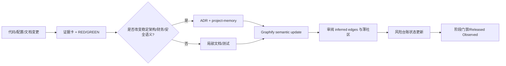

# 知识图谱、长期记忆与治理分域分析

## 1. 结论

Graphify 已经把 HomeFinance 的代码、配置、文档和测试组织成可导航的知识图谱：`graphify-out/GRAPH_REPORT.md` 记录 807 nodes、896 edges、133 communities，提取边约 85% 为 EXTRACTED、15% 为 INFERRED；中心节点包括 `Family Membership Role-Based Access Control` 和 `Current Family Data Scope`，各有 17 条连接。它适合作为导航记忆和变更影响入口，不适合作为唯一事实源。长期治理的核心是把图谱中的假设回写到可执行测试、ADR、project memory 或源代码，而不是人工编辑生成图。

## 2. 基于真实图谱的观察

| 图谱观察 | 来源 | 治理含义 |
|---|---|---|
| Family RBAC 与 Current Family Data Scope 各 17 edges | `graphify-out/GRAPH_REPORT.md:147-155` | Policy 是跨模块高中心性边界，应成为统一 service/policy，而不是继续复制 route helper。 |
| Transaction Creation Ingress Paths hyperedge 包含 income、expense、import、recurring、AI | `GRAPH_REPORT.md:171-177` | 所有写入口应由 Ledger Application Service 统一承接；这与审查中的 viewer、幂等和 cache 风险直接相连。 |
| Human-in-the-Loop AI Booking Flow 与 OCR proposal/confirmation flow | `GRAPH_REPORT.md:173,182` | 图谱显示已有确认能力资产；文本 AI 直接执行属于实现不一致，应补合同而非另建完全不同的写路径。 |
| 126 weakly-connected nodes、薄社区包含多个 route-local Access Helper | `GRAPH_REPORT.md:730-779,860-876` | 孤立/薄社区优先作为文档缺口或重复实现审查清单，不直接当作架构缺陷。 |
| 6/8 inferred relationships around Dual-Mode Ledger/Income Ledger | `GRAPH_REPORT.md:866-870` | 必须用代码或测试逐条确认，不能直接写进 product memory 作为事实。 |
| Frontend Finance Domain cohesion 0.05；Service Contracts cohesion 0.07 | `GRAPH_REPORT.md:872-876` | 可作为未来拆分候选，但不是 Phase 0 的重构理由；先由 API contracts 和 component tests 提高可见性。 |

## 3. 持续查看规则

### 3.1 Source of truth

固定顺序为：Prisma schema/migrations/可执行测试 → backend routes/middleware/services/config → frontend services/stores/pages → spec/wiki/README → Graphify 输出。Graphify 的 inferred edge 只表示待验证假设；任何与测试或 schema 冲突的图谱结论都必须被降级。

### 3.2 变更触发器

以下变化必须同步更新 `AGENTS.md`、`docs/project-memory.md`、相关 ADR、风险台账和 Graphify：

- family/role/action policy 或 tenant boundary；
- 金额、币种、期间、日期、估值、报表公式；
- route、新写入入口、后台 job、AI/OCR action；
- Prisma model、migration、index、cascade、transaction、idempotency；
- cache key/version/invalidation、Redis/MinIO/Compose、CI/CD；
- P0/P1 关闭、风险接受、回滚或生产观察结果。

### 3.3 每个变更的证据卡

每个 PR/任务保存一张证据卡：唯一 ID；源码行号；角色和 family；首个 RED 命令与真实失败输出；GREEN 最小变更；REFACTOR 目标；相关 suite/coverage/e2e；migration/rollback；Graphify update；目标环境 observation。状态固定为：`Evidence confirmed` → `RED reproduced` → `GREEN minimal fix` → `Refactored` → `Regression verified` → `Released/Observed`。

## 4. Graphify 操作协议

1. 代码、文档、图片变更后运行 semantic update；代码-only 可以使用 AST/incremental 快速路径，但文档变化必须刷新语义边。
2. 以 `graphify-out/graph.json` 做机器查询，以 `graph.html` 做人工导航，以 `GRAPH_REPORT.md` 做社区/缺口摘要。
3. 每次更新检查 `detect_incremental == 0` 或等价无残留增量；记录节点/边/社区计数变化。
4. 对 suggested questions、God Nodes、薄社区建立 review 清单；确认后的关系必须落在源文档/ADR/测试中。
5. 不手改 `graph.json`、`graph.html` 或 `GRAPH_REPORT.md` 试图“修正”图谱；应修源事实并重新生成。

## 5. 治理结构与依赖

阶段依赖应固定为：Policy 先于所有写入口迁移；Ledger 先于 recurring/import/AI 重构；exactly-once 先于自动调度；base currency/valuation 先于多币种 UI；error state 先于离线缓存；observability 和 recovery 先于生产扩大流量。

## 6. TDD 与文档治理合同

### GOV-001：记忆更新触发

- RED 文件：`backend/scripts/verify-memory-contract.test.ts` 或 CI documentation check
- 测试名：`requires memory and ADR references for policy, schema, and financial contract changes`
- 核心断言：涉及 `schema.prisma`、route policy、report formulas、cache contract 的变更若没有对应 project-memory/ADR/risk ID，检查失败；Graphify manifest 更新缺失时提示。
- 命令：`npm run verify:governance`（需在计划实施阶段加入脚本）
- 预期 RED：当前没有自动检查，文档同步依赖人工。
- GREEN：建立变更路径到文档/ADR/risk ID 的最小检查。
- REFACTOR：把证据卡、Graphify 计数和阶段门禁作为 PR artifact；允许明确标记“不改变稳定合同”的例外并由 reviewer 批准。
- 退出门禁：合同变更 PR 无法绕过 memory/ADR/Graphify 检查；普通 UI/测试改动不被过度阻断。

### GOV-002：inferred edge verification

- RED 文件：`docs/audit/graph-review.md` 与 CI link/claim check
- 测试名：`does not promote inferred graph relationships to stable facts without evidence`
- 核心断言：每条被引用的 inferred edge 都有源码路径、测试或 ADR 证据；没有证据的关系仍标记 hypothesis。
- GREEN：建立 graph review 表，记录 edge、证据、结论和 reviewer。
- REFACTOR：将 confirmed relationships 引入源文档后重新生成图，避免手工维护派生文件。
- 退出门禁：suggested questions 有处理状态；节点/边/社区变化可解释；`detect_incremental` 无未处理残留。

## 7. 长期项目记忆的最小维护面

`AGENTS.md` 保存不可违反的工程/安全/财务不变量；`docs/project-memory.md` 保存稳定系统地图、owner、风险和更新协议；审查报告保存基线证据；综合计划保存路线和门禁；ADR 保存改变语义的决定；Graphify 保存导航和待验证连接。任何一处都不应重复维护同一份易漂移的细节。

