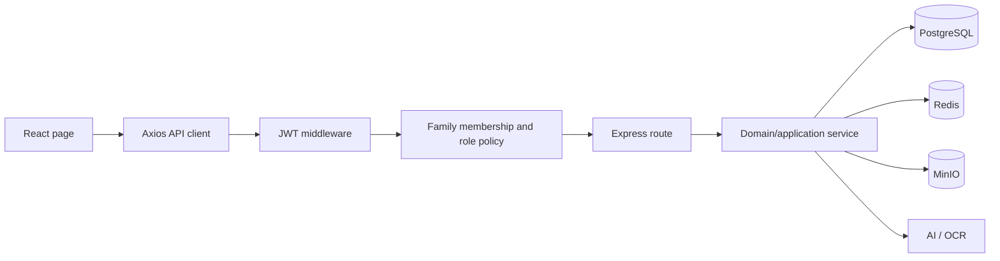

# HomeFinance project memory

## 1. Purpose and baseline

HomeFinance applies company-style financial management to a family: member collaboration, income and expense ledgers, assets and liabilities, three-statement reporting, budgets, goals, recurring records, import/export, file archiving, comparison, and AI/OCR-assisted bookkeeping.

This memory was established on 2026-08-27 against branch `main`, commit `b103e4221ae58d2cd09ee586d69f3cf90c79c146`, remote `https://github.com/QZSAMA/HomeFinance.git`. The first remediation implementation is recorded on branch `codex/phase0-remediation`; its evidence report is `docs/audit/2026-08-27-homefinance-phase0-implementation-report.md`. This file distinguishes the reviewed baseline from later regression-verified changes and does not treat unobserved target-environment behavior as fact.

## 2. Source-of-truth hierarchy

When sources disagree, use this order:

1. `backend/prisma/schema.prisma`, migrations, and executable tests for persisted contracts.
2. Backend routes, middleware, services, and configuration for runtime API behavior.
3. Frontend services, stores, routes, and pages for client behavior.
4. Design specifications, `docs/wiki.md`, development rules, and README for intent.
5. `graphify-out/graph.json` and `GRAPH_REPORT.md` for navigation and hypotheses.

README statistics and product claims are not acceptance criteria unless tests or runtime evidence confirm them. At this baseline, the README's “16 suites / 132 tests” and “offline usable” statements are stale or overstated.

## 3. System map

| Layer | Primary locations | Responsibility |
|---|---|---|
| Web client | `frontend/src/pages`, `components`, `services`, `store` | React 19 SPA, family context, forms, reports, charts, AI/OCR interaction |
| HTTP API | `backend/src/app.ts`, `routes`, `middleware` | Express REST surface, JWT auth, family access, validation, cache and rate limiting |
| Process lifecycle | `backend/src/server.ts`, `backend/src/db/prisma.ts` | Listener, external-service initialization, graceful shutdown, and the single Prisma Client boundary; importing `app.ts` has no startup side effect |
| Domain/application logic | `backend/src/services`, `utils` | AI action parsing/execution, OCR, import parsing, recurring dates, pagination, decimal conversion |
| Persistence | `backend/prisma/schema.prisma` | PostgreSQL via Prisma; users, families, membership, finance records, files, conversations |
| Volatile infrastructure | Redis | GET response cache and fixed-window AI rate limiting; designed to degrade on outage |
| Object storage | MinIO | Family file objects, presigned URLs, OCR image persistence, perceptual-hash metadata |
| External AI | Volcano Ark-compatible endpoint | OpenAI-compatible chat and optional vision; local rules/Tesseract provide partial degradation |
| Delivery | Docker Compose, Nginx, PWA plugin, GitHub Actions | Local/container deployment, frontend hosting, builds, unit and PostgreSQL integration jobs |

### Critical request paths



The enforced report order on the remediation branch is authentication, family authorization, family-versioned cache, then resource access. The baseline cache-before-policy exception is preserved in the audit as historical evidence.

## 4. Domain invariants

| Invariant | Required behavior | Baseline status |
|---|---|---|
| Tenant isolation | Every family-scoped operation verifies membership before data/cache/storage access | Report cache authorization regression verified; broader target-environment matrix remains pending |
| Viewer semantics | Viewer can read but cannot mutate through any ingress | Unified mutation middleware and zero-side-effect viewer tests added; full role×method matrix remains pending |
| Admin continuity | A family always retains at least one admin | Implemented and tested |
| Financial reconciliation | Statements use consistent classification, currency, and as-of rules | Other cash flow now reconciles in a regression fixture; classification, period and currency issues remain |
| Atomic transaction generation | Imports, recurring, and AI writes are atomic/idempotent | Not consistently implemented |
| Human confirmation | AI-proposed writes require explicit confirmation | Image/OCR path supports it; text chat writes immediately |
| Cache correctness | Authorized epoch/family/version/URL keys; mutation and revision commit atomically | `v2` protocol epoch, PostgreSQL-backed `Family.cacheVersion`, trigger coverage and stale-Redis restart regression are verified in code; real migration, Redis outage and multi-instance recovery remain unobserved |
| Bounded work | List/import/report work is paginated or capped | Partial; optional pagination and unbounded import/report aggregation remain |

## 5. Feature ownership map

| Capability | Frontend | Backend | Persistence/support |
|---|---|---|---|
| Authentication | `useAuthStore`, login/register pages, `authService` | `routes/auth.ts`, `middleware/auth.ts` | `User`, JWT |
| Family collaboration | `FamiliesPage`, `FamilySelector`, `familyService` | `routes/families.ts` | `Family`, `FamilyMember` |
| Income/expense ledger | `TransactionsPage`, `financeService` | `routes/incomes.ts`, `expenses.ts` | `Income`, `Expense` |
| Assets/liabilities | assets and liabilities pages | corresponding routes | `Asset`, `Liability` |
| Reports/dashboard | reports/dashboard pages, charts, `reportService` | `routes/reports.ts`, `compare.ts` | derived from financial tables, Redis cache |
| Budgets/goals | budget and goals pages/services | `routes/budgets.ts`, `goals.ts` | `Budget`, `Goal` |
| Recurring | recurring page/service | `routes/recurring.ts`, recurring date service | `RecurringTransaction`, generated ledger rows |
| Import/export | import page and export/import services | `routes/import.ts`, `export.ts`, parser service | ledger rows, Excel/CSV |
| Files | files page/service | `routes/files.ts`, MinIO and pHash helpers | `File`, MinIO objects |
| AI/OCR | `AIPage`, AI service client | `routes/ai.ts`, `aiService`, `aiActions`, OCR/file storage services | `AIConversation`, ledger rows, MinIO |

## 6. Baseline quality facts

- 68 Express endpoints, 20 frontend page files, 14 frontend service files, and 16 backend route files were inventoried.
- Clean backend and frontend builds pass.
- Default Jest run passes 21 suites and 215 tests; the real-database suite is opt-in and has a separate CI job.
- Coverage run fails the configured 60% global threshold: statements 53.78%, branches 39.72%, functions 55.21%, lines 54.07%.
- Frontend lint exits successfully with 18 warnings, mainly missing Hook dependencies.
- Frontend production main chunk is 854.60 kB minified / 237.44 kB gzip; route-level pages are eagerly imported.
- Runtime smoke evidence is under `docs/audit/evidence/`. The profit statement request omitted authorization and returned 401 while the UI rendered zeros.
- The baseline machine had PostgreSQL on port 5432, but Redis, MinIO, and Docker were unavailable; full Compose behavior was not executed locally.

### Phase 1 implementation facts on `codex/phase1-ledger-trust`

- Commit `a726668` separates Express construction (`app.ts`), process startup/shutdown (`server.ts`), and Prisma Client ownership (`db/prisma.ts`). A focused import test proves the app does not open a listener or initialize Redis/MinIO; this is PASS-MOCK rather than real-infrastructure evidence.
- Commit `36c710d` introduces pure `LedgerApplicationService` and `FinancialMutationCoordinator` contracts for normalized Income/Expense create commands, authorization-before-mutation, stable errors, canonical request hashing, sequential replay/conflict, audit/result orchestration, and transaction dependency injection. Commit `db98a00` places `effectiveDate` at the top-level command boundary and hardens opt-in integration test isolation across Windows/POSIX.
- These services are not yet consumed by Income/Expense routes. The pure coordinator contract remains PASS-MOCK, while the typed Prisma adapter and database-arbitrated concurrency/replay have separate local PASS-REAL evidence; route-level exactly-once is not yet proven because routes remain on the legacy path.
- The default backend suite excludes every opt-in `*.integration.test.ts` file on Windows and POSIX; only exact `RUN_INTEGRATION=1` enables them, and the dedicated script discovers all integration suites. All 34 default suites / 281 tests pass. The Prisma financial-mutation adapter rejects invalid Dates, unsupported JSON values, undefined array entries, non-finite (`NaN`/`±Infinity`) numbers, and non-plain objects such as `Map`, `Set`, and `RegExp` before any persistence call; ordinary objects including null-prototype objects remain supported. Its unit contract now reaches 87.03% statements, 89.47% branches, 75% functions and 88.09% lines. `ensureBucket()` now propagates MinIO initialization failure to `startServer()`, the lifecycle owner that records the error; a server regression proves startup continues and duplicate shutdown reaches listener close/Prisma disconnect only once. The required global coverage command reports statements 63.22%, branches 46.01%, functions 64.06% and lines 63.58%, so it still fails because branches are below the unchanged 60% threshold. Existing OCR/MinIO fixtures emit console warnings. Prisma format/validate/generate and the dedicated PostgreSQL integration suite pass with matching local 5.22 engines.
- The current P1-G-03 frontend slice adds three `ImportPage` and two `AIPage` React Testing Library contracts: the CSV file input is discoverable through its visible label; failed import and AI proposed-action confirmation are alerts; and pending confirmations prevent a second local click before their returned success counts are announced as statuses. The frontend suite now passes 3 suites / 10 tests, lint has no errors and retains 16 pre-existing warnings, and the production build still reports the known oversized 856.71 kB main chunk. These are PASS-MOCK UI semantics only; the legacy import endpoint lacks the Phase 1 batch/idempotency contract and legacy AI confirmation has not adopted P1-E proposal-only, server-side exactly-once semantics.
- Commit `17c2644` adds Phase 1 persistence for Family.baseCurrency, Income/Expense version/currency/origin fields, RecurringTransaction.version, scoped IdempotencyRecord, and append-oriented AuditEvent. A fresh PostgreSQL 18.1 database applied all six migrations and passed 2 integration suites / 20 tests for unique arbitration, defaults, stale version predicates, cache revision and rollback. Twenty-way coordinator replay, populated upgrades, restore/staging and route adoption remain open.
- The P1-B-04 implementation adds a typed Prisma adapter and coordinator recovery path for scoped `P2002`: membership is checked before root winner lookup; matching completed records replay, hash mismatches return stable `IDEMPOTENCY_KEY_REUSED`, and incomplete winners return bounded retryable `IDEMPOTENCY_IN_PROGRESS`. Real PostgreSQL 18.1 evidence on localhost:5433 passes 3 integration suites / 24 tests, including 20 identical requests collapsing to one Income, one IdempotencyRecord and one AuditEvent with 19 replays, response-loss replay, payload conflict and stale-version arbitration. A 2026-08-31 aggregate recheck produced one unclassified `INTERNAL_ERROR`, then passed a full rerun and five isolated concurrency repetitions. `mapPrismaError` now preserves an unmapped raw Prisma error as non-enumerable `DomainError.cause`; a focused RED/GREEN verifies this for simulated `P2028` without exposing database detail in the stable client error. P1-B-04 therefore retains historical local REGRESSION_VERIFIED/PASS-REAL evidence but is AT_RISK until an actual recurrence is classified or ruled out. Route adoption, populated upgrade/restore, staging and release observation remain open.
- Current P1-A-03 service-boundary hardening rejects an executor result without a nonblank `resourceId` before AuditEvent and replay-result persistence. Its original focused RED/GREEN proves the coordinator no longer records internally inconsistent audit/idempotency output, and a 2026-08-31 PostgreSQL 18.1 failure-injection test now creates an Income before returning a whitespace-only resource ID, receives `VALIDATION_FAILED`, and proves that Income, IdempotencyRecord, and AuditEvent counts remain unchanged. The exact invalid-result rollback is therefore PASS-REAL, but it does not prove HTTP route adoption or route-level exactly-once behavior.

## 7. Risk status after first remediation

The four original code blockers now have failing-then-passing regression evidence on `codex/phase0-remediation`: viewer mutation denial, authorization-before-cache, authenticated profit-statement loading with explicit error state, and cash-flow reconciliation. Family cache write-after-read freshness and stale-cache protection across Redis outage plus process restart now use a PostgreSQL-backed durable revision and have regression fixtures.

Phase 1 implementation has started on `codex/phase1-ledger-trust`. Process lifecycle separation, the pure Ledger/coordinator protocol, additive persistence models, typed Prisma adaptation, pre-audit mutation-result validation and database-arbitrated twenty-way replay are implemented with focused TDD and local PostgreSQL evidence. They do not close all data-integrity risks: current routes still bypass the service, update/delete/import/recurring/AI adoption is incomplete, and populated upgrade/restore, staging/release and global coverage evidence remain open.

Phase 0 is not fully exited. Remaining gates are high dependency advisories (backend 3, frontend 6), a complete role/method authorization matrix, real PostgreSQL/Redis/MinIO/Compose verification, browser E2E, and disposition of the 16 frontend warnings and large main bundle. The project remains unsuitable for an unsupported public production release until those gates and later Phase 1 data-integrity risks are addressed.

See `docs/audit/2026-08-27-homefinance-deep-audit-report.md` for evidence and `docs/audit/2026-08-27-homefinance-integrated-remediation-plan.md` for the consolidated TDD acceptance tests, sequencing, migration, rollback, and new-feature portfolio. The six supporting domain analyses are under `docs/audit/parallel-analysis/`.

## 8. Memory update protocol

Update this file when any of the following changes:

- tenant/role rules, financial calculation semantics, data ownership, or AI mutation policy;
- a route is added, removed, renamed, or moved behind a new service boundary;
- Prisma models, cascades, indexes, currency/date behavior, or transaction boundaries change;
- cache keys, invalidation, MinIO topology, deployment security, or external AI contracts change;
- a baseline blocker is fixed or a new P0/P1 risk is accepted.

For every update, record the new commit, update affected feature and invariant tables, link a failing-then-passing test, and refresh Graphify. Use `graphify-out/graph.html` for visual navigation, `graphify-out/graph.json` for machine queries, and `graphify-out/GRAPH_REPORT.md` for community hubs and knowledge gaps. Inferred edges are leads, not facts.

Optional automation:

```powershell
graphify hook install
python -m graphify.watch . --debounce 3
```

The hook updates code structure after commits; documentation or image changes still require `/graphify . --update` so semantic edges are refreshed.

## 9. Decision log

| Date | Decision | Reason | Revisit trigger |
|---|---|---|---|
| 2026-08-27 | Treat family as the tenant boundary | All principal resources are family-scoped | Cross-family sharing or organization accounts |
| 2026-08-27 | Block feature expansion until financial correctness and access control are repaired | Current defects can expose or corrupt household financial data | All Phase 0 gates pass |
| 2026-08-27 | Use TDD for remediation | Each audit finding needs a reproducible regression contract | Only by explicit project-owner exception |
| 2026-08-27 | Keep Graphify as navigation memory, not ultimate truth | Semantic edges include model inference and isolated nodes | Extraction quality or source-of-truth policy changes |
| 2026-08-27 | Version report caches with PostgreSQL `Family.cacheVersion` advanced by transaction-local triggers | A Redis-only or process-memory dirty marker cannot survive outage plus restart/multi-instance routing; DB revision commits atomically with family mutations | Measured trigger contention, schema redesign, or a transactional outbox replaces the mechanism |
| 2026-08-27 | Treat report request failure as error, never financial zero | Unknown data and real zero carry different financial meaning | A documented offline/degraded data contract replaces this rule |
| 2026-08-28 | Separate app construction, process lifecycle, and Prisma ownership | Route tests must import the Express app without listeners or external initialization | Deployment topology or multi-process ownership changes |
| 2026-08-28 | Freeze a pure Ledger/coordinator protocol before route and schema migration | Shared commands, stable errors, authorization order, hashes, audit/result semantics, and TDD evidence must exist before ingress refactors | ADR-0001/0002 acceptance or real Prisma adapter evidence changes the contract |
| 2026-08-28 | Accept ADR-0001/0002 for Phase 1 implementation | Repository Owner repeatedly approved Scheme B, the detailed design and implementation; governance now matches that authorization | New evidence requires changing coordinator ownership or database arbitration |
