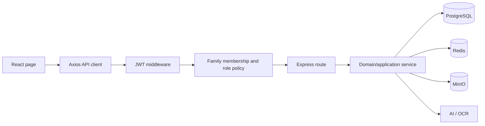

# HomeFinance project memory

## 1. Purpose and baseline

HomeFinance applies company-style financial management to a family: member collaboration, income and expense ledgers, assets and liabilities, three-statement reporting, budgets, goals, recurring records, import/export, file archiving, comparison, and AI/OCR-assisted bookkeeping.

This memory was established on 2026-08-27 against branch `main`, commit `b103e4221ae58d2cd09ee586d69f3cf90c79c146`, remote `https://github.com/QZSAMA/HomeFinance.git`. It describes the reviewed baseline, not a guarantee that later code still behaves the same.

## 2. Source-of-truth hierarchy

When sources disagree, use this order:

1. `backend/prisma/schema.prisma`, migrations, and executable tests for persisted contracts.
2. Backend routes, middleware, services, and configuration for runtime API behavior.
3. Frontend services, stores, routes, and pages for client behavior.
4. Design specifications, `docs/wiki.md`, development rules, and README for intent.
5. `graphify-out/graph.json` and `GRAPH_REPORT.md` for navigation and hypotheses.

README statistics and product claims are not acceptance criteria unless tests or runtime evidence confirm them. At this baseline, the README's “16 suites / 132 tests” and “offline usable” statements are stale or overstated.

## 3. System map

| Layer | Primary locations | Responsibility |
|---|---|---|
| Web client | `frontend/src/pages`, `components`, `services`, `store` | React 19 SPA, family context, forms, reports, charts, AI/OCR interaction |
| HTTP API | `backend/src/app.ts`, `routes`, `middleware` | Express REST surface, JWT auth, family access, validation, cache and rate limiting |
| Domain/application logic | `backend/src/services`, `utils` | AI action parsing/execution, OCR, import parsing, recurring dates, pagination, decimal conversion |
| Persistence | `backend/prisma/schema.prisma` | PostgreSQL via Prisma; users, families, membership, finance records, files, conversations |
| Volatile infrastructure | Redis | GET response cache and fixed-window AI rate limiting; designed to degrade on outage |
| Object storage | MinIO | Family file objects, presigned URLs, OCR image persistence, perceptual-hash metadata |
| External AI | Volcano Ark-compatible endpoint | OpenAI-compatible chat and optional vision; local rules/Tesseract provide partial degradation |
| Delivery | Docker Compose, Nginx, PWA plugin, GitHub Actions | Local/container deployment, frontend hosting, builds, unit and PostgreSQL integration jobs |

### Critical request paths



The desired order is authentication, authorization, then cache or resource access. The reviewed report routes currently place cache lookup before the family membership check; this is a release-blocking exception recorded in the audit.

## 4. Domain invariants

| Invariant | Required behavior | Baseline status |
|---|---|---|
| Tenant isolation | Every family-scoped operation verifies membership before data/cache/storage access | Broadly present, but report cache can bypass handler authorization |
| Viewer semantics | Viewer can read but cannot mutate through any ingress | Broken across many POST routes |
| Admin continuity | A family always retains at least one admin | Implemented and tested |
| Financial reconciliation | Statements use consistent classification, currency, and as-of rules | Partially implemented; cash-flow and currency issues remain |
| Atomic transaction generation | Imports, recurring, and AI writes are atomic/idempotent | Not consistently implemented |
| Human confirmation | AI-proposed writes require explicit confirmation | Image/OCR path supports it; text chat writes immediately |
| Cache correctness | User/tenant-scoped keys and write invalidation | Broken; URL-only keys and TTL-only freshness |
| Bounded work | List/import/report work is paginated or capped | Partial; optional pagination and unbounded import/report aggregation remain |

## 5. Feature ownership map

| Capability | Frontend | Backend | Persistence/support |
|---|---|---|---|
| Authentication | `useAuthStore`, login/register pages, `authService` | `routes/auth.ts`, `middleware/auth.ts` | `User`, JWT |
| Family collaboration | `FamiliesPage`, `FamilySelector`, `familyService` | `routes/families.ts` | `Family`, `FamilyMember` |
| Income/expense ledger | `TransactionsPage`, `financeService` | `routes/incomes.ts`, `expenses.ts` | `Income`, `Expense` |
| Assets/liabilities | assets and liabilities pages | corresponding routes | `Asset`, `Liability` |
| Reports/dashboard | reports/dashboard pages, charts, `reportService` | `routes/reports.ts`, `compare.ts` | derived from financial tables, Redis cache |
| Budgets/goals | budget and goals pages/services | `routes/budgets.ts`, `goals.ts` | `Budget`, `Goal` |
| Recurring | recurring page/service | `routes/recurring.ts`, recurring date service | `RecurringTransaction`, generated ledger rows |
| Import/export | import page and export/import services | `routes/import.ts`, `export.ts`, parser service | ledger rows, Excel/CSV |
| Files | files page/service | `routes/files.ts`, MinIO and pHash helpers | `File`, MinIO objects |
| AI/OCR | `AIPage`, AI service client | `routes/ai.ts`, `aiService`, `aiActions`, OCR/file storage services | `AIConversation`, ledger rows, MinIO |

## 6. Baseline quality facts

- 68 Express endpoints, 20 frontend page files, 14 frontend service files, and 16 backend route files were inventoried.
- Clean backend and frontend builds pass.
- Default Jest run passes 21 suites and 215 tests; the real-database suite is opt-in and has a separate CI job.
- Coverage run fails the configured 60% global threshold: statements 53.78%, branches 39.72%, functions 55.21%, lines 54.07%.
- Frontend lint exits successfully with 18 warnings, mainly missing Hook dependencies.
- Frontend production main chunk is 854.60 kB minified / 237.44 kB gzip; route-level pages are eagerly imported.
- Runtime smoke evidence is under `docs/audit/evidence/`. The profit statement request omitted authorization and returned 401 while the UI rendered zeros.
- The baseline machine had PostgreSQL on port 5432, but Redis, MinIO, and Docker were unavailable; full Compose behavior was not executed locally.

## 7. Known release blockers

1. Viewers can mutate through multiple POST endpoints.
2. Cached reports can be returned before family authorization.
3. Profit statement requests bypass the authenticated API client.
4. Cash-flow net excludes displayed “other” income/expense.

See `docs/audit/2026-08-27-homefinance-deep-audit-report.md` for evidence and `docs/audit/2026-08-27-homefinance-integrated-remediation-plan.md` for the consolidated TDD acceptance tests, sequencing, migration, rollback, and new-feature portfolio. The six supporting domain analyses are under `docs/audit/parallel-analysis/`.

## 8. Memory update protocol

Update this file when any of the following changes:

- tenant/role rules, financial calculation semantics, data ownership, or AI mutation policy;
- a route is added, removed, renamed, or moved behind a new service boundary;
- Prisma models, cascades, indexes, currency/date behavior, or transaction boundaries change;
- cache keys, invalidation, MinIO topology, deployment security, or external AI contracts change;
- a baseline blocker is fixed or a new P0/P1 risk is accepted.

For every update, record the new commit, update affected feature and invariant tables, link a failing-then-passing test, and refresh Graphify. Use `graphify-out/graph.html` for visual navigation, `graphify-out/graph.json` for machine queries, and `graphify-out/GRAPH_REPORT.md` for community hubs and knowledge gaps. Inferred edges are leads, not facts.

Optional automation:

```powershell
graphify hook install
python -m graphify.watch . --debounce 3
```

The hook updates code structure after commits; documentation or image changes still require `/graphify . --update` so semantic edges are refreshed.

## 9. Decision log

| Date | Decision | Reason | Revisit trigger |
|---|---|---|---|
| 2026-08-27 | Treat family as the tenant boundary | All principal resources are family-scoped | Cross-family sharing or organization accounts |
| 2026-08-27 | Block feature expansion until financial correctness and access control are repaired | Current defects can expose or corrupt household financial data | All Phase 0 gates pass |
| 2026-08-27 | Use TDD for remediation | Each audit finding needs a reproducible regression contract | Only by explicit project-owner exception |
| 2026-08-27 | Keep Graphify as navigation memory, not ultimate truth | Semantic edges include model inference and isolated nodes | Extraction quality or source-of-truth policy changes |
