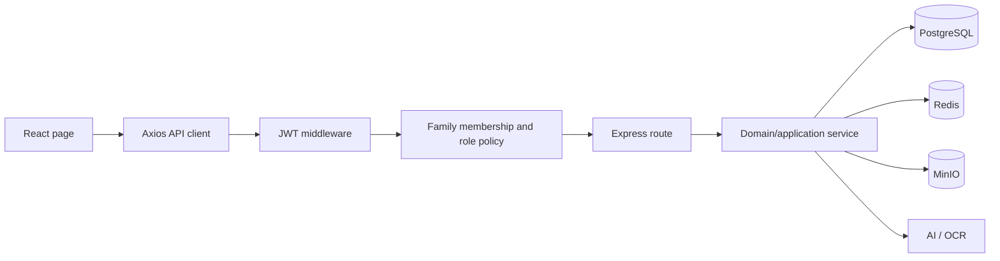

# HomeFinance project memory

## 1. Purpose and baseline

HomeFinance applies company-style financial management to a family: member collaboration, income and expense ledgers, assets and liabilities, three-statement reporting, budgets, goals, recurring records, import/export, file archiving, comparison, and AI/OCR-assisted bookkeeping.

This memory was established on 2026-08-27 against branch `main`, commit `b103e4221ae58d2cd09ee586d69f3cf90c79c146`, remote `https://github.com/QZSAMA/HomeFinance.git`. The first remediation implementation is recorded on branch `codex/phase0-remediation`; its evidence report is `docs/audit/2026-08-27-homefinance-phase0-implementation-report.md`. This file distinguishes the reviewed baseline from later regression-verified changes and does not treat unobserved target-environment behavior as fact.

## 2. Source-of-truth hierarchy

When sources disagree, use this order:

1. `backend/prisma/schema.prisma`, migrations, and executable tests for persisted contracts.
2. Backend routes, middleware, services, and configuration for runtime API behavior.
3. Frontend services, stores, routes, and pages for client behavior.
4. Design specifications, `docs/wiki.md`, development rules, and README for intent.
5. `graphify-out/graph.json` and `GRAPH_REPORT.md` for navigation and hypotheses.

README statistics and product claims are not acceptance criteria unless tests or runtime evidence confirm them. At this baseline, the README's “16 suites / 132 tests” and “offline usable” statements are stale or overstated.

## 3. System map

| Layer | Primary locations | Responsibility |
|---|---|---|
| Web client | `frontend/src/pages`, `components`, `services`, `store` | React 19 SPA, family context, forms, reports, charts, AI/OCR interaction |
| HTTP API | `backend/src/app.ts`, `routes`, `middleware` | Express REST surface, JWT auth, family access, validation, cache and rate limiting |
| Process lifecycle | `backend/src/server.ts`, `backend/src/db/prisma.ts` | Listener, external-service initialization, graceful shutdown, and the single Prisma Client boundary; importing `app.ts` has no startup side effect |
| Domain/application logic | `backend/src/services`, `utils` | AI action parsing/proposal normalization and confirmation, OCR, import parsing, recurring dates, pagination, decimal conversion |
| Persistence | `backend/prisma/schema.prisma` | PostgreSQL via Prisma; users, families, membership, finance records, files, conversations |
| Volatile infrastructure | Redis | GET response cache and fixed-window AI rate limiting; designed to degrade on outage |
| Object storage | MinIO | Family file objects, presigned URLs, OCR image persistence, perceptual-hash metadata |
| External AI | Volcano Ark-compatible endpoint | OpenAI-compatible chat and optional vision; local rules/Tesseract provide partial degradation |
| Delivery | Docker Compose, Nginx, PWA plugin, GitHub Actions | Local/container deployment, frontend hosting, builds, unit and PostgreSQL integration jobs |

### Critical request paths



The enforced report order on the remediation branch is authentication, family authorization, family-versioned cache, then resource access. The baseline cache-before-policy exception is preserved in the audit as historical evidence.

## 4. Domain invariants

| Invariant | Required behavior | Baseline status |
|---|---|---|
| Tenant isolation | Every family-scoped operation verifies membership before data/cache/storage access | Report cache authorization regression verified; broader target-environment matrix remains pending |
| Viewer semantics | Viewer can read but cannot mutate through any ingress | Unified mutation middleware plus real negative role×method evidence for all registered family mutation entries; positive full-role matrix remains pending |
| Admin continuity | A family always retains at least one admin | Implemented and tested |
| Financial reconciliation | Statements use consistent classification, currency, and as-of rules | Other cash flow now reconciles in a regression fixture; classification, period and currency issues remain |
| Atomic transaction generation | Imports, recurring, and AI writes are atomic/idempotent | Import batch confirm, recurring occurrence execution, ordinary Asset/Liability CRUD and supported AI Income/Expense/Asset/Liability confirmation now use transaction-backed Ledger/Balance paths with local PostgreSQL atomic/replay/concurrency evidence; valuation semantics and external infrastructure remain open |
| Human confirmation | AI-proposed writes require explicit confirmation | Text chat and Image/OCR are proposal-only; server-owned proposal persistence, proposalId/version/hash confirmation, atomic supported Ledger mutation, replay protection and refresh recovery are implemented and tested; cancellation, Balance actions and legacy adapter closure remain open |
| Cache correctness | Authorized epoch/family/version/URL keys; mutation and revision commit atomically | `v2` protocol epoch, PostgreSQL-backed `Family.cacheVersion`, trigger coverage and stale-Redis restart regression are verified in code; real migration, Redis outage and multi-instance recovery remain unobserved |
| Bounded work | List/import/report work is paginated or capped | Partial; optional pagination and unbounded import/report aggregation remain |

## 5. Feature ownership map

| Capability | Frontend | Backend | Persistence/support |
|---|---|---|---|
| Authentication | `useAuthStore`, login/register pages, `authService` | `routes/auth.ts`, `middleware/auth.ts` | `User`, JWT |
| Family collaboration | `FamiliesPage`, `FamilySelector`, `familyService` | `routes/families.ts` | `Family`, `FamilyMember` |
| Income/expense ledger | `TransactionsPage`, `financeService` | `routes/incomes.ts`, `expenses.ts` | `Income`, `Expense` |
| Assets/liabilities | assets and liabilities pages | corresponding routes | `Asset`, `Liability` |
| Reports/dashboard | reports/dashboard pages, charts, `reportService` | `routes/reports.ts`, `compare.ts` | derived from financial tables, Redis cache |
| Budgets/goals | budget and goals pages/services | `routes/budgets.ts`, `goals.ts` | `Budget`, `Goal` |
| Recurring | `RecurringPage`, `recurringService` | `routes/recurring.ts`, `recurringService.ts`, `prismaRecurringExecutionStore.ts` | `RecurringTransaction`, `RecurringExecution`, generated Income/Expense rows, idempotency and audit |
| Import/export | import page and export/import services | `routes/import.ts`, `export.ts`, parser service | ledger rows, Excel/CSV |
| Files | files page/service | `routes/files.ts`, MinIO and pHash helpers | `File`, MinIO objects |
| AI/OCR | `AIPage`, AI service client | `routes/ai.ts`, `aiService`, `aiActions`, `aiProposalService`, `aiProposalConfirmationService`, OCR/file storage services | `AIConversation`, `AiProposal`, `AiProposalItem`, ledger rows, MinIO |

## 6. Baseline quality facts

- 68 Express endpoints, 20 frontend page files, 14 frontend service files, and 16 backend route files were inventoried.
- Clean backend and frontend builds pass.
- Default Jest run passes 21 suites and 215 tests; the real-database suite is opt-in and has a separate CI job.
- Coverage run fails the configured 60% global threshold: statements 53.78%, branches 39.72%, functions 55.21%, lines 54.07%.
- Frontend lint exits successfully with 18 warnings, mainly missing Hook dependencies.
- Frontend production main chunk is 854.60 kB minified / 237.44 kB gzip; route-level pages are eagerly imported.
- Runtime smoke evidence is under `docs/audit/evidence/`. The profit statement request omitted authorization and returned 401 while the UI rendered zeros.
- The baseline machine had PostgreSQL on port 5432, but Redis, MinIO, and Docker were unavailable; full Compose behavior was not executed locally.

### Phase 1 implementation facts on `codex/phase1-ledger-trust`

- Commit `a726668` separates Express construction (`app.ts`), process startup/shutdown (`server.ts`), and Prisma Client ownership (`db/prisma.ts`). A focused import test proves the app does not open a listener or initialize Redis/MinIO; this is PASS-MOCK rather than real-infrastructure evidence.
- Commit `36c710d` introduces pure `LedgerApplicationService` and `FinancialMutationCoordinator` contracts for normalized Income/Expense create commands, authorization-before-mutation, stable errors, canonical request hashing, sequential replay/conflict, audit/result orchestration, and transaction dependency injection. Commit `db98a00` places `effectiveDate` at the top-level command boundary and hardens opt-in integration test isolation across Windows/POSIX.
- These services are not yet consumed by Income/Expense routes. The pure coordinator contract remains PASS-MOCK, while the typed Prisma adapter and database-arbitrated concurrency/replay have separate local PASS-REAL evidence; route-level exactly-once is not yet proven because routes remain on the legacy path.
- The default backend suite excludes every opt-in `*.integration.test.ts` file on Windows and POSIX; only exact `RUN_INTEGRATION=1` enables them, and the dedicated script discovers all integration suites. All 34 default suites / 295 tests pass. The Prisma financial-mutation adapter rejects invalid Dates, unsupported JSON values, undefined array entries, non-finite (`NaN`/`±Infinity`) numbers, and non-plain objects such as `Map`, `Set`, and `RegExp` before any persistence call; ordinary objects including null-prototype objects remain supported. The Ledger coordinator additionally rejects malformed canonical payloads before a transaction, family/user membership mismatches before an idempotency lookup, and corrupt stored responses before replay; command validation rejects invalid amount/category/currency/source before membership lookup. `ensureBucket()` propagates MinIO initialization failure to `startServer()`, the lifecycle owner that records the error; a server regression proves startup continues and duplicate shutdown reaches listener close/Prisma disconnect only once. The required global coverage command reports statements 63.71%, branches 47.10%, functions 64.06% and lines 64.00%, so it still fails because branches are below the unchanged 60% threshold. Existing OCR/MinIO fixtures emit console warnings. Prisma format/validate/generate and the dedicated PostgreSQL integration suite pass with matching local 5.22 engines.
- The 2026-08-31 P1-G-03 frontend slice added three `ImportPage` and two `AIPage` React Testing Library contracts: accessible file selection, alert/status semantics, and pending-click guards. At that checkpoint the frontend passed 3 suites / 10 tests with 16 warnings and a 856.71 kB main chunk, while Import still used the legacy confirm shape. P1-C-06 later migrated Import and P1-D later added Recurring occurrence/key retry contracts; AI proposal-only remains open.
- Commit `17c2644` adds Phase 1 persistence for Family.baseCurrency, Income/Expense version/currency/origin fields, RecurringTransaction.version, scoped IdempotencyRecord, and append-oriented AuditEvent. A fresh PostgreSQL 18.1 database applied all six migrations and passed 2 integration suites / 20 tests for unique arbitration, defaults, stale version predicates, cache revision and rollback. Twenty-way coordinator replay, populated upgrades, restore/staging and route adoption remain open.
- The P1-B-04 implementation adds a typed Prisma adapter and coordinator recovery path for scoped `P2002`: membership is checked before root winner lookup; matching completed records replay, hash mismatches return stable `IDEMPOTENCY_KEY_REUSED`, and incomplete winners return bounded retryable `IDEMPOTENCY_IN_PROGRESS`. Real PostgreSQL 18.1 evidence on localhost:5433 passes 3 integration suites / 24 tests, including 20 identical requests collapsing to one Income, one IdempotencyRecord and one AuditEvent with 19 replays, response-loss replay, payload conflict and stale-version arbitration. A 2026-08-31 aggregate recheck produced one unclassified `INTERNAL_ERROR`, then passed a full rerun and five isolated concurrency repetitions. `mapPrismaError` now preserves an unmapped raw Prisma error as non-enumerable `DomainError.cause`; a focused RED/GREEN verifies this for simulated `P2028` without exposing database detail in the stable client error. P1-B-04 therefore retains historical local REGRESSION_VERIFIED/PASS-REAL evidence but is AT_RISK until an actual recurrence is classified or ruled out. Route adoption, populated upgrade/restore, staging and release observation remain open.
- P1-B-03/P1-B-05 add PASS-REAL verification only, with no production-code change: in local PostgreSQL 18.1, reusing a completed scoped key with a different payload returns `IDEMPOTENCY_KEY_REUSED` and leaves Income, IdempotencyRecord, AuditEvent and `Family.cacheVersion` unchanged; twenty identical concurrent `createIncome` commands advance `Family.cacheVersion` exactly once, while replaying a completed command leaves those same facts and revision unchanged. The shared-family integration assertions use snapshots or relative counts so they are independent of previously committed fixtures. The full integration suite passes 3 suites / 27 tests; the default 34-suite / 295-test coverage run still fails only the unchanged 60% branch threshold at 47.10%. This evidence does not prove HTTP route adoption, Redis/Compose behavior, populated upgrades/restores, or staging/release operation; P1-B-04's historic unclassified `INTERNAL_ERROR` keeps all three gates AT_RISK.
- The installed Graphify executable currently exposes only AST code updates. A 2026-08-31 attempt would have replaced the reviewed semantic graph (692 nodes / 680 edges) with a smaller 653-node / 617-edge structure-only graph, so the generated files were restored. Treat semantic Graphify refreshes for subsequent test-and-documentation changes as pending until the intended semantic incremental runner is available; do not substitute or claim the AST-only result as a complete knowledge-memory update.
- Current P1-A-03 service-boundary hardening rejects an executor result without a nonblank `resourceId` before AuditEvent and replay-result persistence. Its original focused RED/GREEN proves the coordinator no longer records internally inconsistent audit/idempotency output, and a 2026-08-31 PostgreSQL 18.1 failure-injection test now creates an Income before returning a whitespace-only resource ID, receives `VALIDATION_FAILED`, and proves that Income, IdempotencyRecord, and AuditEvent counts remain unchanged. The exact invalid-result rollback is therefore PASS-REAL, but it does not prove HTTP route adoption or route-level exactly-once behavior.
- The 2026-08-31 P1-A-04/P1-A-05 route adoption connects Income and Expense POST/PUT/DELETE to `LedgerApplicationService`; those routes no longer call `income/expense.create`, `update`, or `delete` directly and no longer carry a route-local family-access copy. The HTTP adapter applies centralized `requireFamilyAccess`/`requireFamilyWriteAccess`, forwards `Idempotency-Key`, supports compatible missing or integer/quoted/weak `If-Match`, exposes replay through both `deduplicated` and CORS-readable `Idempotency-Replayed: true`, and returns a stable `VALIDATION_FAILED` contract for malformed input. Ledger update/delete reads only in the family scope, then uses `id + familyId + version` conditional `updateMany`/`deleteMany` operations, records the before snapshot for audit, and maps zero conditional writes to `VERSION_CONFLICT`; missing `If-Match` uses the version read inside the transaction for legacy compatibility. Focused adapter/security/cache tests are PASS-MOCK (18 contracts); `ledgerRoutes.phase1.integration.test.ts` is PASS-REAL for authenticated-member HTTP→PostgreSQL CRUD: Income create/replay/weak-ETag update/stale 409/delete and Expense create/update/stale 409/delete. `npm run test:integration` passes 5 suites / 33 tests; the full coverage run executes 37 suites / 322 tests with all assertions passing, but the required coverage gate remains FAILED at branches 50.48% versus 60%. Existing OCR/MinIO warning fixtures, frontend warnings, oversized bundle, remaining external/object-isolation role coverage, Graphify semantic refresh, infrastructure, E2E and release observation remain open.
- The 2026-09-01 P1-G-02 authorization slice adds `requireFamilyAdminAccess` for Family update/delete/invite/role administration and `requireFamilyMemberRemovalAccess` for the explicit admin-or-member-self-removal rule. Viewer self-removal is rejected, and role changes cannot demote the final administrator. `roleMethodMatrix.integration.test.ts` mounts all registered family-scoped mutation entries and verifies against real PostgreSQL that unauthenticated requests receive 401, viewer/unknown-role/non-member requests receive 403, and the family snapshot has no Income, Expense, FamilyMember, or Family change after each denial; member/admin positive 2xx lifecycle checks now cover Income/Expense, Asset, Liability, Budget, Goal, Recurring (including execution), Import CSV preview/confirm, File delete, and family administration. File delete also records the current best-effort MinIO-unavailable path, so object-storage success, AI/OCR, File upload, object isolation, and transactional adoption remain open. This is PASS-REAL local route/persistence evidence, not closure of the full external-dependency matrix.
- The 2026-09-01 P1-C-01 Import slice centralizes a 10 MiB file, 10,000 data-row, and 512-character field policy in `backend/src/services/importLimits.ts`. Multer rejects oversized files before parser execution; both direct CSV parsing and the HTTP preview route return stable `IMPORT_LIMIT_EXCEEDED` 413 contracts for byte, row, and field overflow. This is a local PASS-MOCK route/parser contract; server-owned preview is now adopted, while expiry cleanup and release behavior remain open under ADR-0003.
- The 2026-09-01 P1-C-02 Import persistence slice adds additive `ImportBatch`/`ImportRow` Prisma models and migration `20260828100300_phase1_add_import_batch`. Batch rows record actor/family, source and preview hashes, parser version, lifecycle status and row count; rows record canonical JSON, validation errors, status and result entity references with a unique `(batchId,rowNumber)`. Local PostgreSQL 18.1 verifies persistence, named hash/row CHECK constraints, duplicate-row arbitration and family cascade cleanup. The tables are now consumed by preview and confirm; populated upgrade/restore remains open under ADR-0003.
- The 2026-09-01 P1-C-03 slice connects CSV preview to server-owned persistence: after centralized `requireFamilyWriteAccess`, `persistImportPreview` computes SHA-256 source and normalized preview hashes, stores a `PREVIEWED` `ImportBatch` with parser version `csv-v1`, and nested canonical `ImportRow` records. The legacy preview array remains in the HTTP body while `X-Import-Batch-Id` and `X-Import-Preview-Hash` are added and exposed through CORS. Focused tests and real PostgreSQL HTTP evidence verify family/actor/status/row ownership and remove the duplicate route-local membership lookup; confirm has now migrated to the batch contract, with frontend state migration still open.
- The 2026-09-01 P1-C-04/C-05 slice changes `/import/confirm` to strict batch/hash/category-patch input. It validates all server-owned rows before writing, then uses one PostgreSQL transaction and a transaction-backed Ledger adapter to create Income/Expense facts, update `ImportRow` references and commit `ImportBatch`; invalid rows, hash tamper, expiry, cross-family access and client-owned `items` produce zero ledger writes. Local PostgreSQL evidence verifies same-key replay, committed-batch duplicate rejection and two-way concurrent confirmation collapsing to one successful submission. The distinct-key loser currently receives stable 409, while frontend migration, expiry cleanup, upgrade/restore, E2E, release observation, global coverage and semantic Graphify refresh remain open.
- The 2026-09-01 P1-C-06 slice migrates `frontend/src/services/importService.ts` and `ImportPage.tsx` to the server-owned batch contract. Preview requires and returns the CORS-readable batch ID/hash; confirm sends only batch ID, expected hash, row-number keyed category patches and one stable idempotency key, retaining that key across a failed retry. Frontend focused/full tests pass (4 files / 13 tests), lint passes with the existing 16 warnings, and build passes with the known large main chunk; full-page refresh recovery, browser E2E and release observation remain open.
- Commit `370b2d9` completes P1-D recurring occurrence execution. `RecurringExecution` owns the unique `(recurringTransactionId, scheduledFor)` occurrence, committed result, generated `entryId`, mutation reference and execution audit identity; rules use `deletedAt` tombstones so history is retained. `executeRecurring` authorizes before any winner lookup, then creates the execution, calls the transaction-backed Ledger, conditionally advances `nextDate/version`, saves replay state and audit/idempotency facts in one PostgreSQL transaction. Twenty different keys for one occurrence collapse to one execution/ledger fact and 19 replays; inactive/future/endDate paths write nothing, forced rule-update failure rolls back every fact, and HTTP deletion preserves execution history. The migrated frontend always sends the displayed occurrence and reuses one key after failure. Backend build, Prisma validation/format and 8 integration suites / 47 tests pass; full coverage executes 42 suites / 344 tests with all assertions passing but branches remain 47.68% versus 60%. Frontend passes 6 files / 15 tests, lint with 16 existing warnings, and build with the known 857.88 kB main chunk. Fresh migration rehearsal applied all 9 migrations in an isolated schema and removed it afterward. Populated upgrade/restore, E2E, staging/release observation and semantic Graphify refresh remain open.
- Commit `5a564c9` closes the direct text-chat auto-mutation path for P1-E-01. When `chatWithActions` returns financial actions, `/ai/chat` now returns them as `proposedActions` with duplicate flags and an empty executed-actions array; it does not call `executeActions`. The existing AIPage text-send test path renders the editable confirmation card and only calls the legacy `/execute-actions` endpoint after a user click. Focused RED/GREEN, the 28-test AI route suite, centralized family-access regression, backend build, full 42-suite / 344-test behavior run, and the 2-test AIPage confirmation suite pass. This is PASS-MOCK and not full P1-E closure: `AIProposal`/items, original-versus-confirmed payloads, proposal expiry/version/hash, transaction-backed Ledger/Balance confirmation, replay/concurrency, real PostgreSQL and E2E remain open.
- Commit `732eafd` completes the P1-E-02 persistence contract without connecting routes. Prisma models `AiProposal`/`AiProposalItem` map to physical `AIProposal`/`AIProposalItem` tables and persist tenant family, nullable actor plus snapshot, text/OCR source conversation/file, original and confirmed JSON/hash pairs, controlled lifecycle status, optimistic version, expiry, result and ordered typed actions. PostgreSQL checks enforce lowercase SHA-256 format, confirmed payload/hash pairing, positive version, source/status sets, non-negative ordinal and unique `(proposalId, ordinal)`; family deletion cascades proposals/items, while actor/source deletion uses SetNull to preserve proposal history. Static RED failed on missing models; real PostgreSQL RED failed on missing tables before migration; the GREEN applies as the tenth migration to the existing test DB and to a disposable fresh DB. Build, Prisma gates, 9 integration suites / 50 tests and 43 default suites / 345 behavior assertions pass; the coverage command remains FAILED only because branches are 47.63% versus 60%. Same-family source validation, canonical hashing, retention/limits, route persistence, atomic confirmation, Balance orchestration, replay/concurrency, E2E and release observation remain open.
- Commit `7f6c366` completes P1-E-03 chat/OCR proposal-only route adoption. `/ai/chat` text, image-only, image-plus-text and `/ai/ocr` now persist server-owned `AiProposal`/`AiProposalItem` records when create actions exist and return proposal ID/version/hash/expiry; proposal-producing paths never call `executeActions`. `aiProposalService` authorizes the current family membership before writing, builds the actor snapshot from that membership instead of trusting caller role, validates same-family actor-owned source conversation/file and TEXT/OCR type, normalizes allow-listed create actions, rejects query/delete/unknown and malformed actions, strips unknown confirmable fields, applies a 15-minute server TTL and deterministic canonical SHA-256 hash, and emits stable error fields. Focused AI/service/permission regression passes 82 tests; default backend passes 44 suites / 361 tests; local PostgreSQL 18.1 passes 10 integration suites / 54 tests including 4 AI route cases with zero pre-confirmation changes to Income/Expense/Asset/Liability. Required coverage executes all 361 assertions but remains FAILED at branches 49.10% versus 60%.
- Commit `cdfcb67` completes supported AI proposal confirmation for Income/Expense through `FinancialMutationCoordinator`: proposal status is conditionally claimed, ledger entries, item results, AuditEvent, idempotency response and `EXECUTED` result are committed atomically. Service and route tests cover edited actions, expiry, malformed data, viewer/non-member, same-key replay, changed-payload conflict, second-key rejection and concurrent confirmation. Commit `d945e65` restores pending server-owned proposals from `/ai/history`; `c769a78` also returns persisted executed results and lets AIPage render completed bookkeeping after refresh without reopening confirmation. Backend AI focused regression is 52/52, frontend AI focused regression is 6/6, and the real PostgreSQL AI route suite is 17/17. Asset/Liability Balance orchestration, cancellation, legacy adapter removal, Redis/MinIO/Compose, browser E2E, populated restore, release observation, semantic Graphify refresh and global branch coverage remain open.
- Commit `6704300` removes the former direct Prisma-backed `executeActions` executor from `backend/src/services/aiActions.ts`; the boundary regression fails before the removal and passes afterward, and the AI route/family-permission focused regression remains 4 suites / 52 tests. The `/ai/execute-actions` URL is retained only as a strict proposal ID/version/hash confirmation adapter to preserve the compatibility window; it is not a raw-action bypass and remains a release-removal risk. This is an AI-scope P1-A-07 regression result, not proof that every financial mutation path has adopted Ledger.
- Commit `9e89525` delivers the 2026-09-01 P1-G-04 E2E foundation: a one-command Playwright Chromium runner, isolated PostgreSQL/Redis/MinIO/backend/Nginx Compose topology, and a server-side deterministic AI mock; the Nginx frontend is loopback-bound at `127.0.0.1:4173`, so browser calls use its same-origin `/api` proxy. It covers registration/family tenant isolation, Income/Expense CRUD and income-statement reconciliation, viewer mutation denial, and server-owned CSV/AI confirmation. Frontend tests (7 files / 19 tests), lint, frontend/backend builds, Prisma validation/format, YAML parsing, and Playwright discovery (4 journeys) pass. Actual Compose/Playwright execution is BLOCKED because Docker is absent from PATH, so no P1-G-04 PASS-E2E or real-infrastructure claim exists; Chromium installation and a Docker-capable rerun remain required. The image startup command is corrected to `prisma migrate deploy && node dist/server.js`, with Prisma installed in production dependencies. The semantic Graphify refresh remains pending because the available AST-only runner would overwrite the reviewed semantic graph.

- Commits `fc50633`, `d204201` and `bdabe7b` complete P1-E-07 for AI Asset/Liability confirmation. The transaction adapter exposes only transaction-scoped `asset.create`/`liability.create`; `balanceMutationService` validates family/actor/source/idempotency scope, finite non-negative amounts, optional dates and three-letter currencies; `confirmAiProposal` requires proposal-item/action type equality and dispatches these actions inside the existing proposal coordinator transaction. Local PostgreSQL 18.1 passes the AI confirmation/route suite 25/25 and the full integration run 12 suites / 80 tests: Balance facts, proposal/item results, AuditEvent and IdempotencyRecord commit atomically, same-key replay creates no second fact, concurrent claims are arbitrated, and injected transaction failure leaves no balance or proposal metadata. Focused Balance/AI regression is 18/18; ordinary Asset CRUD now has a separate 4/4 PostgreSQL route suite and version-CAS/idempotency/audit evidence. Backend default tests pass 50 suites / 417 tests; coverage passes the unchanged gate at statements 75.81%, branches 60.04%, functions 70.85%, and lines 76.67%. Ordinary Liability HTTP CRUD, valuation/currency conversion, Docker/Compose/Playwright, Redis/MinIO, populated restore, release observation and semantic Graphify refresh remain open; ADR-0007 records the boundary.
- Commits `310e6ca`, `d180d60` and `c644d50` complete P1-A-08 ordinary Asset CRUD adoption. `Asset.version` is an additive `INTEGER NOT NULL DEFAULT 1` contract; `createAsset`/`updateAsset`/`deleteAsset` validate the command and use the transaction-scoped Balance writer, while the HTTP route delegates all mutations to the coordinator and preserves response compatibility. Update/delete constrain writes by `id + familyId + version`, expose `If-Match` and replay metadata, and rely on the transaction for audit, idempotency and family cache revision. The route characterization contains 15 contracts and the isolated PostgreSQL route suite passes 4/4: eight concurrent creates yield one fact and seven replays, stale update/delete have zero side effects, viewer/non-member writes are rejected before persistence, and invalid executor output rolls back the Asset plus coordinator records. The current backend run is 50 suites / 417 tests with statements 75.81%, branches 60.04%, functions 70.85%, lines 76.67%; current PostgreSQL integration is 12 suites / 80 tests across 11 applied migrations. Ordinary Liability CRUD, allocation/valuation multi-currency semantics, external infrastructure, E2E, populated restore, release observation and semantic Graphify refresh remain open.

- Commit `cb75891` starts P1-A-09 ordinary Liability CRUD adoption. Liability POST now normalizes the command and delegates to the transaction-scoped Balance/coordinator path with idempotency and unified mutation errors; Liability GET uses centralized family access, while PUT/DELETE remain on the legacy direct-Prisma path. Focused route/service tests pass (9 + 7 tests) and the full backend behavior run passes 50 suites / 419 tests; backend build passes. No Liability version migration, update/delete CAS service, or real PostgreSQL route evidence exists yet, so P1-A-09 remains `GREEN_MINIMAL`/`AT_RISK` and ordinary Liability CRUD is still an open release risk. The next slice is the version schema/adapter and update/delete route migration; valuation/currency conversion remains separate.

- Commits `03eb48b..62cabf7` complete the P1-A-09 Liability CRUD migration. `Liability.version` and migration `20260902100000_add_liability_version` are additive; all four HTTP methods now use centralized family policy plus the Balance/coordinator boundary, with idempotency, audit, cache revision and family/version CAS. Local PostgreSQL 18.1 verifies 20-way create coalescing, same-key payload conflict, stale update/delete zero side effects, viewer/non-member denial and invalid-result rollback (13 integration suites / 85 tests overall). The default backend run is 50 suites / 430 tests; coverage is statements 76.14%, branches 60.01%, functions 71.42%, lines 77.09%. P1-A-09 is `REGRESSION_VERIFIED` but remains `AT_RISK` for staging/release observation, populated restore, Docker/Compose/Redis/MinIO/Playwright execution and semantic Graphify refresh; Balance valuation and currency conversion remain separate open work.
- Commits `288c078`, `3742ab4`, `dae4f50`, `2f25004` and `9e9693d` complete the frontend Hook warning cleanup slice. Report loaders now receive explicit filter values so reset cannot reuse stale dates; family-scoped, CRUD/Recurring and family-list loaders use stable callbacks with primitive dependencies, and FamilySelector reads the latest store selection before choosing a first family. Focused regressions cover report reset and pending family selection; the full frontend run passes 9 files / 23 tests, `npm run lint` exits 0 with no warning lines, and `npm run build` passes. The main chunk remains 859.81 kB minified / 238.89 kB gzip with the existing >500 kB warning. No API, authorization, financial calculation, cache or database contract changed; Docker/Compose, Redis/MinIO, browser E2E, populated restore, staging/release and semantic Graphify refresh remain open.

## 7. Risk status after first remediation

The four original code blockers now have failing-then-passing regression evidence on `codex/phase0-remediation`: viewer mutation denial, authorization-before-cache, authenticated profit-statement loading with explicit error state, and cash-flow reconciliation. Family cache write-after-read freshness and stale-cache protection across Redis outage plus process restart now use a PostgreSQL-backed durable revision and have regression fixtures.

Phase 1 implementation has started on `codex/phase1-ledger-trust`. Process lifecycle separation, the Ledger/coordinator protocol, Income/Expense, ordinary Asset/Liability route adoption, atomic Import confirmation, Recurring exactly-once execution, text-AI pre-confirmation safety, AI proposal schema, chat/OCR proposal-only persistence, supported AI Income/Expense/Asset/Liability atomic confirmation, refresh recovery, the family authorization matrix, and the AI direct-executor removal are implemented with focused TDD. Import, Recurring, ordinary Asset/Liability CRUD and the supported AI confirmation path no longer remain open transactional-adoption risks, text and OCR proposal-producing paths no longer write financial facts before confirmation, and proposal lifecycle facts now have an additive PostgreSQL contract. Backend coverage now passes the global 60% threshold; Balance HTTP query/valuation/currency semantics, object/external-dependency paths, production-like populated restore, browser E2E (harness ready but Docker-blocked), staging/release and semantic Graphify refresh remain open; the strict `/execute-actions` compatibility adapter is still a release-removal risk.

Phase 0 is not fully exited. Remaining gates are high dependency advisories (backend 3, frontend 6), completion of external/object-storage coverage in the role/method matrix, real PostgreSQL/Redis/MinIO/Compose verification, browser E2E, and disposition of the oversized frontend main bundle (the 16 Hook warning lines are now cleared). The project remains unsuitable for an unsupported public production release until those gates and later Phase 1 data-integrity risks are addressed.

See `docs/audit/2026-08-27-homefinance-deep-audit-report.md` for evidence and `docs/audit/2026-08-27-homefinance-integrated-remediation-plan.md` for the consolidated TDD acceptance tests, sequencing, migration, rollback, and new-feature portfolio. The six supporting domain analyses are under `docs/audit/parallel-analysis/`.

## 8. Memory update protocol

Update this file when any of the following changes:

- tenant/role rules, financial calculation semantics, data ownership, or AI mutation policy;
- a route is added, removed, renamed, or moved behind a new service boundary;
- Prisma models, cascades, indexes, currency/date behavior, or transaction boundaries change;
- cache keys, invalidation, MinIO topology, deployment security, or external AI contracts change;
- a baseline blocker is fixed or a new P0/P1 risk is accepted.

For every update, record the new commit, update affected feature and invariant tables, link a failing-then-passing test, and refresh Graphify. Use `graphify-out/graph.html` for visual navigation, `graphify-out/graph.json` for machine queries, and `graphify-out/GRAPH_REPORT.md` for community hubs and knowledge gaps. Inferred edges are leads, not facts.

Optional automation:

```powershell
graphify hook install
python -m graphify.watch . --debounce 3
```

The hook updates code structure after commits; documentation or image changes still require `/graphify . --update` so semantic edges are refreshed.

## 9. Decision log

| Date | Decision | Reason | Revisit trigger |
|---|---|---|---|
| 2026-08-27 | Treat family as the tenant boundary | All principal resources are family-scoped | Cross-family sharing or organization accounts |
| 2026-08-27 | Block feature expansion until financial correctness and access control are repaired | Current defects can expose or corrupt household financial data | All Phase 0 gates pass |
| 2026-08-27 | Use TDD for remediation | Each audit finding needs a reproducible regression contract | Only by explicit project-owner exception |
| 2026-08-27 | Keep Graphify as navigation memory, not ultimate truth | Semantic edges include model inference and isolated nodes | Extraction quality or source-of-truth policy changes |
| 2026-08-27 | Version report caches with PostgreSQL `Family.cacheVersion` advanced by transaction-local triggers | A Redis-only or process-memory dirty marker cannot survive outage plus restart/multi-instance routing; DB revision commits atomically with family mutations | Measured trigger contention, schema redesign, or a transactional outbox replaces the mechanism |
| 2026-08-27 | Treat report request failure as error, never financial zero | Unknown data and real zero carry different financial meaning | A documented offline/degraded data contract replaces this rule |
| 2026-09-01 | Accept ADR-0007 for AI Asset/Liability confirmation | Balance facts keep their independent storage semantics while sharing the proposal coordinator's authorization, transaction, audit and idempotency boundary | Ordinary Balance CRUD migration, valuation/currency conversion, immutable correction events, or asynchronous balance workflows change the boundary |
| 2026-08-28 | Separate app construction, process lifecycle, and Prisma ownership | Route tests must import the Express app without listeners or external initialization | Deployment topology or multi-process ownership changes |
| 2026-08-28 | Freeze a pure Ledger/coordinator protocol before route and schema migration | Shared commands, stable errors, authorization order, hashes, audit/result semantics, and TDD evidence must exist before ingress refactors | ADR-0001/0002 acceptance or real Prisma adapter evidence changes the contract |
| 2026-08-28 | Accept ADR-0001/0002 for Phase 1 implementation | Repository Owner repeatedly approved Scheme B, the detailed design and implementation; governance now matches that authorization | New evidence requires changing coordinator ownership or database arbitration |
| 2026-09-01 | Accept ADR-0006 for Recurring occurrence execution | Request keys alone cannot arbitrate one business occurrence; execution, ledger entry, schedule, audit and history require a database-owned identity and transaction boundary | Automatic scheduling, multi-timezone catch-up, cross-region execution, or archival changes the occurrence model |
